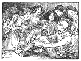

  
[Intangible Textual Heritage](../../../index)  [Legends and
Sagas](../../index)  [Celtic](../index)  [Index](index) 
[Previous](sfft42)  [Next](sfft44) 

------------------------------------------------------------------------

[Buy this Book at
Amazon.com](https://www.amazon.com/exec/obidos/ASIN/B0026FCJ10/internetsacredte)

------------------------------------------------------------------------

  
*Scottish Fairy and Folk Tales*, by George Douglas, \[1901\], at
Intangible Textual Heritage

------------------------------------------------------------------------

p. 138

### THE LOTHIAN FARMER'S WIFE. [1](#fn_63)

THE wife of a farmer in Lothian had been carried off by the fairies,
and, during the year of probation, repeatedly appeared on Sunday, in the
midst of her children, combing their hair. On one of these occasions she
was accosted by her husband; when she related to him the unfortunate
event which had separated them, instructed him by what means he might
win her, and exhorted him to exert all his courage, since her temporal
and eternal happiness depended on the success of his attempt. The
farmer, who ardently loved his wife, set out on Hallowe'en, and, in the
midst of a plot of furze, waited impatiently for the procession of the
fairies. At the ringing of the fairy bridles, and the wild, unearthly
sound which accompanied the cavalcade, his heart failed him, and he
suffered the ghostly train to pass by without interruption. When the
last had rode past, the whole troop vanished, with loud shouts of
laughter and exultation; among which he plainly discovered the voice of
his wife, lamenting that he had lost her for ever.

------------------------------------------------------------------------

### Footnotes

[138:1](sfft43.htm#fr_63) Sir Walter Scott,
*Minstrelsy of the Scottish Border*.

------------------------------------------------------------------------

[Next: Redemption From Fairy Land](sfft44)
