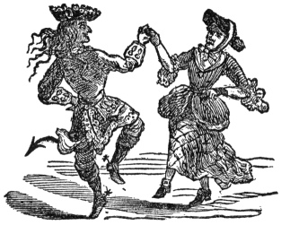

  
[Intangible Textual Heritage](../../../index)  [Legends and
Sagas](../../index)  [Celtic](../index)  [Index](index) 
[Previous](swc106)  [Next](swc108) 

------------------------------------------------------------------------

  
*Traditions and Hearthside Stories of West Cornwall, Vol. 1*, by William
Bottrell, \[1870\], at Intangible Textual Heritage

------------------------------------------------------------------------

### The Giant Bolster, of Saint Ann's

Only a few giants’ steps from Portreath there dwelt in Saint Ann's
another huge giant called Bolster, who made nothing of striding from the
beacon to Carn Brea—a distance of six miles or, more. The Saint Ann's
people say that Bolster fell in love with the beautiful Saint Agnes, who
was a pattern woman of virtue. We think that monkish invention is
apparent in this legend, because our real old giants were never the
fools to waste their wind in filling the air with such a tempest of
groans and sighs as Bolster is said to have blown after the cruel Saint
Agnes, who served her tall lover, at last, too treacherous a trick, as
an honest body might think, for any female saint to invent. After
coquetting with the giant, she asked him, as a last proof of his love,
to fill the hole in the cliff at Chapel Porth with his blood. The giant,
thinking he could spare blood enough to fill many such holes, without
hesitation stretched his

p. 51

great arm over the hole, plunged a knife into a vein, and torrents of
blood gushed out and flowed into the hole. The love-sick giant, ready to
do anything to please the fancy of the fair saint, bled himself to death
without discovering that, as fast as the seething gore issued from his
arm, it ran into the sea through a hole in the bottom of the pit. The
cunning saint, well aware that the hole had an opening at the bottom
into the sea, thus got rid of her hill-striding lover.

Some may think that Saint Agnes served Bolster no worse than he
deserved, because he was a married man all the time that he persecuted
the blessed saint with his troublesome love; besides, he was a most
cruel husband. Whilst he was going over the hills galivanting the saint,
he compelled the unfortunate giantess to pick all the stones from the
ground at the foot of Bury-Anack or Barytanack (as the Beacon was called
in Bolster's time), on the side of the hill nearest Saint Ann's town.
She was made to carry the stones in her apron to the top of the hill,
where they may still be seen, forming many burrows. She laboured so
dilligently that, at this day, the farm which is now made out of this
part of the giant's land is remarkably clear of stones, although all the
surrounding farms are as stony as the Fourborough Downs. Bolster
himself, before he became enamoured of Saint Agnes, must have been an
industrious, hardworking, giant enough to throw up the great gurgoe or
hedge, miles long, which is still called by his name. Any one who will
take the trouble to go to Saint Ann's may still see great part of this
earthwork, thrown up by the giant, which, when he completed it, extended
from Trevaunce Porth to Chapel Porth, enclosing all the richest
tin-ground on the giant's land. As a proof of the truth of the tradition
respecting the way in which the giant Bolster came by his death, the
inhabitants of these parts still show the red stains in the hole at
Chapel Porth, marking the track of the giant's gore which fell in
torrents and flowed for hours down the hole, while the

                  "Fretted flood  
Roll’d frothy waves of purple blood."

 

------------------------------------------------------------------------

[Next: The Piskey-Led Commercial Traveller's Ride over the
Hills](swc108)

