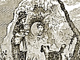

  
[Intangible Textual Heritage](../../../index)  [Legends and
Sagas](../../index)  [Celtic](../index)  [Index](index) 
[Previous](swc124)  [Next](swc126) 

------------------------------------------------------------------------

  
*Traditions and Hearthside Stories of West Cornwall, Vol. 1*, by William
Bottrell, \[1870\], at Intangible Textual Heritage

------------------------------------------------------------------------

### A Legend of Tolcarn

The farm of Tolcarn, near Newlyn, derives its name from a remarkable
group of trap-rock, a little above and in the rear of St. Peter's
church. On the surface of this rock, near the top, may be seen a hollow,
which bears some resemblance to a gigantic footprint, and, near this, a
portion of the rock is marked with reticulated veins of a harder
substance, much less weather-worn than the general surface. This stone,
network, and the footprint, are accounted for by the following legend,
which was given us by an old fisherman of Newlyn:—

In the year 1592, at the time the fishermen of Mousehole and Newlyn were
barking their nets for the seine fishery, the devil had a mind himself
to go a-fishing; so he carried off as many nets, on his head, as were in
the barking-house. He intended going by the road that leads to Tredavoe,
but his theft was discovered, and he was hotly pursued by Shepherd
Pentreath, Jacky Kelynack, Benny Downing, Dick Keigwin, and other
members of the choir of Paul church, who chanted the Apostles’ Creed,
Lord's Prayer, and other parts of the Church Service, so persistently
and vociferously, that the devil tried to escape from the infuriated
exorcists, and jumped with one stride, across the valley, from the road
behind the top of Captain Bry Tonkin's orchard; and his foot sunk into
the blue elvan rock, with his huge weight, so deeply, that he tripped
and fell forward, dropping the nets on the cairn!

The fishermen still religiously chanted the Apostles’ Creed and Lord's
Prayer from the opposite hill across the valley where St. Peter's church
now stands. The devil, finding that he could not escape with his
plunder, whilst thus exorcised, raised his huge body to a towering
height, and, flapping his wings, turned about and looked from the cairn
to the choir, on the opposite side; then, emitting
[sulphureous](errata.htm#26) smoke and fire from his mouth, her fiercely
uttered, three times, "*Buckah*! Buckah!
Buckah!!!" This was supposed to mean,
"You are doomed to be destroyed by a foreign power."

Accordingly, on the 23rd July of the year 1595, about two hundred men
landed from a squadron of Spanish galleys on Merlin's Rock, at
Mousehole; set fire to the church of Paul and to Mousehole; thence they
proceeded to Newlyn, and burnt that village also. On the next day,

p. 169

\[paragraph continues\] Penzance men
fought the Spaniards and compelled them to draw off and put to sea.

The mark of the devil's foot, and the petrified nets, remain on Tolcarn
to this day.

------------------------------------------------------------------------

[Next: Newlyn; Our Jan's Brath; and the Particular Lodger](swc126)

