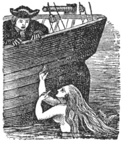

  
[Intangible Textual Heritage](../../../index)  [Legends and
Sagas](../../index)  [Celtic](../index)  [Index](index) 
[Previous](swc131)  [Next](swc133) 

------------------------------------------------------------------------

  
*Traditions and Hearthside Stories of West Cornwall, Vol. 1*, by William
Bottrell, \[1870\], at Intangible Textual Heritage

------------------------------------------------------------------------

### Sarah Polgrain

There are many stories connected with the old superstition that when
rash lovers make vows to be constant to each other, "living or dead,"
and one of the pledged dies far away from the other, the freed spirit at
the appointed time traverses sea and land to fetch its affianced home to
the land of shadows.

The legend of the lovers of Porthgwartha is founded on the same notion.

The most recent story we know (in which the same belief is shown to be
still current) is that of Sarah Polgrain and Yorkshire Jack. The woman,
who lived in Ludgvan (within the present century), was hanged for
poisoning her husband, that she might make room for a horse dealer known
as Yorkshire Jack. ’Tis said that the jockey was much enamoured of the
woman, and that they had been for a long time criminally acquainted
before he succeeded in instigating her to commit the diabolical deed.

p. 204

\[paragraph continues\] Jack accompanied
the woman on to the scaffold, and there, standing by the beam from which
the murderess was in a few minutes to be launched into eternity, the
unholy pair kissed each other; and promises, confirmed by oaths, passed
between them the moment before the woman was executed. ’Tis said that
Jack vowed to be with her in three years. Soon after the woman's
execution, Yorkshire Jack went to sea, that a roving life might dispel
the gloomy thoughts caused by the remembrance of the reckless vow,
carelessly made to satisfy the dying woman.

Disasters constantly followed all the ships in which this unhappy wretch
sailed. Three years from the hour of the woman's death, Jack was on
board a timber-ship, returning from Quebec, when, about midway across
the Atlantic, a violent storm surrounded the ship; the affrighted crew
saw in the lurid thunder-clouds the figure of a fiery female form and
another of gigantic size, too frightful to look at! The figures stood
over the ship, when the crest of a mountain-wave broke on the stern and
swept the doomed man, who was then at the wheel, into the ocean.
Immediately afterwards Yorkshire Jack was seen flying away to the
westward, in the whirling thunder-cloud, between the figures who came in
the storm, and who were no other than Sarah Polgrain and the evil spirit
whose slave she had been on earth, and who was now her eternal master.

From the time that this western Jonah was taken away by the lady of his
love and the devil, the ship was free from all the strange disasters
which were constantly occurring on board during all the time that the
haunted man was one of the crew.

This story obtained much notoriety from the anxiety of Ludgvan folks to
prove that Sarah Polgrain had never been baptized in the water of their
renowned saint's well, which is believed to protect all children
baptized therein against the hangman and his hempen cord. Their joy was
unbounded when it was found that a mistake had been made about the
woman's birthplace, and that she had been christened in a neighbouring
parish, so that the wonderful character of the parish well obtained more
wide-spread celebrity than ever, which it retains to this day.

We are aware that a similar, if not the same, story as the above, of
west-country smugglers taking an Algerine pirate-ship, is told of three
if not more bands belonging to the west country. It has been said that
the person who caused the monument to be erected on the hill near St.
Ives, was, in his youthful days, the captain of a crew who performed a
similar exploit, and continued their buccaneering expeditions in the
same vessel many years, and gained the treasures, by fair means or foul,
that enriched some of the great folks of that place.

The same adventures have been ascribed to Morvah and St. Just men, who,
landing in Genvor Cove from a ship of doubtful fame, came

p. 205

to Penrose, and gave old Justice Jones a lesson in the laws of the high
seas. There is good reason to believe that the honour is due to the
Buryan band, as their story is of much earlier date than either of the
others: besides, it is said that a woman of Penberth, who was *enciente*
at the time of the wreck, was so much frightened at the first sight of a
black, that the child she bore resembled the negro in everything but
colour, and they say that in some of the descendants of the babe,
African features were seen to crop out occasionally, down to the time of
people still alive.

 

------------------------------------------------------------------------

[Next: Lamorna Cove: The Dwelling of Chenance: Joan's Trip to Penzance
on Christmas Eve](swc133)

