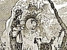

  
[Intangible Textual Heritage](../../../index)  [Legends and
Sagas](../../index)  [Celtic](../index)  [Index](index) 
[Previous](swc139) 

------------------------------------------------------------------------

  
*Traditions and Hearthside Stories of West Cornwall, Vol. 1*, by William
Bottrell, \[1870\], at Intangible Textual Heritage

------------------------------------------------------------------------

p. 278 p. 279

### INDEX

Abracadabra [115](swc114.htm#page_115)

Adders numerous in old times [149](swc118.htm#page_149)

Alsia, the miller's daughter of [185](swc129.htm#page_185)

— the holy well of [189](swc129.htm#page_189)

Amulets [41](swc103.htm#page_41), [43](swc103.htm#page_43),
[117](swc114.htm#page_117)

Alleys, trellised [255](swc138.htm#page_255)

Annual protection from witchcraft [115](swc114.htm#page_115)

Apparitions [103](swc113.htm#page_103), [106](swc113.htm#page_106),
[129](swc116.htm#page_129), [131](swc116.htm#page_131),
[163](swc123.htm#page_163), [165](swc123.htm#page_165),
[175](swc127.htm#page_175), [271](swc139.htm#page_271)

Aquatic embellishments [259](swc138.htm#page_259)

Arthur the king, traditions of [74](swc111.htm#page_74),
[149](swc118.htm#page_149)

Astrologers of the west [113](swc113.htm#page_113),
[179](swc128.htm#page_179)

Attack on the moorhouse [84](swc111.htm#page_84)

 

Betty Toddy and her gown [141](swc118.htm#page_141)

Bewitching the dairy [87](swc111.htm#page_87)

Black [huntsman](errata.htm#77), the [130](swc116.htm#page_130),
[133](swc116.htm#page_133), [226](swc134.htm#page_226)

Bolster, the giant [50](swc106.htm#page_50)

Bonfires, the midsummer [13](swc103.htm#page_13),
[55](swc108.htm#page_55)

Bosava mill [228](swc135.htm#page_228)

— house built by the devil [228](swc135.htm#page_228)

Bosence, family of [57](swc109.htm#page_57)

— Uter and the piskey [60](swc109.htm#page_60)

— old chapel of [60](swc109.htm#page_60)

Bottle, spell of the [23](swc103.htm#page_23)

Bowling-green, the [264](swc138.htm#page_264)

Brath, the feasten [142](swc118.htm#page_142)

— our Jan's [169](swc125.htm#page_169)

Brewer of Market-jew, the [10](swc103.htm#page_10)

Bucca, derivation of name (note) [143](swc118.htm#page_143)

— tricks [144](swc118.htm#page_144)

Buccaneer's adventures [110](swc113.htm#page_110),
[203](swc131.htm#page_203)

Burning the witch, game of [227](swc134.htm#page_227)

Buryan, St., ancient families of [186](swc129.htm#page_186)

—— Saints’ wells in [189](swc129.htm#page_189)

 

Carding black wool white [248](swc136.htm#page_248)

Carn Galva, giant of [46](swc103.htm#page_46)

Charmers [79](swc111.htm#page_79), [116](swc114.htm#page_116)

Charms [41](swc103.htm#page_41), [117](swc114.htm#page_117)

Choon castle, building of [24](swc103.htm#page_24)

Conceit and cant [234](swc135.htm#page_234)

Christmas carols [224](swc134.htm#page_224)

—— feast [226](swc134.htm#page_226)

—— games [227](swc134.htm#page_227)

Conjuror, the, of Cury [70](swc110.htm#page_70)

——— Helston [115](swc114.htm#page_115)

Conjuror, a sensible [123](swc115.htm#page_123)

Cornish names explained [46](swc103.htm#page_46),
[143](swc118.htm#page_143), [148](swc118.htm#page_148),
[158](swc121.htm#page_158), [168](swc124.htm#page_168),
[172](swc126.htm#page_172), [190](swc129.htm#page_190),
[228](swc135.htm#page_228), [220](swc134.htm#page_220)

—— language, the [181](swc128.htm#page_181)

Corker, Parson, the ghost-layer [233](swc135.htm#page_233)

Cottage homes [81](swc111.htm#page_81), [209](swc133.htm#page_209)

Crusader, the [263](swc138.htm#page_263)

 

Dance tunes, old words of [145](swc118.htm#page_145)

Danes, traditions of their incursions [74](swc111.htm#page_74),
[146](swc118.htm#page_146)

Daniels of Morvah [79](swc111.htm#page_79)

Death tokens [103](swc113.htm#page_103), [111](swc113.htm#page_111),
[112](swc113.htm#page_112)

— ship [105](swc113.htm#page_105)

— of Lanyon [196](swc130.htm#page_196)

— of the giant Denbras [13](swc103.htm#page_13)

— of the maltsman of Trove [249](swc137.htm#page_249)

Denbras the giant [10](swc103.htm#page_10)

— his fight with Tom [11](swc103.htm#page_11)

— his wives [12](swc103.htm#page_12)

— his death [13](swc103.htm#page_13)

Demon mason, the [228](swc135.htm#page_228)

Devil, the, and his hounds [128](swc116.htm#page_128),
[136](swc116.htm#page_136), [139](swc117.htm#page_139),
[219](swc134.htm#page_219)

— comes for Joan with horse

— and pillion [220](swc134.htm#page_220)

— stealing fishing-nets [168](swc124.htm#page_168)

— casting out the [177](swc127.htm#page_177)

— builds Bosava [229](swc135.htm#page_229)

— claims his due [231](swc135.htm#page_231)

Dog, Lutey's, saves him from the mermaid [69](swc110.htm#page_69)

— the parson's [162](swc122.htm#page_162)

Dolly Pentreath [178](swc128.htm#page_178)

Droll of the meremaid [64](swc110.htm#page_64)

—— Betty Toddy [140](swc118.htm#page_140)

— teller, the wandering [63](swc110.htm#page_63)

Dwelling of Chenance, the [209](swc133.htm#page_209)

 

Enchanter of Pengersec, the [33](swc103.htm#page_33),
[37](swc103.htm#page_37)

—— and giant of the mount [36](swc103.htm#page_36)

 

Fairy stories [58](swc109.htm#page_58), [75](swc111.htm#page_75),
[77](swc111.htm#page_77), [197](swc130.htm#page_197)

— ointment [199](swc131.htm#page_199)

Feasten broth [198](swc130.htm#page_198)

Fish-women of Mount's-bay [155](swc120.htm#page_155)

[French](errata.htm#78) invasion, alarm of [149](swc118.htm#page_149)

Funerals, entertainment at [85](swc111.htm#page_85)

—— ghostly [129](swc116.htm#page_129)

 

Games, ancient [34](swc103.htm#page_34), [47](swc104.htm#page_47),
[146](swc118.htm#page_146), [147](swc118.htm#page_147)

Gardens, old-fashioned, of Trove [250](swc137.htm#page_250)

p. 280

Ghost, a ride with a [198](swc130.htm#page_198)

—— of Lenine [232](swc135.htm#page_232)

—— of Mrs. Baines [165](swc123.htm#page_165)

—— of Stythians [218](swc134.htm#page_218)

—— rising [134](swc116.htm#page_134)

—— -layers [135](swc116.htm#page_135), [138](swc116.htm#page_138),
[167](swc124.htm#page_167), [231](swc135.htm#page_231)

Ghosts of the Keigwins [173](swc127.htm#page_173)

—— troops of [129](swc116.htm#page_129)

—— of Trove mill-pool [262](swc138.htm#page_262)

—— of the haunted chamber of Trove [248](swc136.htm#page_248)

Giants, legends of [10](swc103.htm#page_10), [46](swc103.htm#page_46),
[47](swc104.htm#page_47),
[49](swc105.htm#page_49)-[51](swc107.htm#page_51)

Guise-dance of St. George and the Turkish knight
[227](swc134.htm#page_227)

 

Hall, the old-fashioned [239](swc136.htm#page_239)

Hammer, Jack of the [45](swc103.htm#page_45)

Hale sands, dangers of crossing, in former times
[119](swc114.htm#page_119)

Hell-hounds [130](swc116.htm#page_130), [139](swc117.htm#page_139)

Holy warriors [200](swc131.htm#page_200), [264](swc138.htm#page_264)

Hurling, the game of [34](swc103.htm#page_34), [55](swc108.htm#page_55),
[146](swc118.htm#page_146)

 

Ill-wished cattle [79](swc111.htm#page_79)

 

Joan, her trip to Penzance [207](swc133.htm#page_207)

— punished for prying [216](swc134.htm#page_216)

— taken to the sky [219](swc134.htm#page_219)

— brought home in a wheel-barrow [221](swc134.htm#page_221)

 

King Arthur, legends of [74](swc111.htm#page_74),
[149](swc118.htm#page_149)

— of Market-jew [28](swc103.htm#page_28)

Knackers of the mines [77](swc111.htm#page_77)

 

Lamb and Flag inn [121](swc114.htm#page_121)

Lamorna [206](swc133.htm#page_206), [228](swc135.htm#page_228)

Ladies’ bower, the [242](swc136.htm#page_242)

Lanyon (or Lenine), ancient family of [185](swc129.htm#page_185),
[230](swc135.htm#page_230)

—— death of Frank [196](swc130.htm#page_196)

Lenine the cobbler [228](swc135.htm#page_228)

—— fools the devil [232](swc135.htm#page_232)

—— ghost of, baffles Parson Corker [224](swc134.htm#page_224)

Levelis (or Lovell), family and mansion of [235](swc135.htm#page_235)

—— the crusader, story of [263](swc138.htm#page_263)

Loadstone, the, worn as an amulet [42](swc103.htm#page_42)

Lodger, the too-particular-by-half [172](swc126.htm#page_172)

Ludgvan hurlers [34](swc103.htm#page_34)

—— holy well of [204](swc132.htm#page_204)

Market-jew, traditions of its ancient tin-trade [28](swc103.htm#page_28)

——— mayor or king of [28](swc103.htm#page_28)

——— smelting-feast [33](swc103.htm#page_33)

Mason-devil [234](swc135.htm#page_234)

Masonry, old [25](swc103.htm#page_25), [157](swc121.htm#page_157),
[229](swc135.htm#page_229)

Melusina, legend of, known in Breage [261](swc138.htm#page_261)

Mermaid found by the man of Cury [64](swc110.htm#page_64)

——— dwelling of [68](swc110.htm#page_68), [210](swc133.htm#page_210)

——— favours of, dearly purchased [70](swc110.htm#page_70)

Message from the sea [192](swc129.htm#page_192)

Miller, the, of Alsia [186](swc129.htm#page_186)

——— of Trove [221](swc134.htm#page_221)

Morvah fair [45](swc103.htm#page_45)

——— meaning of the name [46](swc103.htm#page_46)

Mount, the giants of the [36](swc103.htm#page_36),
[48](swc104.htm#page_48)

Mousehole, origin of the name [172](swc126.htm#page_172)

——— ancient mansion in [173](swc127.htm#page_173)

——— burnt by the Spaniards [174](swc127.htm#page_174)

——— cavern near [183](swc128.htm#page_183)

——— dwelling of Dolly Pentreath in [178](swc128.htm#page_178)

 

Nancy Trenoweth, the miller's daughter [185](swc129.htm#page_185)

Newlyn, origin of the name [169](swc125.htm#page_169)

—— old, woman of, and her son Jan [170](swc126.htm#page_170)

————— her particular lodger [172](swc126.htm#page_172)

 

Parson Spry and his wooden horse [159](swc122.htm#page_159)

—— the plain-spoken [165](swc123.htm#page_165)

—— Corker and the spirits of Bosava [233](swc135.htm#page_233)

—— Singleton the ghost-layer [167](swc124.htm#page_167)

Pellars, the [67](swc110.htm#page_67), [115](swc114.htm#page_115),
[121](swc114.htm#page_121)

Pellew, his home and schoolboy days [157](swc121.htm#page_157)

—— how he once ran from the foe [158](swc121.htm#page_158)

Pendeen [146](swc118.htm#page_146),[157](swc121.htm#page_157)

Pengersec, the enchanter and giant of the Mount [36](swc103.htm#page_36)

Penzance, sketches in [150](swc119.htm#page_150)

Pentreath, Dolly [178](swc128.htm#page_178)

——  and the schoolboys [179](swc128.htm#page_179)

—— and Mr. Price [180](swc128.htm#page_180)

—— her monument [181](swc128.htm#page_181)

Peter Pindar, a guest at Trevethow [182](swc128.htm#page_182)

Pin-maker, the [54](swc108.htm#page_54)

p. 281

Pirates’ and privateers’ Adventures
[108](swc113.htm#page_108),[200](swc131.htm#page_200),[204](swc132.htm#page_204)

—— craft, seizure of, by Buryan smugglers [201](swc131.htm#page_201)

Piskey, the, and Uter Bosence [60](swc109.htm#page_60)

—— led, traveller [48](swc104.htm#page_48)

Pigeonry, the old fashioned [260](swc138.htm#page_260)

 

Sailor V \* \* \* \* \*, history of [97](swc113.htm#page_97)

Saint Just feast in old times [143](swc118.htm#page_143)

——, alarm of invasion in [149](swc118.htm#page_149)

Saint Ives [52](swc108.htm#page_52)

Sator, arepo, tenet, opera, rotas, charm [116](swc114.htm#page_116)

Sermons [163](swc123.htm#page_163), [164](swc123.htm#page_164),
[179](swc128.htm#page_179)

Skillewidden the fairy [76](swc111.htm#page_76)

Slinging, ancient practice of [147](swc118.htm#page_147)

Small people (see fairies)

Smelters’ feasts [33](swc103.htm#page_33), [55](swc108.htm#page_55)

Smuggling and smugglers [69](swc110.htm#page_69),
[72](swc111.htm#page_72), [198](swc130.htm#page_198),
[199](swc131.htm#page_199)

Spell of the bottle [83](swc111.htm#page_83)

Streamers—tin-works [72](swc111.htm#page_72)

Spry, Rev. William—his eccentric character [159](swc122.htm#page_159)

————, pulpit retorts [165](swc123.htm#page_165)

Stythians, ghost of [125](swc116.htm#page_125)

Summer's friends [21](swc103.htm#page_21)

Sweethearts’ vows [130](swc116.htm#page_130), [204](swc132.htm#page_204)

——, trying for [194](swc130.htm#page_194)

 

Talfat, meaning of [209](swc133.htm#page_209)

Tinkard, the, enters the giant's castle [15](swc103.htm#page_15)

——— makes leather coats [23](swc103.htm#page_23)

——— —love to the giant's daughter [24](swc103.htm#page_24)

——— finds a keenly batch of tin [26](swc103.htm#page_26)

——— conquers the enchanter [40](swc103.htm#page_40)

Tinkard, the, marries Genevra and settles in Morvah
[44](swc103.htm#page_44)

Tin-works, ancient [44](swc103.htm#page_44), [51](swc107.htm#page_51),
[72](swc111.htm#page_72)

Tokens [53](swc108.htm#page_53), [104](swc113.htm#page_104),
[112](swc113.htm#page_112)

Tolcarn, legend of [168](swc124.htm#page_168)

Tom the Hedger fights the giant of Towednack [11](swc103.htm#page_11)

———— takes possession of his castle [14](swc103.htm#page_14)

———— fights with the tinkard [16](swc103.htm#page_16)

Tom Treva and his cows [121](swc114.htm#page_121)

Treasures of the giant's castle [28](swc103.htm#page_28)

Trecrobben & the Mount, giants of [48](swc104.htm#page_48)

Trewoof, ancient mansion of [235](swc135.htm#page_235)

—— gardens of [250](swc137.htm#page_250)

—— haunted chamber of [248](swc136.htm#page_248)

———— mill-pool of [263](swc138.htm#page_263)

—— mill [264](swc138.htm#page_264)

Trenoweth, Nancy, the story of [185](swc129.htm#page_185)

Trevethow, hospitable old squire of [182](swc128.htm#page_182)

Peter Pindar, a guest of [182](swc128.htm#page_182)

Trezillian, Madam, her head-dress [154](swc120.htm#page_154)

 

Velandruchar and Velansager [147](swc118.htm#page_147)

————— moor, battle of [148](swc118.htm#page_148)

Vug or cavity in a lode [77](swc111.htm#page_77)

 

Warren, the rabbit [260](swc138.htm#page_260)

Wells, holy [189](swc129.htm#page_189)

Wise-women or charmers
[79](swc111.htm#page_79)–[127](swc116.htm#page_127)

Witchcraft faith in general [88](swc111.htm#page_88),
[124](swc115.htm#page_124)

Witch's curse, the [94](swc112.htm#page_94)

Witch, the white, of Zennor [72](swc111.htm#page_72)

———— or pellar of Cury [90](swc112.htm#page_90)

———— of Helston [127](swc116.htm#page_127)

Wrath, the giant of Portreath [49](swc105.htm#page_49)

Wrestling [20](swc103.htm#page_20), [57](swc109.htm#page_57),
[101](swc113.htm#page_101), [145](swc118.htm#page_145)

 

Zennor, white-witch of [79](swc111.htm#page_79)

 

 

 

 
