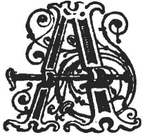

  
[Intangible Textual Heritage](../../../index)  [Legends and
Sagas](../../index)  [Celtic](../index)  [Index](index) 
[Previous](swc236)  [Next](swc238) 

------------------------------------------------------------------------

  
*Traditions and Hearthside Stories of West Cornwall, Vol. 2*, by William
Bottrell, \[1873\], at Intangible Textual Heritage

------------------------------------------------------------------------

## A Tinner's Fireside Stories.

### The Knockers of Ballowal.

Blest be that spot, where cheerful guests retire,  
To pause from toil, and trim their evening fire.  
                                           Goldsmith.

|                    |
|--------------------|
|  |

A FEW years ago, in talking with a Lelant miner about the sprites that
haunt many old mines, he told us the following story, which we give in
his own words, as an example of West Country dialect.

We wish to correct an error that many persons, not Cornish, entertain
with regard to the language of Cornish working people. Their mistake
originates, in many instances, from seeing in stories—misnamed Cornish,
and for the most part written by strangers to the country—such an
uncouth jargon, put into the mouths of West Country folks, which is no
more the common dialect of Cornwall than it is of Jericho. Our English
will bear comparison with that of any rural district, and, in most
cases, be found more correct, though somewhat antiquated. Many of our
peculiar words, such as agricultural or mining terms, a few names of
plants, &c., are genuine old Cornish.

"I know that strangers," said Uncle Bill, "and grand learned folks like
our passen, don't believe in the sperats we cale knackers workan in the
bals, and say that the noise, made by these old ghosts of tinners, is
caused by water oazan out of a lode and drippen into a pit; as of the
water fallan from ever so high, could sound like hammer and boryer, or
pick and showl (shovel)

p. 186

workan away. But, bless us, comrade, what can these strangers that come
here—to instruct us, forsooth!—know about such things? Yet how they will
talk about what they never heard of before they came among us, and say
it es all su-per-sti-tion! Now that's a fine word, my dear, and I mean
to use et on all occasions; like An’ Betty Brea, up your way, who es
twenty times a day askan 'Do ’e knaw the sig-ni-fi-ca-tion' of some
fiddle-stick's end, or other, that she may use her one and word, picked
up from a local preacher.

"I've been minded lately of a story that was told me by an old
comrade—Uncle Tom Trevorrow, who's many years older than I am. When I
was a boy, workan at Trink Stamps, he was married; and he was then as
fine a man as one would meet of a long summer's day. If you'll have
patience enow I'll tell ’e the story of

------------------------------------------------------------------------

[Next: Tom and the Knackers](swc238)

