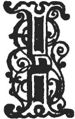

  
[Intangible Textual Heritage](../../../index)  [Legends and
Sagas](../../index)  [Celtic](../index)  [Index](index) 
[Previous](swc253)  [Next](swc255) 

------------------------------------------------------------------------

  
*Traditions and Hearthside Stories of West Cornwall, Vol. 2*, by William
Bottrell, \[1873\], at Intangible Textual Heritage

------------------------------------------------------------------------

### The Crick-Stone, or Men-an-tol.

|                    |
|--------------------|
|  |

IN a croft belonging to Lanyon farm, and about half a mile north of the
town-place, there is a remarkable group of three stones, the centre one
of which is called by antiquaries the Men-an-tol (holed stone), and by
country folk the Crick-stone, from an old custom—not yet extinct—of
"crameing" (crawling on all fours) nine times through the hole in the
centre stone, going against the sun's course, for the cure of lumbago,
scatica, and other "cricks" and pains in the back. Young children were
also put through to ensure them healthy growth.

Antiquaries are undecided with respect to the purpose for which these
mysterious stones were erected. Some hold that it is a sepulchral
monument, as well as the Men Scryfa (inscribed stone) half a mile
further on, because there is a tradition that a little below, in Gendhal
moor, there was once so great a battle that the streams ran with blood.
Others think the object of its erection was for the computation of time
among the latter is Professor Max Müller who, in the *Quarterly Review*,
for August, 1867, after stating that the three stones are in a line
bearing nearly east and west, says:—

"This Men-an-tol may be an old dial, erected originally to fix the
proper time for the celebration of the autumnal equinox,

p. 243

and, though it may have been applied to other purposes likewise, such as
the curing of children by dragging them several times through the hole,
still its original intention may have been astronomical."

He also thinks that the Men-heeres (long stones) served the same
purpose, as they are mostly found in pairs bearing nearly east and west.

The Tolmen, in Constantine parish, and holed stones in other parts of
the county, were used the same way as Lanyon Crickstone for curing
various ailments.

To cure boils and rheumatism, persons "crame" nine times against the
sun, under a bramble-growing at both ends.

The notion is that going against the sun will backen a disease but in
all other cases the sun's course must be followed.

------------------------------------------------------------------------

------------------------------------------------------------------------

[Next: Charms](swc255)

