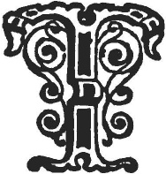

  
[Intangible Textual Heritage](../../../index)  [Legends and
Sagas](../../index)  [Celtic](../index)  [Index](index) 
[Previous](swc254)  [Next](swc256) 

------------------------------------------------------------------------

  
*Traditions and Hearthside Stories of West Cornwall, Vol. 2*, by William
Bottrell, \[1873\], at Intangible Textual Heritage

------------------------------------------------------------------------

### Charms.

|                    |
|--------------------|
|  |

THERE are persons in every parish west of Hayle, and in many east of it,
who charm for the cure of various ailments. The members of a family,
formerly of Sennen, are believed to possess peculiar virtues as
charmers, which is said to have been obtained, hundreds of years ago,
from a forefather of theirs, dwelling in Escols, who found, washed in on
Gwenvor sand, a very old man, almost dead, whom he took to his house,
had him well cared for, so that he soon recovered and prepared to
depart. Before leaving, however, he told his host that he had neither
gold .nor silver to pay him for his hospitality; yet he would bestow on
him and his what would be of more value; and imparted to the old man of
Escols most of the following charms, which a descendant of the family
gave me by word of mouth; if written they are useless, and the giver of
a written one thenceforth loses the power to cure by charming.

------------------------------------------------------------------------

*Charm for a scald, wild-fire, burn, or any other inflammatory disease*.

The person to be charmed gathers nine bramble leaves, which are put into
a vessel of spring water; then each leaf is passed

p. 244

over and from the diseased part, whilst repeating three times to each
leaf as follows:—

"Three ladies come from the east,  
 One with fire and two with frost;  
 Out with thee fire, and in with thee frost,  
 In the name of the Father, Son, and Holy Ghost."

A stick of fire is then taken from the hearth -and passed over and
around the diseased part whilst the above is repeated nine times.

------------------------------------------------------------------------

*Charm for a pack of a thorn, boils, kennels, &c*.

"Christ was crowned with thorns,  
 The thorns did bleed but did not rot,  
 No more shall thy finger *(or whatever part it may be)*,  
 In the name of the Father, Son, and Holy Ghost."

------------------------------------------------------------------------

*Charm for staunching blood*.

"Christ was born in Bethlehem,  
 Baptised in the river Jordan;  
 There he digg’d a well.  
 And turn’d the water against the hill,  
 So shall thy blood stand still.  
 In the name, &c."

------------------------------------------------------------------------

C*harm for a tetter*.

"Tetter, tetter, thou hast nine sisters.  
 God bless the flesh and preserve the bone,  
 Perish thou tetter and be thou gone,  
 In the name, &c."

"Tetter, tetter, thou hast eight sisters.  
 God bless the flesh and preserve the bone,  
 Perish thou tetter and be thou gone,  
 In the name, &c."

The charm is thus continued until it comes to the last, which is:—

"Tetter, tetter, thou hast no sister,  
 God bless the flesh and preserve the bone,  
 Perish thou tatter and be thou gone.  
 In the name, &c."

p. 245

*Charm for toothache*.

"Christ pass’d by his brother's door,  
 Saw his brother lying on the floor.  
 'What aileth thee, brother?  
 Pain in thy teeth?  
 Thy teeth shall pain thee no more.'  
 In the name, &c."

The charmer places his or her thumb on the diseased part in all but the
first charm.

------------------------------------------------------------------------

Divination with a Bible and key; seeking a response to doubts from the
first words the eye may glance on in letting a Bible fall open; and
various other superstitious practices, common to all England, are well
known here and need not be described.

 

------------------------------------------------------------------------

[Next: The Fairy Tribes](swc256)

