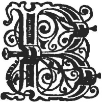

  
[Intangible Textual Heritage](../../../index)  [Legends and
Sagas](../../index)  [Celtic](../index)  [Index](index) 
[Previous](swc255)  [Next](swc257) 

------------------------------------------------------------------------

  
*Traditions and Hearthside Stories of West Cornwall, Vol. 2*, by William
Bottrell, \[1873\], at Intangible Textual Heritage

------------------------------------------------------------------------

### The Fairy Tribes.

|                    |
|--------------------|
|  |

BELIEF in fairies is far from being extinct in Cornwall, though our
country folks never call them by that name.

A few days since, a woman of Mousehal told me that not long ago troops
of small people, no more than a foot and a half high, used—on moonlight
nights—to come out of a hole in the cliff, opening onto the beach,
Newlyn side of the village, and but a short distance from it. The little
people were always dressed very smart; and if anyone came near them they
would scamper away into the hole. Mothers often told their children that
if they went under cliff by night the small people would carry them away
into "Dicky Danjy's holt."

Another kind called spriggans, which simply means sprites, are believed
to guard treasures buried in cliff and hill castles.

Not long since a tinner of Lelant dreamt, three nights following, that a
crock of gold was buried in a particular spot, between large rocks
within the castle, on Trecroben hill. The next clear moonlight night he
dug up the ground of which he had dreamt. After working two or three
hours he came to a flat stone which sounded hollow; whilst digging round
its edges, the weather became suddenly dark, the wind roared around the
earns, and looking up, when he had made a place for his hands to lift
it, he saw hundreds of ugly spriggans coming out from

p. 246

amidst the rocks gathering around and approaching him. The man dropped
his pick, ran down the hill and home as fast as he could lay foot to
ground; he took to his bed and was unable to leave it for weeks.

When he next visited the castle he found the pit all filled in, with the
turf replaced; and he nevermore dug for the treasure.

Piskey still leads benighted people astray; this sprite wanders alone
and is always spoken of in the singular. It is somewhat remarkable that
a green bug, frequently found on bramble bushes in autumn, is called by
this name. After Michaelmas, it is said, that blackberries are
unwholesome because Piskey spoils them then.

Places frequented by goats are believed to be the favourite haunts of
fairies.

It is uncertain whether Bucka can be regarded as one of the fairy tribe;
old people, within my remembrance, spoke of a Bucka Gwidden and a Bucka
Dhu—by the former they meant a good spirit, and by the latter an evil
one, now known as Bucka boo. I have been told, by persons of credit,
that within the last forty years it was a usual practice with Newlyn and
Mousehal fishermen to leave on the sand at night a portion of their
catch for Bucka. Probably from this observance the common nickname of
Newlyn Buckas was derived. An old rhyme says:—

"Penzance boys up in a tree,  
 Looking as wisht as wisht can be;  
 Newlyn buckas as strong as oak,  
 Knocking them down at every poke."

From this it appears that Newlyn boys once considered it a matter of
pride to be called by the name of their ancient divinity.

The knockers of the mines—that some class among fairy tribes—are simply
believed, by our tinners, to be the spirits of those who worked the 'old
bals' in ancient times.

  [  
Click to enlarge](img/24600.jpg)  
  

------------------------------------------------------------------------

[Next: Mermaids and the Hooper](swc257)

