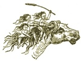

  
[Intangible Textual Heritage](../../../index)  [Legends and
Sagas](../../index)  [Celtic](../index)  [Index](index) 
[Previous](swc275)  [Next](swc277) 

------------------------------------------------------------------------

  
*Traditions and Hearthside Stories of West Cornwall, Vol. 2*, by William
Bottrell, \[1873\], at Intangible Textual Heritage

------------------------------------------------------------------------

p. 293

### INDEX

PAGE

Ancient Bridal Customs  [237](swc252.htm#page_237)

— Coins found at Castle Maen [127](swc221.htm#page_127)

— Mariners' Stories [149](swc231.htm#page_149)

A night's ride to Scilly [233](swc250.htm#page_233)

Ballowal, the knockers of (fairy tale) [185](swc236.htm#page_185)

Baranhuel, a Queen's visit to [67](swc213.htm#page_67)

— fairies’ cow [73](swc214.htm#page_73)

— shell room [72](swc213.htm#page_72), [274](swc263.htm#page_274)

Beatrice I’an, or Ivan [104](swc217.htm#page_104)

— her death [118](swc219.htm#page_118)

Betty Stoggs's baby (fairy tale) [205](swc241.htm#page_205)

Bevan, the Rev. James [197](swc239.htm#page_197)

Bewitching a dairy [65](swc211.htm#page_65)

Bob 'o the Carn (fairy tale) [173](swc236.htm#page_173)

Boleit, ancient monuments of [29](swc204.htm#page_29)

Books popular in the West Country a century ago
[197](swc239.htm#page_197)

Boscawen un circle [34](swc207.htm#page_34)

Boskenna [36](swc208.htm#page_36)

Boslow, the Piskey of [158](swc233.htm#page_158)

Brea, or Bray [42](swc209.htm#page_42), [200](swc240.htm#page_200),
[278](swc267.htm#page_278)

Brea-Vean, the Changeling of (fairy tale) [200](swc240.htm#page_200)

Breage, St., visits her brother, St. Levan [145](swc227.htm#page_145)

Bridal customs, ancient, still in vogue [237](swc252.htm#page_237)

Buccaneering, [45](swc209.htm#page_45)

Bucka, offerings to [187](swc238.htm#page_187),
[246](swc256.htm#page_246)

Buryan fair [39](swc209.htm#page_39)

— Sanctuary, men of [269](swc261.htm#page_269)

— wise-woman or fortune teller of [47](swc209.htm#page_47)

Calling of the sleeves [216](swc245.htm#page_216)

Cardews of Boskenna, the last of [38](swc208.htm#page_38)

Castle Treen, traditions of, [130](swc222.htm#page_130),
[138](swc224.htm#page_138)

— Maen, or Men [127](swc221.htm#page_127)

Changeling of Brea-Vean [200](swc240.htm#page_200)

— how to get rid of one [202](swc241.htm#page_202)

Chapel Uny Well [199](swc240.htm#page_199)

Charms [243](swc254.htm#page_243)

Chyannor, Tom of, the tin-streamer [72](swc213.htm#page_72)

Chynance [116](swc219.htm#page_116)

Clarice de Boleit, inscription on her tomb [29](swc204.htm#page_29)

Conjurors, pellars, or wise-men [20](swc203.htm#page_20),
[76](swc214.htm#page_76) [276](swc265.htm#page_276)

Crick-stone, the, or Men-an-tol [242](swc253.htm#page_242)

Cursing Psalm, the [229](swc248.htm#page_229),
[231](swc249.htm#page_231)

Danes, traditions of their incursions [127](swc221.htm#page_127),
[141](swc227.htm#page_141), [274](swc263.htm#page_274)

Daunce-Mayn [33](swc207.htm#page_33)

Death-ship, the [248](swc258.htm#page_248)

Demon, a, spinning [5](swc202.htm#page_5)

Den-an-Dynas, the giant and his wife [137](swc223.htm#page_137)

Devil's money [227](swc248.htm#page_227)

Divination [131](swc222.htm#page_131), [217](swc245.htm#page_217),
[245](swc255.htm#page_245), [283](swc270.htm#page_283)

Doctresses of the West Country [49](swc209.htm#page_49)

Duffy and a Devil, an old guise-dance [1](swc202.htm#page_1)

Enchanter, the, of Pengersec. [263](swc260.htm#page_263)

— of Maen and a thief [265](swc260.htm#page_265),
[267](swc260.htm#page_267)

Escols, a strong man of [31](swc206.htm#page_31)

— weavers of [196](swc239.htm#page_196)

Faction fight in Buryan Churchtown [215](swc245.htm#page_215)

Fairy dwelling on Selena Moor [94](swc216.htm#page_94)

— fair [161](swc233.htm#page_161)

— master, the [173](swc236.htm#page_173)

— tales [73](swc214.htm#page_73), [94](swc216.htm#page_94),
[102](swc216.htm#page_102), [154](swc233.htm#page_154),
[168](swc234.htm#page_168), [173](swc236.htm#page_173),
[185](swc236.htm#page_185), [200](swc240.htm#page_200)

Fairies, how they may be drive away [75](swc214.htm#page_75)

— old folks’ notions respecting [101](swc216.htm#page_101),
[245](swc255.htm#page_245)

Flowers, planting on graves, an old West Country custom
[114](swc219.htm#page_114)

Fortune-tellers [49](swc209.htm#page_49), [276](swc265.htm#page_276)

Garrack-zans [77](swc215.htm#page_77), [160](swc233.htm#page_160)

Ghost stories [122](swc221.htm#page_122), [162](swc233.htm#page_162),
[217](swc245.htm#page_217), [230](swc249.htm#page_230)

— laying [124](swc221.htm#page_124)

Ghostly ship's-bell, a [277](swc265.htm#page_277)

Giants of Castle Treen [131](swc222.htm#page_131),
[137](swc223.htm#page_137)

Goblins of the Mines [187](swc238.htm#page_187)

Guise-dances, how performed [2](swc202.htm#page_2)

Gulthise (harvest feast) [95](swc216.htm#page_95)

Gwinear, the slighted damsel of [229](swc248.htm#page_229)

p. 294

Haunted houses [122](swc221.htm#page_122), [212](swc245.htm#page_212)

Hella-point, mermaids of [151](swc232.htm#page_151)

Hell-hounds [66](swc212.htm#page_66)

Heimskringla, the, of Snorri Surlusson, account in of Northmen marauding
Cornwall, &c. [274](swc263.htm#page_274)

Hilla-ridden [236](swc251.htm#page_236)

Holed stones [31](swc206.htm#page_31), [242](swc253.htm#page_242),
[280](swc269.htm#page_280)

Hooper of Cowloe, the [247](swc257.htm#page_247)

Hostess, the, of Market-jew [82](swc215.htm#page_82)

Hurling [24](swc203.htm#page_24)

Husbandry, old [195](swc239.htm#page_195)

I’ans, their house in Treen [103](swc217.htm#page_103)

— ghosts of [122](swc221.htm#page_122)

— a Breton descendant of [125](swc221.htm#page_125)

Ill-wishing [63](swc211.htm#page_63), [65](swc211.htm#page_65),
[285](swc272.htm#page_285), [286](swc272.htm#page_286)

Ivy-leaves and rushes, divination by [217](swc245.htm#page_217),
[283](swc270.htm#page_283)

Johanna, the foolish, her garden [146](swc228.htm#page_146)

— rebukes St. Levan for fishing on a Sunday [148](swc230.htm#page_148)

Just, St., feast of [154](swc233.htm#page_154),
[170](swc235.htm#page_170)

Kaerkeis bowjey [127](swc221.htm#page_127)

Key, the, of Castle Treen [130](swc222.htm#page_130)

Knackers of Ballowal (fairy tale) [185](swc236.htm#page_185)

Levan, St., legends of [145](swc227.htm#page_145)

— stone; [147](swc229.htm#page_147)

— his path [146](swc228.htm#page_146), [272](swc262.htm#page_272)

— witches [139](swc225.htm#page_139)

Long-stones, or Menheeres of Boleit [30](swc205.htm#page_30)

— places named from numerous [31](swc206.htm#page_31)

Lovell, Madam, her troubles [21](swc203.htm#page_21)

— or Levelis, family of [271](swc261.htm#page_271)

Loyal hearts of Buryan [69](swc213.htm#page_69)

Madron well and chapel [239](swc252.htm#page_239)

Marriage usages, ancient [237](swc252.htm#page_237),
[239](swc252.htm#page_239)

Mayor of Market-jew, a [83](swc215.htm#page_83)

Merchants of Treen, the [81](swc215.htm#page_81)

Merlin's prophesies [130](swc222.htm#page_130),
[147](swc229.htm#page_147)

Mermaid of Zennor, the [288](swc273.htm#page_288)

Midsummer bonfires [287](swc272.htm#page_287)

Miners’ stories [187](swc238.htm#page_187), [191](swc238.htm#page_191)

Miracle-plays, performed at Sancreed [269](swc261.htm#page_269)

Morvah man, a, shopping [207](swc243.htm#page_207)

Nelly Wearne, the story of [38](swc208.htm#page_38)

Nicknames [198](swc239.htm#page_198)

Night's ride, a, to Scilly [233](swc250.htm#page_233)

Noy, Mr. William, in a fairy dwelling [97](swc216.htm#page_97)

Noy, Madam, and the witch [63](swc211.htm#page_63)

— family of [274](swc263.htm#page_274)

Olaf, the first Christian king of Norway, his conversion at Scilly
[275](swc265.htm#page_275)

Parchapel well [148](swc230.htm#page_148)

Parcurnow, traditions of [140](swc227.htm#page_140)

Pargwartha, legend of [149](swc231.htm#page_149)

Parish clerks sixty years ago [169](swc234.htm#page_169)

Pellars, or wise-men [76](swc214.htm#page_76),
[191](swc238.htm#page_191)

— Penance, doing in Buryan Church [55](swc209.htm#page_55)

Penberth, a cottage dwelling at [111](swc218.htm#page_111)

Pendar, Madam, receiving a Queen [68](swc213.htm#page_68)

— family of [72](swc213.htm#page_72), [95](swc216.htm#page_95),
[119](swc220.htm#page_119), [223](swc246.htm#page_223)

Pendeen of old [166](swc233.htm#page_166), [279](swc268.htm#page_279)

Pengersec, legends of [251](swc260.htm#page_251)

— the magician [264](swc260.htm#page_264)

Penrose, the smugglers of [212](swc245.htm#page_212)

— family [223](swc246.htm#page_223)

Phantom lover, a, takes off his affianced [152](swc232.htm#page_152)

Piskey, how he left Boslow [168](swc234.htm#page_168)

— led [160](swc233.htm#page_160)

— threshing [159](swc233.htm#page_159)

Plan-an-guarre, St. Just [268](swc261.htm#page_268)

Polkinghorne, Parson, an exorcist [125](swc221.htm#page_125)

Queen's, a, visit to Baranhuel [67](swc213.htm#page_67)

Robbers, the, and merchants of Treen [87](swc215.htm#page_87)

Roskestal, Garrack-zans in [148](swc230.htm#page_148),
[151](swc232.htm#page_151)

[Rosemodrass](errata.htm#27), monuments of [27](swc204.htm#page_27)

Sanctuary men of Buryan [260](swc260.htm#page_260)

"Sancras," miracle-play at [269](swc261.htm#page_269)

Scilly, a night's ride to [233](swc250.htm#page_233)

visited by King Olaf [275](swc265.htm#page_275)

Selena Moor, a fairy dwelling on [94](swc216.htm#page_94)

Shovel, Admiral Sir [Cloudesley](errata.htm#28), his wreck at Scilly
[231](swc249.htm#page_231)

— his grave [233](swc250.htm#page_233)

Slighted damsel, the, of Gwinear [229](swc248.htm#page_229)

Small-people, see fairies.

Smugglers [57](swc209.htm#page_57), [106](swc217.htm#page_106)

— the, of Penrose [212](swc245.htm#page_212)

Spinning [5](swc202.htm#page_5), [25](swc203.htm#page_25),
[105](swc217.htm#page_105)

Sweethearts’ Cove, the [149](swc231.htm#page_149)

Sun, the, never shines on a person that has sworn way a life
[249](swc258.htm#page_249)

Tarraway, the spinning demon [16](swc203.htm#page_16)

Tinners’ stories [185](swc236.htm#page_185)

p. 295

Tolmen of Constantine, the [280](swc269.htm#page_280)

Tom Trenoweth's bewitched sow [61](swc210.htm#page_61)

of Chyannor, the tin-streamer [77](swc215.htm#page_77)

— gets three pieces of wisdom in lieu of wages [80](swc215.htm#page_80)

his welcome home [89](swc215.htm#page_89)

Tredrill, the Changeling [201](swc241.htm#page_201)

Treen, a market town, in old times [78](swc215.htm#page_78)

— the I’an's house of [103](swc217.htm#page_103)

Dynas [127](swc221.htm#page_127)

Tregagle bound to Gwenvor [224](swc247.htm#page_224)

— the roaring of [226](swc247.htm#page_226)

Uncle Will Ben's fiddle and sayings [170](swc235.htm#page_170)

Vellan Dreath, the burning of [279](swc268.htm#page_279)

Vow, the, of Pendeen [28](swc204.htm#page_28),
[167](swc234.htm#page_167)

— spirit of the [167](swc234.htm#page_167)

Weddings, old fashioned customs at [237](swc252.htm#page_237),
[239](swc252.htm#page_239)

Wells, holy [128](swc221.htm#page_128), [148](swc230.htm#page_148),
[239](swc252.htm#page_239), [201](swc241.htm#page_201)

Wetherel, Capt., his grave and ghostly ship's-bell
[277](swc265.htm#page_277)

White hare, an injured woman's spirit takes the form of a
[253](swc260.htm#page_253)

Wise-woman, the, of Buryan Church-town [47](swc209.htm#page_47)

Witches [12](swc203.htm#page_12), [59](swc210.htm#page_59),
[63](swc211.htm#page_63), [65](swc211.htm#page_65),
[75](swc214.htm#page_75), [139](swc225.htm#page_139),
[255](swc260.htm#page_255), [265](swc260.htm#page_265)

Zennor man's will, a [210](swc243.htm#page_210)

— mermaid of [288](swc273.htm#page_288)

  [  
Click to enlarge](img/29500.jpg)

------------------------------------------------------------------------

[Next: Subscribers' Names](swc277)

