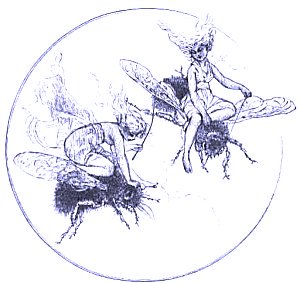

  
[Intangible Textual Heritage](../../../index)  [Sagas and
Legends](../../index)  [Celtic](../index) 

------------------------------------------------------------------------

<table width="75%">
<colgroup>
<col style="width: 50%" />
<col style="width: 50%" />
</colgroup>
<tbody>
<tr class="odd">
<td width="50%" data-valign="TOP"> 
</td>
<td width="50%" data-valign="TOP"><h1 id="the-fairy-mythology" data-align="CENTER">The Fairy Mythology</h1>
<h5 id="illustrative-of-the-romance-and-superstition-of-various-countries." data-align="CENTER">Illustrative of the Romance and Superstition of Various Countries.</h5>
<h2 id="by-thomas-keightley" data-align="CENTER">by Thomas Keightley</h2>
<h4 id="section" data-align="CENTER">[1870]</h4></td>
</tr>
</tbody>
</table>

------------------------------------------------------------------------

[Title Page](tfm000)  
[Table of Plates](tfm001)  
[Preface](tfm002)  
[Introduction](tfm003)  

### Oriental Romance

[Persian Romance](tfm004)  
[The Peri-Wife](tfm005)  
[Arabian Romance](tfm006)  

### Middle-Age Romance

[Middle-Age Romance](tfm007)  

### Fairy-Land

[Fairy-Land](tfm008)  

### Spenser's Faerie Queene

[Spenser's Faerie Queene](tfm009)  

### Eddas and Sagas

[Eddas and Sagas](tfm010)  
[The Alfar](tfm011)  
[The Duergar](tfm012)  
[Loki and the Dwarf](tfm013)  
[Thorston and the Dwarf](tfm014)  
[The Dwarf-Sword Tirfing](tfm015)  

### Scandanavia

[Scandanavia](tfm016)  
[Elves](tfm017)  
[Sir Olof in the Elve-Dance](tfm018)  
[The Elf Woman and Sir Olof](tfm019)  
[The Young Swain and the Elves](tfm020)  
[Svend Faelling and the Elle-Maid](tfm021)  
[The Elle-Maids](tfm022)  
[Maid Vae](tfm023)  
[The Elle-Maid near Ebeltoft](tfm024)  
[Hans Puntleder](tfm025)  
[Dwarfs or Trolls](tfm026)  
[Sir Thynnè](tfm027)  
[Proud Margaret](tfm028)  
[The Troll Wife](tfm029)  
[The Altar-Cup in Aagerup](tfm030)  
[Origin of Tiis Lake](tfm031)  
[A Farmer tricks a Troll](tfm032)  
[Skotte in the Fire](tfm033)  
[The Legend of Bodedys](tfm034)  
[Kallundborg Church](tfm035)  
[The Hill-Man invited to the Christening](tfm036)  
[The Troll turned Cat](tfm037)  
[Kirsten's Hill](tfm038)  
[The Troll-Labourer](tfm039)  
[The Hill-Smith](tfm040)  
[The Girl at the Troll-Dance](tfm041)  
[The Changeling](tfm042)  
[The Tile-Stove jumping over the Brook](tfm043)  
[Departure of the Trolls from Vendsyssel](tfm044)  
[Svend Faelling](tfm045)  
[The Dwarfs' Banquet](tfm046)  
[Nisses](tfm047)  
[The Nis Removing](tfm048)  
[The Penitant Nis](tfm049)  
[The Nis and the Boy](tfm050)  
[The Nis stealing Corn](tfm051)  
[The Nis and the Mare](tfm052)  
[The Nis Riding](tfm053)  
[The Nisses in Vosborg](tfm054)  
[Necks, Merman and Mermaids](tfm055)  
[The Power of the Harp](tfm056)  
[Duke Magnus and the Mermaid](tfm057)  

### Northern Islands

[Northern Islands](tfm058)  
[Iceland](tfm059)  
[Feroes](tfm060)  
[Shetland](tfm061)  
[Gioga's Son](tfm062)  
[The Mermaid Wife](tfm063)  
[Orkneys](tfm064)  
[Isle of Rugen](tfm065)  
[Adventures of John Dietrich](tfm066)  
[The Little Glass Shoe](tfm067)  
[The Wonderful Plough](tfm068)  
[The Lost Bell](tfm069)  
[The Black Dwarfs of Granitz](tfm070)  

### Germany

[Germany](tfm071)  
[Dwarfs](tfm072)  
[The Hill-Man at the Dance](tfm073)  
[The Dwarf's Feast](tfm074)  
[The Friendly Dwarfs](tfm075)  
[Wedding Feast of the Little People](tfm076)  
[Smith Riechert](tfm077)  
[Dwarfs stealing Corn](tfm078)  
[Journey of Dwarfs over the Mountain](tfm079)  
[The Dwarfs borrowing Bread](tfm080)  
[The Changeling](tfm081)  
[The Dwarf-Husband](tfm082)  
[Inge of Rantum](tfm083)  
[The Wild-Women](tfm084)  
[The Oldenburg Horn](tfm085)  
[Kobolds](tfm086)  
[Hinzelmann](tfm087)  
[Hödeken](tfm088)  
[King Goldemar](tfm089)  
[The Heinzelmänchen](tfm090)  
[Nixes](tfm091)  
[The Peasant and the Waterman](tfm092)  
[The Water-Smith](tfm093)  
[The Working Waterman](tfm094)  
[The Nix-Labour](tfm095)  

### Switzerland

[Switzerland](tfm096)  
[Gertrude and Rosy](tfm097)  
[The Chamois-Hunter](tfm098)  
[The Dwarfs on the Tree](tfm099)  
[Curiousity punished](tfm100)  
[The Rejected Gift](tfm101)  
[The Wonderful Little Pouch](tfm102)  
[Aid and Punishment](tfm103)  
[The Dwarf in search of Lodging](tfm104)  

### Great Britian

[Great Britian](tfm105)  
[England](tfm106)  
[The Green Children](tfm107)  
[The Fairy-Banquet](tfm108)  
[The Fairy-Horn](tfm109)  
[The Portunes](tfm110)  
[The Grant](tfm111)  
[The Luck of Eden Hall](tfm112)  
[The Fairy-Fair](tfm113)  
[The Fairies' Cauldron](tfm114)  
[The Cauld Lad of Hilton](tfm115)  
[The Pixy-Labour](tfm116)  
[Pixy-Vengence](tfm117)  
[Pixy-Gratitude](tfm118)  
[The Fairy Thieves](tfm119)  
[The Boggart](tfm120)  
[Addlers and Menters](tfm121)  
[The Fairy-Nursling](tfm122)  
[The Fairy-Labour](tfm123)  
[Ainsel and Puck](tfm124)  
[Scottish Lowlands](tfm125)  
[The Fairies' Nurse](tfm126)  
[The Fairy-Rade](tfm127)  
[The Changeling](tfm128)  
[Departure of the Fairies](tfm129)  
[The Brownie](tfm130)  

### Celts and Cymry

[Celts and Cymry](tfm131)  
[Ireland](tfm132)  
[Clever Tom and the Leprechaun](tfm133)  
[The Leprechaun in the Garden](tfm134)  
[The Three Leprechauns](tfm135)  
[The Little Shoe](tfm136)  
[Scottish Highlands](tfm137)  
[The Fairy's Inquiry](tfm138)  
[The Young Man in the Shian](tfm139)  
[The Two Fiddlers](tfm140)  
[The Fairy-Labour](tfm141)  
[The Fairy borrowing Oatmeal](tfm142)  
[The Fairy-Gift](tfm143)  
[The Stolen Ox](tfm144)  
[The Stolen Lady](tfm145)  
[The Changeling](tfm146)  
[The Wounded Seal](tfm147)  
[The Brownies](tfm148)  
[The Urisk](tfm149)  
[Isle of Man](tfm150)  
[The Fairy-Chapman](tfm151)  
[The Fairy-Banquet](tfm152)  
[The Fairies' Christening](tfm153)  
[The Fairy-Whipping](tfm154)  
[The Fairy-Hunt](tfm155)  
[The Fiddler and the Fairy](tfm156)  
[The Phynodderee](tfm157)  
[Wales](tfm158)  
[Tale of Elidurus](tfm159)  
[The Tylwyth Teg](tfm160)  
[The Spirit of the Van](tfm161)  
[Rhys at the Fairy Dance](tfm162)  
[Gitto Bach](tfm163)  
[The Fairies Banished](tfm164)  
[Brittany](tfm165)  
[Lai D'Ywenec](tfm166)  
[Lord Nann and the Korrigan](tfm167)  
[The Dance and Song of the Korred](tfm168)  
[Southern Europe](tfm169)  
[Greece](tfm170)  
[Italy](tfm171)  
[Spain](tfm172)  
[The Daughter of Peter de Cabinam](tfm173)  
[Origin of the House of Haro](tfm174)  
[La Infantina](tfm175)  
[Pepito el Corcovado](tfm176)  
[France](tfm177)  
[Legend of Melusina](tfm178)  

### Eastern Europe

[Eastern Europe](tfm179)  
[Finns](tfm180)  
[Slaves](tfm181)  
[Vilas](tfm182)  
[Deer and Vila](tfm183)  

### Africans, Jews, etc.

[Africans, Jews, etc.](tfm184)  
[Africans](tfm185)  
[Jews](tfm186)  
[The Broken Oaths](tfm187)  
[The Moohel](tfm188)  
[The Mazik-Ass](tfm189)  

### Conclusion

[Conclusion](tfm190)  

### Appendices

[The Harvest Dinner](tfm191)  
[The Young Piper](tfm192)  
[The Soul Cages](tfm193)  
[Barry of Cairn Thierna](tfm194)  
[Aileen a Roon](tfm195)  
[Rousseau's Dream](tfm196)  
[Alexander Selkirk's Dream](tfm197)  
[A Moonlight Scene](tfm198)  
[Lines Written in a Lady's Album](tfm199)  
[To Amanda](tfm200)  
[Lines](tfm201)  
[A Farewell](tfm202)  
[Verses](tfm203)  
[Father Cuddy's Song](tfm204)  
[The Praises of Mazenderan](tfm205)  
