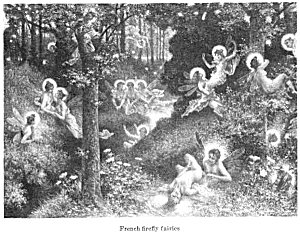

  
[Intangible Textual Heritage](../../../index)  [Sagas and
Legends](../../index)  [Celtic](../index)  [Index](index) 
[Next](tfm001) 

------------------------------------------------------------------------

# The Fairy Mythology

##### Illustrative of the Romance and Superstition of Various Countries.

## by Thomas Keightley

###### \[b. 1789 d. 1872.\]

#### London, H. G. Bohn,

#### \[1870\]

###### Scanned and redacted by Phillip Brown. Additional formatting and proofing at Intangible Textual Heritage by John B. Hare. This text is in the public domain. This file may be used for any non-commercial purpose provided this notice of attribution is left intact.

 

------------------------------------------------------------------------

[Next: Table of Plates](tfm001)
