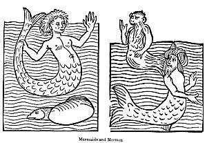

  
[Intangible Textual Heritage](../../../index)  [Sagas and
Legends](../../index)  [Celtic](../index)  [Index](index) 
[Previous](tfm165)  [Next](tfm167) 

------------------------------------------------------------------------

LAI D'YWENEC

>  

> I HAVE in thought and purpose too,  
> Of Ywenec to tellon you--  
> Of whom he born was, his sire's fame,  
> How first he to his mother came.  
> He who did beget Ywenec  
> Y-clepod was Eudemarec.

> There formerly lived in Britain a man who was rich and old. He was
> Avoez or governor of Caerwent on the Doglas, and lord of the
> surrounding country. Desirous of having an heir to his estates, he
> espoused a maiden "courteous and sage, and passing fair." She was
> given to him because he was rich, and loved by him for her beauty. Why
> should I say more, but that her match was not to be found between
> Lincoln and Ireland? "Great sin did they who gave her him," adds the
> poet.

> On account of her rare beauty, the jealous husband now turned all his
> thoughts to keeping her safe. To this end he shut her up in his tower,
> in a large room, to which no one had access but himself and his
> sister, an old widow, without whose permission the young wife was
> forbidden to speak to any even of her female attendants. In this tower
> the suspicious husband immured his lovely bride for seven years,
> during which time they had no children, nor did she ever leave her
> confinement on any account. She had neither chamberlain nor huissier
> to light the tapers in her chamber when she would retire, and the poor
> lady passed her time weeping, sighing, and lamenting; and from grief
> and neglect of herself losing all her beauty.

> The month of April was entering,  
> When every bird begins to sing;  
> Her lord arose at early day,  
> And to the wood he takes his way.

> Before he set out he called up the old dame to fasten the door after
> him. This done, she took her psalter and retired to another room to
> chant it. The imprisoned lady awoke in tears, seeing the brightness of
> the sun, and thus began her moan:

> Alas! said she, why born was l?  
> Right grievous is my destiny:  
> In this towére imprisoned,  
> I ne'er shall leave it till I'm dead.

> She marvels at the unreasonable jealousy of her old husband, curses
> her parents, and all concerned in giving her to a man not only so
> unamiable, but who was of so tough a constitution that the chance of
> his dying seemed infinitely remote.

> When baptised he was to be,  
> In hell's rivere deep dipt was he;  
> Hard are his sinews, hard each vein,  
> And lively blood they all contain.  
> Oft have I heard the people tell,  
> That in this country there befell  
> Adventures in the days of yore,  
> That did to joy grieved hearts restore;  
> Knights met with damsels, fair and gent,  
> In all things unto their talent;  
> And dames met lovers courteous,  
> Handsome, and brave, and generous;  
> So that they never blamed were,  
> For save themselves none saw them e'er. \[a\]  
> If this may be, or ever was,  
> Or any it befallen has,  
> May God, who hath all might and power,  
> My wish perform for me this hour.

> Scarcely had she uttered this pious wish, when she perceived the
> shadow of a large bird at a narrow window. The bird now flew into the
> room. He had jesses on his legs, and appeared to be a goss-hawk. \[b\]
> He placed himself before the lady, and in a few minutes after became a
> handsome gentle knight. The lady was terrified at the sight, and
> covered her head; but the knight was courteous, and addressed her,

> Lady, said he, be not thus stirred;  
> A goss-hawk is a gentle bird.  
> If my secréte should be obscure,  
> Attend, and I will you assure;  
> Maketh now of me your lovére,  
> For that it is I am come here.  
> Long have I loved you and admired,  
> And in my heart have much desired;  
> I ne'er have loved save you alone,  
> And save you never shall love none;  
> But I could never come to you,  
> Nor from own countrie issue,  
> If you had not required me:  
> Your lover now I may well be.

> The lady was now re-assured: she uncovered her head, and told the
> knight she would accept him as her *Dru*, if she were satisfied that
> he believed in God. On this head, he assures her,

> I in the Créator believe,  
> Who did from misery us relieve,  
> In which us Adam our sire put,  
> By eating of that bitter fruit:  
> He is, and was, and ever he  
> To sinners life and light will be.

> And to put the matter out of all doubt, he directs her to feign
> sickness, and send for the chaplain, when he undertakes to assume her
> form, and receive the holy Sacrament. The dame does accordingly; and
> the old woman, after many objections, at length sends for the
> chaplain.

> And he with all due speed did hie,  
> And brought the Corpus Domini.  
> The knight received the holy sign,  
> And from the chalice drank the wine \[c\]  
> The chaplain then his way is gone--  
> The old dame shut the doors anon.

> The scruples of the lady being now entirely removed, she grants *le
> don d'amoureuse merci*, and the bliss of the lovers is complete. At
> length the knight takes his leave, and in reply to the lady's
> question, of when she should see him again, he tells her that she has
> only to wish for him, and the wish will be fulfilled by his
> appearance; \[d\] but he warns her to beware of the old woman, who
> will closely watch her, assuring her at the same time that a discovery
> will be his certain death.

> The lady now bids adieu to all sadness and melancholy, and gradually
> regains all her former beauty. She desires no longer to leave her
> tower; for, night or day, she has only to express a wish, and her
> knight is with her. The old lord marvels greatly at this sudden
> change, and begins to distrust the fidelity of his sister. On
> revealing his suspicions, her replies fully satisfy him on that head,
> and they concert between them how to watch the young wife, and to
> discover her secret. After an interval of three days, the old lord
> tells his wife that the king has sent for him, and that he must attend
> him, but will soon return. He sets out, and the old woman having
> closed the door as usual after him, gets behind a curtain to watch.
> The lady now wishes for her lover, and instantly he is with her, and
> they continue together till it is time to rise. He then departs,
> leaving the spy, who had seen how he came and went, terrified at the
> strange metamorphosis.

> When the husband, who was at no great distance, came home, his spy
> informed him of the strange affair. Greatly grieved and incensed at
> this, he began to meditate the destruction of his rival. He
> accordingly got four pikes made, with steel-heads so sharp that

> No razor under heaven's sheen  
> Was ever yet so sharp and keen.

> These he set at the window through which the knight was used to enter.
> Next day he feigns to go to the chase, the old woman returns to her
> bed to sleep, and the lady anxiously expects "him whom she loveth
> loyally,"

> And says that he may come safely,  
> And with her at all leisure be.

> So said, so done: the bird was at the window; but alas! too eager for
> caution, he overlooked the pikes, and, flying against them, was
> mortally wounded. Still he entered the chamber and threw himself on
> the bed, which his blood soon filled, and thus addressed his
> distracted mistress:

> He said unto her-- " My sweet friend,  
> For you my life comes to an end;  
> I often told you 't would be so,  
> That your fair cheer would work us woe."  
> When she heard this she swooned away,  
> And long time there for dead she lay;  
> Her gently to herself he brought,  
> And said, that grief availeth nought;  
> That she by him a son would bear,  
> Valiant and wise, and debonair;  
> He would dispel her sorrows all.  
> Ywenec she should him call.  
> He wouldè vengeance for their sake  
> Upon their trait'rous enemy take. \[e\]

> Exhausted with loss of blood, he can stay no longer. He departs; and
> the lady, uttering loud cries of woe, leaps after him, unapparelled as
> she is, out of the window, which was twenty feet from the ground, and
> pursues him by the traces of his blood.

> Along his path strayed the dame,  
> Until unto a hill she came. \[f\]  
> Into this hill one entrance led;  
> It with the blood was all sprinkled.  
> Before her she can nothing see;  
> Whereat she thinketh full surely  
> Her lover thither is gone in.  
> She entereth with mickle teen;  
> Within it light ne found she none;  
> Thorow it still she goeth on,  
> Until she from the hill issued  
> In a fair meadow, rich and good.  
> With blood she stained found the grass,  
> At which she much dismayed was;  
> The trace lay of it on the ground.  
> Quite near she there a city found;  
> With walls it was enclosed all--  
> There was not house, nor tower, nor hall,  
> That did not seem of silver fair:  
> The Mandevent \[g\] right wealthy are.  
> Before the town lay marshes rude,  
> The forest, and wild solitude.  
> On the other side, toward the donjón,  
> The water all around did run;  
> And here the shippès did enter,  
> More thannè three hundréd they were.  
> The lower gate wide open lay;  
> Therein the lady took her way,  
> Stil following the blood, that fell  
> The townè thorow to the castél.  
> Unto her spake there no one,  
> Ne man nor woman found she none.  
> She to the palace came; with blood  
> The steps she found were all embrued;  
> She entered then a low chambére;  
> A knight she found fast sleeping there;  
> She knew him not--she passed on--  
> To a larger chamber came anon;  
> A bed, and nothing more, there found,  
> A knight was on it sleeping sound.  
> Still farther passed on the dame;  
> Unto the third chambére she came,  
> Where she gan find her lover's bed.  
> The posts were gold enamelled;  
> I could not price the clothes aright:  
> The chandeliers and tapers bright,  
> Which night and day burned constantly,  
> Were worth the gold of a citee.

> She finds her lover at the point of death.

> At seeing his wretched state the unhappy lady swoons again. The
> expiring knight endeavours to console her; and, foretelling his own
> death on that day, directs her to depart, lest his people in their
> grief should ill treat her as the cause of his death. She, however,
> protests that she will stay and die with him, as, if she returns, her
> husband will put her to death. The knight repeats his consolations,
> and gives her a ring, which, while she wears, her husband will retain
> no remembrance of what relates to her. At the same time he gives her
> his sword, which she is to keep safely and to give to her son when
> grown up and become a valiant knight. He says, she then

> Unto a festival will go;  
> Her lord will thither wend also;  
> Unto an abbey they will come,  
> Where they will see a stately tomb,  
> Will learn the story of the dead,  
> And how he was there buried.  
> There thou the sword shalt to him reach,  
> And all the adventure then teach,  
> How he was born, who was his sire;  
> His deeds enough will then admire.

> He then gave her a dress of fine silk, and insisted on her departure.
> She is with difficulty induced to leave him, and is hardly half a
> league from the place when she hears the bells tolling, and the cries
> of grief of the people for the death of their lord. She faints four
> times, but at length recovering retraces her steps, and returns to her
> tower. Her husband makes no inquiry, and gives her no farther
> uneasiness. She bare a son, as Eudemarec had foretold, and named him
> Ywenec. As he grew up, there was not his peer in the kingdom for
> beauty, valour, and generosity.

> After Ywenec had been dubbed a knight, his supposed father was
> summoned to attend the feast of St. Aaron at Carlion. He went,
> accompanied by his wife and Ywenec. On their way, they stopped at a
> rich abbey, where they were received with the utmost hospitality. Next
> day, when they asked to depart, the abbot entreated them to stay a
> little longer till he should show them the rest of the abbey. They
> consented, and after dinner,

> On entering the chapter-room,  
> They found a large and stately tomb,  
> Covered with rich tapestry,  
> Bordered with gold embroidery.  
> At head and feet and sides there were  
> Twenty tapers burning clear;  
> Of fine gold were the chandeliers;  
> Of amethyst were the censéres,  
> With which they incensed alwáy,  
> For great honour, this tomb each day.

> The curiosity of the visitors was excited by the sight of this
> magnificent tomb, and they learned, on inquiry, that therein lay one
> of the noblest and most valiant knights that had ever lived. He had
> been king of that country, and had been slain at Caerwent for the love
> of a lady, leaving a vacancy in the throne which had never been since
> filled, it being reserved, according to his last commands, for his son
> by that lady.

> When the Dame heard this, she called aloud to her son,

> "Fair son, you now have heard," she said,  
> "That God hath us to this place led.  
> It is your father here doth lie,  
> Whom this old man slew wrongfully."

> She then gave him the sword she had kept so long, relating the whole
> story to him. At the conclusion she fainted on the tomb, and expired.
> Filled with rage and grief, Ywenec at one blow struck off the head of
> the old man, and avenged both his father and mother. The lady was
> buried in the coffin with him whom she had loved, and the people
> joyfully acknowledged Ywenec as king of the country.

> Long time after maden they,  
> Who heard this adventure, a Lay  
> Of the grief and the dolour  
> That for love these did endure.

> There are still to be seen in Brittany the rock, the cavern, the
> fountain, the hole, the valley, etc., of the Fées.

> The forest of Brezeliande, near Quintin, was, in the twelfth and
> thirteenth centuries, regarded as the chief seat of Breton wonders. It
> contained the tomb of Merlin. Robert de Ware, hearing of the wonders
> of this forest, visited it; but, by his own account, to little
> purpose.

> La allai je merveilles querre (*chercher*),  
> Vis lit forêt et via la terre;  
> Merveilles quis (*cherchai*) main ne troval,  
> Fol m'en revins, fol y allai;  
> Fol y allai, fol men revins,  
> Folie quis, por fol me tins. \[h\]

> There were also the Fountain of Berenton and the Perron (*block*, or
> *steps*) Merveilleux.

> En Bretagne ce treuve-on  
> Une Fontaine et un Perron;  
> Quant on gette l'iaue (*eau*) dessus  
> Si vente et tonne et repluit jus (*à bas*).

> Huon do Méry was more fortunate than Ware. He sprinkled the Perron
> from the golden basin which hung from the oak that shaded it, and
> beheld all the marvels. \[i\]

> Such is the result of our inquiries respecting the Fairy system of the
> "oldè gentil Bretons." Owing to the praiseworthy labours of a Breton
> gentleman of the present day, \[j\] we are enabled to give the
> following account of it as it actually prevails in Brittany.

> Our author divides the Breton fairies into two classes,--the Fays
> (*Fées*) and the Dwarfs (*Nains*); of which the Breton name seems to
> be Korrig or Korrigan, and Korr or Korred. \[k\] The former he
> identifies, as we have seen, very plausibly, with the Gallicenae of
> Mela; for he says that the ancient Welsh bards declare that they
> reverenced a being of the female sex named Korid-gwen, *i. e.*
> Korid-woman, to whom they assigned nine virgins as attendants. To this
> being Taliesin gives a magic vase, the edges of which are adorned with
> pearl, and it contains the wondrous water of bardic genius and of
> universal knowledge.

> The Korrigan, our authority further states, can predict the future,
> assume any form they please, move from place to place with the
> rapidity of thought, cure maladies by the aid of charms which they
> communicate to their favourites. Their size is said not to exceed two
> feet, but their proportions are most exact; and they have long flowing
> hair, which they comb out with great care. Their only dress is a long
> white veil, which they wind round their body. Seen at night, or in the
> dusk of the evening, their beauty is great; but in the daylight their
> eyes appear red, their hair white, and their faces wrinkled; hence
> they rarely let themselves be seen by day. They are fond of music, and
> have fine voices, but are not much given to dancing. Their favourite
> haunts are the springs, by which they sit and comb their hair. They
> are said to celebrate there every returning spring a great nocturnal
> festival. On the sod at its brink is spread a table-cloth white as the
> driven snow, covered with the most delicious viands. In the centre is
> a crystal cup, which emits such light that there is no need of lamps.
> At the end of the banquet a cup goes round filled with a liquor, one
> drop of which would make one as wise as God himself. At the approach
> of a mortal the whole vanishes.

> Like fairies in general the Korrigan steal children, against which the
> remedy usually employed is, to place the child under the protection of
> the Virgin, by putting a rosary or a scapulary about its neck. They
> are also fond of uniting themselves with handsome young men to
> regenerate, as the peasants say, their accursed race. The general
> belief respecting them is, that they were great princesses who, having
> refused. to embrace Christianity when it was preached in Armorica by
> the Apostles, were struck by the curse of God. Hence it is that they
> are said to be animated by a violent hatred of religion and the
> clergy. The sight of a *soutane*, or the sound of a bell, puts them to
> flight; but the object of greatest abhorrence to them is the Holy
> Virgin. The last trait to be noticed. of these beings is, that, like
> simiilar beings in other countries, their breath is deadly.

> The reader must have observed. the strong resemblance which the
> Korrigan bear to the Elle-maids of Scandinavia. In like manner the
> Korred are very similar to the Trolls. \[l\] These are usually
> represented as short and stumpy with shaggy hair, dark wrinkled faces,
> little deep-set eyes, but bright as carbuncles. Their voice is cracked
> and hollow:

> their hands have claws like a cat's; their feet are horny like those
> of a goat. They are expert smiths and coiners; the are said to have
> great treasures in the *dolmen* \[m\] in which they dwell, and of
> which they are regarded as the builders. They dance around them by
> night, and wo to the belated peasant who, passing by, is forced to
> join in their roundel; he usually dies of exhaustion. Wednesday is
> their holiday; the first Wednesday in May their annual festival, which
> they celebrate with dancing, singing, and music. They have the same
> aversion to holy things as the Korrigan; like them, too, they can
> fortell events to come. The Korrid is always furnished with a large
> leathern purse, which is said to be full of gold; but if any one
> succeeds in getting it from him, he finds nothing in it but hair and a
> pair of scissors.

>  

> The Bretons also believe in Mermaids; they name them Morgan
> (*sea-women*) and Morverc'h (*sea-daughters*), and say that they draw
> down to their palaces of gold and crystal at the bottom of the sea or
> of ponds, those who venture imprudently too neat the edge of the
> water. Like the mermaids they sing and comb their golden hair. In one
> of the ballads we read, "Fisher, hast thou seen the mermaid combing
> her hair, yellow as gold, by the noontide sun, at the edge of the
> water?" "I have seen the fair mermaid. I have also heard her singing;
> her, songs were plaintive as the waves." \[n\]

> In M. Villemarqué's collection there are three ballads relating to the
> Korrigan and Korred. The following is a faithful translation of the
> first of them in the exact measure of the original. All the Breton
> poetry is rimed, very frequently in triads or tercets.

>  

------------------------------------------------------------------------

> \[a\] This manifestly alludes to Laval or Graeleat, or similar
> stories.

> \[b\] It follows, in M. de Roquefort's edition,  
>   
> "Deci ne muez fu ou déeis"  
>   
> Of which we can make no sense, and the French translation gives no
> aid. In the Harleian MS. it is

> "De cinc muez fu ou de sis,"

> which is more intelligible.

> \[c\] This tends to prove that this is a translation from the Breton;
> for Innocent III., in whose pontificate the cup was first refused to
> the laity, died in 1216, when Henry III., to whom Marie is supposed to
> have dedicated her Lais, was a child.

> \[d\] The same was the case with the Wünschelweib (*Wish-woman*) of
> German romance.

> Swenne du einêst wünachest nach mir,  
> So bin ich endelichen bi dir,

> says the lady to the Staufenberger. She adds,

> War ich wil da bin ich,  
> Den Wunsch hat mir Got gegeben.

> He finds it to be true,

> Er wünschte nach der frouwen sin,  
> Bi im so war diu schiune sin.

> GRIMM, *Deut. Mythol*, p. 391.

> \[e\] In the Shah-nameh, Siyawush, when he foresees his own death by
> the treachery of Afrasiab, tells his wife Ferengis, the daughter of
> that monarch, that she will bear a son whom she is to name Ky Khosroo,
> and who will avenge the death of his father: see Görres, Heldenbuch
> von Iran, ii. 32.

> \[f\] Desi k'a une hoge vint:  
> En cele hoge ot une entree.

> M. de Roquefort, in his Glossaire de Ia Langue Romaine, correctly
> renders *hoge* by *colline*. In his translation of this Lai he renders
> it by *cabane*, not, perhaps, understanding how a hill could be
> pervious. The story, however, of Prince Ahmed, and the romance of
> Orfeo and Heurodis, are good authority on this point.

> \[g\] In the Harleian MS. Mandement. M. Ce Roquefort confesses his
> total ignorance of this people; we follow his example. May it not,
> however, be connected with *manant*, and merely signify people,
> inhabitants?

> \[h\] Roman de Roux, *v*. ii. 234.

> \[i\] See Roquefort, Supplément au Glossaire de la Langue Romaine *s.
> v.* Perron.

> \[j\] Barzan-Breiz, Chants Populaires de la Bretagne, recueilles et
> publiés par Th. Hersart de la Villemarqué. Paris, 1846. This is a most
> valuable work and deserving to take its place with the Ballads of
> Scotland, Scandinavia, and Servia, to none of which is it inferior. To
> the credit of France the edition which we use is the fourth. How
> different would the fate of such a work be in this country!

> \[k\] We make this distinction, because in the ballads in which the
> personage is a Fay, the word used is Korrigan or Korrig, while in that
> in which the Dwarfs are actors, the words are Korr and Korred. But the
> truth is, they are all but different forms of Korr. They are all the
> same, singular and plural. The Breton changes its first consonant like
> the Irish. We also meet with Crion, Goric, Couril, as names of these
> beings, but they are only forms of those given above.

> \[l\] Hence we may infer that they came originally from Scandinavia,
> communicated most probably by the Normans.

> \[m\] Stone-tables. They are called by the same name in Devon and
> Cornwall; is Irish their appellation is Cromleach.

> \[n\] Barzan-Breiz., l. xlix. 69.

>  

------------------------------------------------------------------------

[Next: Lord Nann and the Korrigan](tfm167)
