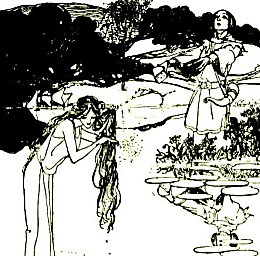

  
[Intangible Textual Heritage](../../../index)  [Sagas and
Legends](../../index)  [Celtic](../index) 

------------------------------------------------------------------------

<table width="75%">
<colgroup>
<col style="width: 50%" />
<col style="width: 50%" />
</colgroup>
<tbody>
<tr class="odd">
<td width="50%" data-valign="TOP"> 
</td>
<td width="50%" data-valign="TOP"><h1 id="the-welsh-fairy-book" data-align="CENTER">The Welsh Fairy Book</h1>
<h2 id="by-w.-jenkyn-thomas" data-align="CENTER">by W. Jenkyn Thomas</h2>
<h4 id="section" data-align="CENTER">[1908]</h4></td>
</tr>
</tbody>
</table>

------------------------------------------------------------------------

[Title Page](wfb00)  
[Preface](wfb01)  
[Notes on Welsh Pronunciation](wfb02)  
[The Lady of the Lake](wfb03)  
[Arthur in the Cave](wfb04)  
[The Curse of the Pantannas](wfb05)  
[The Drowning of the Bottom Hundred](wfb06)  
[Elidyr's Sojurn in Fairy Land](wfb07)  
[Rhys and Llywelyn](wfb08)  
[Lowri Dafydd Earns a Purse of Gold](wfb09)  
[The Llanfabon Changeling](wfb10)  
[Why the Red Dragon is the Emblem of Wales](wfb11)  
[Lyn Cwm Llwch](wfb12)  
[The Adventures of Three Farmers](wfb13)  
[Cadwaladr and his Goat](wfb14)  
[The Fairy Wife](wfb15)  
[Einion and the Lady of the Greenwood](wfb16)  
[The Green Isles of the Ocean](wfb17)  
[March's Ears](wfb18)  
[The Fairy Harp](wfb19)  
[Guto Bach and the Fairies](wfb20)  
[Ianto's Chase](wfb21)  
[The Stray Cow](wfb22)  
[Bala Lake](wfb23)  
[The Forbidden Fountain](wfb24)  
[Tudur ap Einion](wfb25)  
[The Fairy Walking Stick](wfb26)  
[Dick the Fiddler's Money](wfb27)  
[A Strange Otter](wfb28)  
[Fairy Ointment](wfb29)  
[Pergrin and the Mermaiden](wfb30)  
[The Cave of the Young Men of Snowdonia](wfb31)  
[Einion and the Fair Family](wfb32)  
[St Collen and the King of Fairy](wfb33)  
[Helig's Hollow](wfb34)  
[Owen Goes A-Wooing](wfb35)  
[The Fairy Reward](wfb36)  
[Why Deunant has the Front Door in the Back](wfb37)  
[Getting Rid of Fairies](wfb38)  
[The Mantle of Kings' Beards](wfb39)  
[Pedws Ffowk and St. Elian's Well](wfb40)  
[Magic Music](wfb41)  
[Sili go Dwt](wfb42)  
[Another Changeling](wfb43)  
[A Fairy Borrowing](wfb44)  
[Treasure Seeking](wfb45)  
[The Richest Man](wfb46)  
[St. Beuno and the Curlew](wfb47)  
[The Cat Witches](wfb48)  
[The Swallowed Court](wfb49)  
[What Marged Rolant Saw](wfb50)  
[Ned Puw's Farewell](wfb51)  
[Pennard Castle](wfb52)  
[The Man with the Green Weeds](wfb53)  
[Goronwy Tudor and the Witches of Llanddons](wfb54)  
[Robin's Return](wfb55)  
[The Harper's Gratuity](wfb56)  
[Six and Four are Ten](wfb57)  
[Envy Burns Itself](wfb58)  
[The Bride from the Red Lake](wfb59)  
[A Fairy Dog](wfb60)  
[Grace's Well](wfb61)  
[The Fairy Password](wfb62)  
[St. Winifred's Well](wfb63)  
[The Ancients of the World](wfb64)  
[Nansi Llwyd and the Dog of Darkness](wfb65)  
[An Adventure in the Big Bog](wfb66)  
[The Pwca of the Trwyn](wfb67)  
[John Gethin and the Candle](wfb68)  
[Fetching a Halter](wfb69)  
[Dai Sion's Homecoming](wfb70)  
[Melangell's Lambs](wfb71)  
[Syfaddon Lake](wfb72)  
[The Power of St Tegla's Well](wfb73)  
[The Men of Ardudwy](wfb74)  
[The Parti-coloured Cow](wfb75)  
[Striking a Corpse Candle](wfb76)  
[Hu Gadarn](wfb77)  
[The Devil's Bridge](wfb78)  
[The Martyred Hound](wfb79)  
[Twm of the Fair Lies](wfb80)  
[Black Robin](wfb81)  
[Llyn Llech Owen](wfb82)  
[A Ghostly Rehersal](wfb83)  
[A Phantom's Funeral](wfb84)  
[Why the Robin's Breast is Red](wfb85)  
