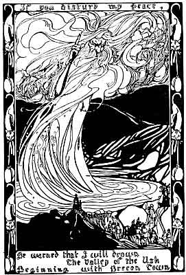

  
[Intangible Textual Heritage](../../../index)  [Sagas and
Legends](../../index)  [Celtic](../index)  [Index](index) 
[Previous](wfb11)  [Next](wfb13) 

------------------------------------------------------------------------

Llyn Cwm Llwch

 

AT the foot of Pen y Fan, the principal peak of the Beacons of Brecon,
is a lake called Llyn Cwm Llwch, overhung by frowning precipices, the
home of croaking ravens, the only birds which will venture near the dark
waters of the mere.

In very ancient times there was a door in a rock hard by, which opened
once in each year--on May Day--and disclosed a passage leading to a
small island in the centre of the lake. This island was, however,
invisible to those who stood upon the shore. Those who ventured down the
secret passage on May Day were most graciously received by the fairies
inhabiting the island, whose beauty was only equalled by their courtesy
to their guests. They entertained them with delicious fruits and
exquisite music. and disclosed to them many events of the future. They
laid down one condition only, and that was that none of the produce of
the island was to be carried away, because the island was sacred.

It happened upon one of these annual visits that an evil visitor, when
he was about to leave the island, put a flower in his pocket. His theft
did him no good: as soon as he reached unhallowed ground his senses left
him, and he was a jibbering idiot all the days of his life. Of this
injury the fairies took no notice at the time. They dismissed the rest
of their guests with their accustomed courtesy, and the door was closed
as usual. But their resentment ran high. Those who went to pay them a
visit on May Day the year after failed to find the door, and it has
never been found from that day to this.

Some hundreds of years after, the inhabitants of the neighbourhood
formed a plan of draining the lake to see whether the fairies had left
any treasure at the bottom of it. They assembled at the lake one day in
considerable numbers with spades and pickaxes, and set to work with such
vigour that in a few hours they had dug a trench thirty yards in depth
(the remains of it may still be seen). At last they had got so near the
mere that it seemed as if another blow of the pickaxe would break
through the bank and let out the water. Just as this blow was going to
be given, just as the pickaxe was lifted up to complete the undertaking,
a flash of lightning was seen which averted the blow; the sky became
black, a loud peal of thunder rolled among the mountains, waking their
thousand echoes, and all the workmen ran from the trench and stood in
awe upon the brink of the lake. As the sound of the thunder died away, a
sort of ripple was perceived on the face of the water, and the centre of
the lake became violently agitated. From this boiling eddy was seen to
arise a figure of gigantic stature, whose hair and beard were at least
three yards in length. Standing nearly half out of the water, he
addressed the workmen:

"If you disturb my peace,  
Be warned that I will drown  
The valley of the Usk,  
Beginning with Brecon town."

He concluded by saying, "Remember the token of the cat," and then
disappeared amidst a terrific storm of thunder and lightning.

When the wonder and fear had a little subsided, the people began to
discuss the matter together. They could perfectly understand the
warning, but they were much perplexed about the "token of the cat,"
which conveyed no meaning at all to them. At this point an old man of
the name of Thomas Sion Rhydderch came forward and said he could explain
the words. "When I was a young lad," he said, "I was tending some sheep
on yonder mountain, and a woman, who had a very troublesome cat, asked
me to take it with me one morning to drown it in this lake. When I
arrived here, I took off my garter and with it tied a large stone to the
cat's neck, and threw it into the water. The cat of course immediately
sank out of sight. The next day I went in a boat on Llyn Syfaddon to
fish. What should I see floating in the middle of the lake but the very
cat which I had drowned in Llyn Cwm Llwch, with my garter around its
body! I was much frightened, because the two lakes are miles apart and
there is no stream flowing from the one to the other, and I have never
mentioned it to a living soul until to-day."

From this they concluded that there is some mysterious connection
between Llyn Syfaddon and Llyn Cwm Llwch, and that, though the latter is
but small, yet if they attempted to drain it, the large lake would
assist its little relative and avenge any injury done to it by
discharging its vast body of water over the whole of the adjacent
country. Accordingly they left the trench which they had dug unfinished
and departed to their homes.

  
 

------------------------------------------------------------------------

[Next: The Adventures of Three Farmers](wfb13)
