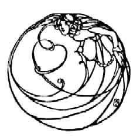

  
[Intangible Textual Heritage](../../../index)  [Sagas and
Legends](../../index)  [Celtic](../index)  [Index](index) 
[Previous](wfb35)  [Next](wfb37) 

------------------------------------------------------------------------

The Fairy Reward

IANTO LLYWELYN lived by himself in a cottage at Llanfihangel. One night
after he had gone to bed he heard a noise outside the door of the house.
He opened his window and said, "Who is there? And what do you want?" He
was answered by a small silvery voice, "It is room we want to dress our
children." lanto went down and opened the door: a dozen small beings
entered carrying tiny babies in their arms, and began to search for an
earthen pitcher with water; they remained in the cottage for some hours,
washing the infants and adorning themselves. Just before the cock crew
in the morning they went away, leaving some money on the hearth as a
reward for the kindness they had received.

After this lanto used to keep his fire of coal balls burning all night
long, leaving a vessel of water on the hearth, and bread with its
accompaniments on the table, taking care, also, to remove everything
made of iron before going to bed. The fairies often visited his cottage
at night, and after each visit he found money left for him on the
hearth. lanto gave up working, and lived very comfortably on the money
which he received in return for his hospitality from the Fair Family.
His income from this source was more than enough to keep himself in
comfort, so lanto married a wife.

Betsi--that was the name of her whom lanto thus honoured--did not bother
about the way in which he got his money before she married him, but
after the knot had been tied she became very curious. lanto refused to
tell her, and this of course made her more inquisitive than ever. "I
don't believe you get it honestly," she said. lanto denied by wood,
field and mountain that there was anything dishonest about his means of
livelihood. She gave him no peace, however. "Nine shames on you," she
said, "for having a bad secret from your own dear wife." "But,"
remonstrated lanto, "if I tell you, Betsi *bach,* I'll never get any
more money." "Ah," she said (she had already had her doubts about
lanto's nightly preparations of fire and hot water), "then it's the
fairies." "Drato," said he, "yes, the fairies it is." With that he
thrust his hands down in his breeches pocket in a sullen manner and left
the house. He had seven shillings in his pockets up to that minute. When
he went feeling for them, thinking that a glass of beer and a pipe of
tobacco at the inn would not be amiss after such a matrimonial squabble,
he found they were gone. In place of them were some pieces of paper, no
good even to light his pipe. From that day the fairies brought him no
more money, and he had once more to eat his bread in the sweat of his
face, which is a more scriptural but less pleasant method of earning a
living than gathering up fairy money.

 

------------------------------------------------------------------------

[Next: Why Deunant has the Front Door in the Back](wfb37)
