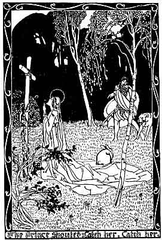

  
[Intangible Textual Heritage](../../../index)  [Sagas and
Legends](../../index)  [Celtic](../index)  [Index](index) 
[Previous](wfb70)  [Next](wfb72) 

------------------------------------------------------------------------

Melangell's Lambs

 

BROCHWEL, the Prince of Powys, upon a certain day in the year of our
Lord 604, was hunting in a place called Pennant. His hounds started a
hare, and pursued it into a dense thicket. Following them into the
thicket, he saw a beautiful maiden on her knees praying devoutly to God.
The hare was lying on the folds of her garment, facing the hounds
boldly. The Prince shouted, "Catch her, catch her!" but the more he
urged his hounds on, the further did they retreat, and at last they fled
away, howling with terror. The Prince, astonished at the strange
behaviour of his hounds, turned to the maiden and asked her who she was.
"I am the daughter of a King of Ireland," she answered, "and because my
father desired to wed me to one of his chiefs, I fled from my native
soil, and, God guiding me, came to this desert place, where for fifteen
years I have served God without seeing the face of any man." The Prince
enquired her name, and she replied that she was called Melangell (the
Latin form of the name is Monacella). Thereupon the Prince broke forth
in these words, "O most worthy Melangell, I perceive that thou art the
handmaiden of the true God. Because it hath pleased Him for thy merits
to give protection to this little wild hare from the attack and pursuit
of the ravening hounds, I give and present to thee with willing mind
these my lands for the service of God, to be a perpetual asylum and
refuge. If any men or women flee hither to seek thy protection, provided
they do not pollute thy sanctuary, let no prince or chieftain be so rash
towards God as to attempt to drag them forth."

Melangell passed the rest of her days in this lonely place, sleeping on
bare rock. Many were the miracles which she wrought for those who sought
refuge in her sanctuary with pure hearts. The little wild hares were
ever under her special protection, and that is why they are called
"Melangell's lambs." Even now, if a hare is pursued by hounds and
someone shouts after it, "God and Melangell be with thee," it will
escape.

 

------------------------------------------------------------------------

[Next: Syfaddon Lake](wfb72)
