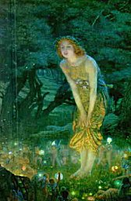

  
[Intangible Textual Heritage](../../../index)  [Sagas and
Legends](../../index)  [Celtic](../index) 

------------------------------------------------------------------------

<table width="75%">
<colgroup>
<col style="width: 50%" />
<col style="width: 50%" />
</colgroup>
<tbody>
<tr class="odd">
<td width="50%" data-valign="TOP"> 
</td>
<td width="50%" data-valign="TOP"><h1 id="british-goblins" data-align="CENTER">British Goblins</h1>
<h5 id="welsh-folk-lore-fairy-mythology-legends-and-traditions" data-align="CENTER">Welsh Folk-lore, Fairy Mythology, Legends and Traditions</h5>
<h2 id="by-wirt-sikes" data-align="CENTER">by Wirt Sikes</h2>
<h4 id="section" data-align="CENTER">[1880]</h4></td>
</tr>
</tbody>
</table>

------------------------------------------------------------------------

[Title Page](wfl00)  
[Chapter I: Fairy Tales and the Ancient Mythology](wfl01)  
[Chapter II: Classification of Welsh Fairies](wfl02)  
[Chapter III: Lake Fairies](wfl03)  
[Chapter IV: Mountain Fairies](wfl04)  
[Chapter V: Changelings](wfl05)  
[Chapter VI: Living with the Tylwyth Teg](wfl06)  
[Chapter VII: Fairy Music](wfl07)  
[Chapter VIII: Fairy Rings](wfl08)  
[Chapter IX: Piety as a Protection from the Seductions of the Tylwyth
Teg](wfl09)  
[Chapter X: Fairy Money and Fairy Gifts in General](wfl10)  
[Chapter XI: Origins of Welsh Fairies](wfl11)  
