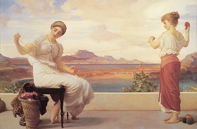

  
[Intangible Textual Heritage](../../../index)  [Legends and
Sagas](../../index)  [Lord Dunsany](../index) 

------------------------------------------------------------------------

[Buy this Book on
Kindle](https://www.amazon.com/exec/obidos/ASIN/B002M3ST7Y/internetsacredte)

------------------------------------------------------------------------

<table width="75%">
<colgroup>
<col style="width: 50%" />
<col style="width: 50%" />
</colgroup>
<tbody>
<tr class="odd">
<td width="50%" data-valign="TOP"></td>
<td width="50%" data-valign="CENTER"><h1 id="a-dreamers-tales" data-align="CENTER">A Dreamer's Tales</h1>
<h2 id="by-lord-dunsany" data-align="CENTER">by Lord Dunsany</h2>
<h4 id="section" data-align="CENTER">[1910]</h4></td>
</tr>
</tbody>
</table>

------------------------------------------------------------------------

[Contents](#contents)    [Start Reading](adta00)    [Text
\[Zipped\]](adta.txt.gz)

------------------------------------------------------------------------

|                                                                                                                           |
|---------------------------------------------------------------------------------------------------------------------------|
|  |

 [Title Page](adta00)  
[Contents](adta01)  
[Preface](adta02)  
[Poltarnees, Beholder of Ocean](adta03)  
[Blagdaross](adta04)  
[The Madness of Andelsprutz](adta05)  
[Where the Tides Ebb and Flow](adta06)  
[Bethmoora](adta07)  
[Idle Days on the Yann](adta08)  
[The Sword and the Idol](adta09)  
[The Idle City](adta10)  
[The Hashish Man](adta11)  
[Poor Old Bill](adta12)  
[The Beggars](adta13)  
[Carcassonne](adta14)  
[In Zaccarath](adta15)  
[The Field](adta16)  
[The Day of the Poll](adta17)  
[The Unhappy Body](adta18)  
