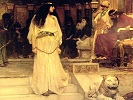

  
[Intangible Textual Heritage](../../../index)  [Legends and
Sagas](../../index)  [Lord Dunsany](../index)  [Index](index) 
[Previous](fotd24)  [Next](fotd26) 

------------------------------------------------------------------------

[Buy this Book on
Kindle](https://www.amazon.com/exec/obidos/ASIN/B002M3SWBC/internetsacredte)

------------------------------------------------------------------------

  
*Fifty-one Tales*, by Lord Dunsany, \[1915\], at Intangible Textual
Heritage

------------------------------------------------------------------------

THE STORM

They saw a little ship that was far at sea and that went by the name of
the *Petite Espérance*. And because of its uncouth rig and its lonely
air and the look that it had of coming from strangers' lands they said:
"It is neither a ship to greet nor desire, nor yet to succor when in the
hands of the sea."

And the sea rose up as is the wont of the sea and the little ship from
afar was in his hands, and frailer than ever seemed its feeble masts
with their sails of fantastic cut and their alien flags. And the sea
made a great and very triumphing voice, as the sea doth. And then there
arose a wave that was very strong, even the ninth-born son of the
hurricane and the tide, and hid the little ship and hid the whole of the
far parts of the sea. Thereat said those who stood on the good dry land:

"'Twas but a little, worthless alien ship and it is sunk at sea, and it
is good and right that the storm have spoil." And they turned and
watched the course of the merchant-men, laden with silver and appeasing
spice; year after year they cheered them into port and praised their
goods and their familiar sails. And many years went by.

And at last with decks and bulwarks covered with cloth of gold; with
age-old parrots that had known the troubadours, singing illustrious
songs and preening their feathers of gold; with a hold full of emeralds
and rubies; all silken with Indian loot; furling as it came in its
way-worn alien sails, a galleon glided into port, shutting the sunlight
from the merchantmen: and lo! it loomed the equal of the cliffs.

"Who are you?" they asked, "far-travelled wonderful ship?"

And they said: "The *Petite Espérance*."

"O," said the people on shore. "We thought you were sunk at sea."

"Sunk at sea?" sang the sailors. "We could not be sunk at sea—we had the
gods on board."

------------------------------------------------------------------------

[Next: A Mistaken Identity](fotd26)

