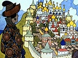

  
[Intangible Textual Heritage](../../../index)  [Legends and
Sagas](../../index)  [Dunsany](../index)  [Index](index) 
[Previous](gope07)  [Next](gope09) 

------------------------------------------------------------------------

[Buy this Book on
Kindle](https://www.amazon.com/exec/obidos/ASIN/B002M3SXVG/internetsacredte)

------------------------------------------------------------------------

  
*The Gods of Pegana*, by Lord Dunsany, \[1905\], at Intangible Textual
Heritage

------------------------------------------------------------------------

THE SAYINGS OF KIB

(Sender of Life in all the Worlds)

Kib said: "I am Kib. I am none other than Kib."

Kib is Kib. Kib is he and no other. Believe! Kib said: "When Time was
early, when Time was very early indeed—there was only MANA-YOOD-SUSHAI.
MANA-YOOD-SUSHAI was before the beginning of the gods, and shall be
after their going."

And Kib said: "After the going of the gods there will be no small worlds
nor big."

Kib said: "It will be lonely for MANA-YOOD-SUSHAI."

Because this is written, believe! For is it not written, or are you
greater than Kib? Kib is Kib.

------------------------------------------------------------------------

[Next: Concerning Sish](gope09)

