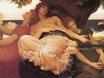

  
[Intangible Textual Heritage](../../../index)  [Legends and
Sagas](../../index)  [Dunsany](../index)  [Index](index) 
[Previous](swld04)  [Next](swld06) 

------------------------------------------------------------------------

[Buy this Book on
Kindle](https://www.amazon.com/exec/obidos/ASIN/B002M3T2IE/internetsacredte)

------------------------------------------------------------------------

  
*Selections from the Writings of Lord Dunsany*, by Lord Dunsany,
\[1912\], at Intangible Textual Heritage

------------------------------------------------------------------------

ACT III

Same room. A few days have elapsed. Seven thrones shaped like
mountain-crags stand along the back of the stage. On these the beggars
are lounging. The Thief is absent.

MLAN Never had beggars such a time.

OOGNO Ah, the fruits and tender lamb!

THAHN The Woldery wine!

SLAG It was better to see my Master's wise devices than to have fruit
and lamb and Woldery wine.

MLAN Ah, when they spied on him to see if he would eat when they went
away!

OOGNO When they questioned him concerning the gods and Man!

THAHN When they asked him why the gods permitted cancer!

SLAG Ah! My wise Master.

MLAN How well his scheme has succeeded.

OOGNO How far away is hunger!

THAHN It is even like to one of last year's dreams, the trouble of a
brief night long ago.

MLAN Ho, ho, ho, to see them pray to us!

AGMAR (sternly) When we were beggars did we not speak as beggars? Did we
not whine as they? Was not our mien beggarly?

MLAN We were the pride of our calling.

AGMAR (sternly) Then now that we are gods let us *be* as gods, and not
mock our worshippers.

ULF I think the gods *do* mock their worshippers.

AGMAR The gods have never mocked *us*. We are above all pinnacles that
we have ever gazed at in dreams.

ULF I think that when Man is high then most of all are the gods wont to
mock him. (Enter Thief)

THIEF Master, I have been with those that see all and know all, I have
been with the thieves, Master. They know me for one of the craft, but
they do not know me as being one of us.

AGMAR Well, well ...

THIEF There is danger, Master, there is great danger.

AGMAR You mean that they suspect that we are men?

THIEF That they have long done, Master. I mean that they will know it.
Then we are lost.

AGMAR Then they do not know it?

THIEF They do not know it yet, but they will know it, and we are lost.

AGMAR When will they know it?

THIEF Three days ago they suspected us.

AGMAR More than you think suspected us, but have any dared to say so?

THIEF No, Master.

AGMAR Then forget your fears, my thief.

THIEF Two men went on dromedaries three days ago to see if the gods were
still at Marma.

AGMAR They went to Marma!

THIEF Yes, three days ago.

OOGNO We are lost.

AGMAR They went three days ago?

THIEF Yes, on dromedaries.

AGMAR They should be back to-day.

OOGNO We are lost.

THAHN We are lost.

THIEF They must have seen the green jade idols sitting against the
mountains. They will say, 'The gods are still at Marma.' And we shall be
burnt.

SLAG My Master will yet devise a plan.

AGMAR (to the Thief) Slip away to some high place and look towards the
desert and see how long we have to devise a plan. (Exit Thief.)

SLAG My Master will devise a plan.

OOGNO He has taken us into a trap.

THAHN His wisdom is our doom.

SLAG He will find a wise plan yet. (Re-enter Thief.)

THIEF It is too late.

AGMAR It is too late?

THIEF The dromedary men are here.

OOGNO We are lost.

AGMAR Be silent! I must think. (They all sit still. Citizens enter and
prostrate themselves. Agmar sits deep in thought.)

ILLANAUN (to Agmar) Two holy pilgrims have gone to your sacred shrines,
wherein you were wont to sit before you left the mountains. (Agmar says
nothing) They return even now.

AGMAR They left us here and went to find the gods. A fish once took a
journey into a far country to find the sea.

ILLANAUN Most reverend Deity, their piety is so great that they have
gone to worship even your shrines.

AGMAR I know these men that have great piety. Such men have often prayed
to me before, but their prayers are not acceptable. They little love the
gods, their only care is their piety. I know these pious ones. They will
say that the seven gods were still at Marma. So shall they seem more
pious to you all, pretending that they alone have seen the gods. Fools
shall believe them and share in their damnation.

OORANDER (to Illanaun) Hush. You anger the gods.

ILLANAUN I am not sure whom I anger.

OORANDER It may be they are the gods.

ILLANAUN Where are these men from Marma?

CITIZEN Here are the dromedary men, they are coming now.

ILLANAUN (to Agmar) The holy pilgrims from your shrine are come to
worship you.

AGMAR The men are doubters. How the gods hate the word! Doubt ever
contaminated virtue. Let them be cast into prison and not besmirch your
purity, (rising) Let them not enter here.

ILLANAUN But O most reverened Deity from the mountain, we also doubt,
most reverend Deity.

AGMAR You have chosen. You have chosen. And yet it is not too late.
Repent and cast these men in prison and it may not be too late. *The
gods have never wept*. And yet when they think upon damnation and the
dooms that are withering a myriad bones, then almost, were they not
divine, they *could* weep. Be quick. Repent of your doubt.

ILLANAUN Most reverend Deity, it is a mighty doubt.

CITIZENS *Nothing has killed him! They are not the gods*!

SLAG (to Agmar) You have a plan, my Master. You have a plan?

AGMAR Not yet, Slag. (Enter the dromedary men.)

ILLANAUN (to Oorander) These are the men that went to the shrines at
Marma.

OORANDER (in a loud, clear voice) Were the gods of the mountain seated
still at Marma, or were they not there? (The beggars get up hurriedly
from their thrones.)

DROMEDARY MAN They were not there.

ILLANAUN They were not there?  DROMEDARY MAN Their shrines were empty.

OORANDER Behold the gods of the mountain!

AKMOS They have indeed come from Marma.

OORANDER Come. Let us go away to prepare a sacrifice, a mighty sacrifice
to atone for our doubting. (Exeunt.)

SLAG My most wise Master!

AGMAR No, no, Slag. I do not know what has befallen. When I went by
Marma only two weeks ago the idols of green jade were still seated
there.

OOGNO We are saved now.

THAHN Aye, we are saved.

AGMAR We are saved, but I know not how.

OOGNO *Never* had beggars such a time.

THIEF I will go out and watch. (He creeps out.)

ULF Yet I have a fear.

OOGNO A fear? Why, we are saved.

ULF Last night I dreamed.

OOGNO What was your dream?

ULF It was nothing. I dreamed that I was thirsty and one gave me Woldery
wine; yet there was a fear in my dream.

THAHN When I drink Woldery wine I am afraid of nothing. (Re-enter
Thief.)

THIEF They are making a pleasant banquet ready for us; they are killing
lambs, and girls are there with fruits, and there is to be much Woldery
wine.

MLAN Never had beggars such a time.

AGMAR Do any doubt us now?

THIEF I do not know.

MLAN When will the banquet be?

THIEF When the stars come out.

OOGNO Ah. It is sunset already. There will be good eating.

THAHN We shall see the girls come in with baskets upon their heads.

OOGNO There will be fruits in the baskets.

THAHN All the fruits of the valley.

MLAN Ah, how long we have wandered along the ways of the world.

SLAG Ah, how hard they were.

THAHN And how dusty.

OOGNO And how little wine.

MLAN How long we have asked and asked, and for how much!

AGMAR We to whom all things are coming now at last.

THIEF I fear lest my art forsake me now that good things come without
stealing.

AGMAR You will need your art no longer.

SLAG The wisdom of my Master shall suffice us all our days. (Enter a
frightened man. He kneels before Agmar and abases his forehead.)

MAN Master, we implore you, the people beseech you. (Agmar and the
beggars in the attitude of the gods sit silent.)

MAN Master, it is terrible. (The beggars maintain silence) It is
terrible when you wander in the evening. It is terrible on the edge of
the desert in the evening. Children die when they see you.

AGMAR In the desert? When did you see us?

MAN Last night, Master. You were terrible last night. You were terrible
in the gloaming. When your hands were stretched out and groping. You
were feeling for the city.

AGMAR Last night do you say?

MAN You were terrible in the gloaming!

AGMAR You yourself saw us?

MAN Yes, Master, you were terrible. Children too saw you and they died.

AGMAR You say you saw us?

MAN Yes, Master. Not as you are now, but otherwise. We implore you,
Master, not to wander at evening. You are terrible in the gloaming. You
are....

AGMAR You say we appeared not as we are now. How did we appear to you?

MAN Otherwise, Master, otherwise.

AGMAR But how *did* we appear to you?

MAN You were all green, Master, all green in the gloaming, all of rock
again as you used to be in the mountains. Master, we can bear to see you
in flesh like men, but when we see rock walking it is terrible, it is
terrible.

AGMAR That is how we appeared to you?

MAN Yes, Master. Rock should not walk. When children see it they do not
understand. Rock should not walk in the evening.

AGMAR There have been doubters of late. Are they satisfied?

MAN Master, they are terrified. Spare us, Master.

AGMAR It is wrong to doubt. Go, and be faithful. (Exit Man.)

SLAG What have they seen, Master?

AGMAR They have seen their own fears dancing in the desert. They have
seen something green after the light was gone, and some child has told
them a tale that it was us. I do not know what they have seen. What
should they have seen?

ULF Something was coming this way from the desert, he said.

SLAG What should come from the desert?

AGMAR They are a foolish people.

ULF That man's white face has seen some frightful thing.

SLAG A frightful thing?

ULF That man's face has been near to some frightful thing.

AGMAR It is only we that have frightened them, and their fears have made
them foolish. (Enter an attendant with a torch or lantern which he
places in a receptacle. Exit.)

THAHN Now we shall see the faces of the girls when they come to the
banquet.

MLAN Never had beggars such a time.

AGMAR Hark! They are coming. I hear footsteps.

THAHN The dancing girls. They are coming.

THIEF There is no sound of flutes; they said they would come with music.

OOGNO What heavy boots they have, they sound like feet of stone.

THAHN I do not like to hear their heavy tread; those that would dance to
*us* must be light of foot.

AGMAR I shall not smile at them if they are not airy.

MLAN They are coming very slowly. They should come nimbly to us.

THAHN They should dance as they come. But the footfall is like the
footfall of heavy crabs.

ULF (in a loud voice, almost chaunting) I have a fear, an old fear and a
boding. We have done ill in the sight of the seven gods; beggars we were
and beggars we should have remained; we have given up our calling and
come in sight of our doom: I will no longer let my fear be silent: it
shall run about and cry: it shall go from me crying, like a dog from out
of a doomed city; for my fear has seen calamity and has known an evil
thing.

SLAG (hoarsely) Master!

AGMAR (rising) Come, come! (They listen. No one speaks. The stony boots
come on. Enter in single file a procession of seven green men, even
hands and faces are green; they wear greenstone sandals, they walk with
knees extremely wide apart, as having sat cross-legged for centuries,
their right arms and right forefingers point upwards, right elbows
resting on left hands: they stoop grotesquely: halfway to the footlights
they wheel left. They pass in front of the seven beggars, now in
terrified attitudes and six of them sit down in the attitude described,
with their backs to the audience. The leader stands, still stooping.
Just as they wheel left, OOGNO cries out.) The gods of the mountain!

AGMAR (hoarsely) Be still. They are dazzled by the light, they may not
see us. (The leading green thing points his forefinger at the lantern,
the flame turns green. When the six are seated the leader points one by
one at each of the seven beggars, shooting out his forefinger at them.
As he does this each beggar in his turn gathers himself back on to his
throne and crosses his legs, his right arm goes stiffly upwards with
forefinger erect, and a staring look of horror comes into his eyes. In
this attitude the beggars sit motionless while a green light falls upon
their faces. The gods go out.

Presently enter the Citizens, some with victuals and fruit. One touches
a beggar's arm and then another's.)

CITIZEN They are cold; they have turned to stone. (All abase themselves
foreheads to the floor.)

ONE We have doubted them. We have doubted them. They have turned to
stone because we have doubted them.

ANOTHER They were the true gods.

ALL They were the true gods.

------------------------------------------------------------------------

[Next: The First Act of King Argimenes and the Unknown Warrior](swld06)

