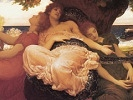

  
[Intangible Textual Heritage](../../../index)  [Legends and
Sagas](../../index)  [Dunsany](../index)  [Index](index) 
[Previous](swld10) 

------------------------------------------------------------------------

[Buy this Book on
Kindle](https://www.amazon.com/exec/obidos/ASIN/B002M3T2IE/internetsacredte)

------------------------------------------------------------------------

  
*Selections from the Writings of Lord Dunsany*, by Lord Dunsany,
\[1912\], at Intangible Textual Heritage

------------------------------------------------------------------------

THE CASTLE OF TIME

Presently there was a stir in one of the houses, and a bat flew out of
the door into the daylight, and three mice came running out of the
doorway down the step, an old stone cracked in two and held together by
moss; and there followed an old man bending on a stick with a white
beard coming to the ground, wearing clothes that were glossed with use,
and presently there came others out of the other houses, all of them as
old, and all hobbling on sticks. These were the oldest people that the
King had ever beheld, and he asked them the name of the village and who
they were; and one of them answered: 'This is the City of the Aged in
the Territory of Time.'

And the King said; 'Is Time then here?'

And one of the old men pointed to a great castle standing on a steep
hill and said: 'Therein dwells Time, and we are his people;' and they
all looked curiously at King Karnith Zo, and the eldest of the villagers
spoke again and said: 'Whence do you come, you that are so young?' and
Karnith Zo told him how he had come to conquer Time, to save the world
and the gods, and asked them whence they came.

And the villagers said:

'We are older than always, and know not whence we came, but we are the
people of Time, and here from the Edge of Everything he sends out his
hours to assail the world, and you may never conquer Time.' But the King
went back to his armies, and pointed toward the castle on the hill and
told them that at last they had found the Enemy of the Earth; and they
that were older than always went back slowly into their houses with the
creaking of olden doors. And they went across the fields and passed the
village. From one of his towers Time eyed them all the while, and in
battle order they closed in on the steep hill as Time sat still in his
great tower and watched.

But as the feet of the foremost touched the edge of the hill Time hurled
five years against them, and the years passed over their heads and the
army still came on, an army of older men. But the slope seemed steeper
to the King and to every man in his army, and they breathed more
heavily. And Time summoned up more years, and one by one he hurled them
at Karnith Zo and at all his men. And the knees of the army stiffened,
and their beards grew and turned grey, and the hours and days and the
months went singing over their heads, and their hair turned whiter and
whiter, and the conquering hours bore down, and the years rushed on and
swept the youth of that army clear away till they came face to face
under the walls of the castle of Time with a mass of howling years, and
found the top of the slope too steep for aged men. Slowly and painfully,
harassed with agues and chills, the King rallied his aged army that
tottered down the slope. Slowly the King led back his warriors over
whose heads had shrieked the triumphant years. Year in, year out, they
straggled southwards, always towards Zoon; they came, with rust upon
their spears and long beards flowing, again into Astarma, and none knew
them there.

HERE ENDS 'SELECTIONS FROM THE WRITINGS OF LORD DUNSANY.' FINISHED ON
LADY DAY, IN THE YEAR NINETEEN HUNDRED AND TWELVE.

 

 
