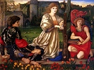

  
[Intangible Textual Heritage](../../../index)  [Legends and
Sagas](../../index)  [Dunsany](../index)  [Index](index) 
[Previous](swos06)  [Next](swos08) 

------------------------------------------------------------------------

  
*The Sword of Welleran and Other Stories*, by Lord Dunsany, \[1908\], at
Intangible Textual Heritage

------------------------------------------------------------------------

The Ghosts

The argument that I had with my brother in his great lonely house will
scarcely interest my readers. Not those, at least, whom I hope may be
attracted by the experiment that I undertook, and by the strange things
that befell me in that hazardous region into which so lightly and so
ignorantly I allowed my fancy to enter. It was at Oneleigh that I had
visited him.

Now Oneleigh stands in a wide isolation, in the midst of a dark
gathering of old whispering cedars. They nod their heads together when
the North Wind comes, and nod again and agree, and furtively grow still
again, and say no more awhile. The North Wind is to them like a nice
problem among wise old men; they nod their heads over it, and mutter
about it all together. They know much, those cedars, they have been
there so long. Their grandsires knew Lebanon, and the grandsires of
these were the servants of the King of Tyre and came to Solomon's court.
And amidst these black-haired children of grey-headed Time stood the old
house of Oneleigh. I know not how many centuries had lashed against it
their evanescent foam of years; but it was still unshattered, and all
about it were the things of long ago, as cling strange growths to some
sea-defying rock. Here, like the shells of long-dead limpets, was armour
that men encased themselves in long ago; here, too, were tapestries of
many colours, beautiful as seaweed; no modern flotsam ever drifted
hither, no early Victorian furniture, no electric light. The great trade
routes that littered the years with empty meat tins and cheap novels
were far from here. Well, well, the centuries will shatter it and drive
its fragments on to distant shores. Meanwhile, while it yet stood, I
went on a visit there to my brother, and we argued about ghosts. My
brother's intelligence on this subject seemed to me to be in need of
correction. He mistook things imagined for things having an actual
existence; he argued that second-hand evidence of persons having seen
ghosts proved ghosts to exist. I said that even if they had seen ghosts,
this was no proof at all; nobody believes that there are red rats,
though there is plenty of first-hand evidence of men having seen them in
delirium. Finally, I said I would see ghosts myself, and continue to
argue against their actual existence. So I collected a handful of cigars
and drank several cups of very strong tea, and went without my dinner,
and retired into a room where there was dark oak and all the chairs were
covered with tapestry; and my brother went to bed bored with our
argument, and trying hard to dissuade me from making myself
uncomfortable. All the way up the old stairs as I stood at the bottom of
them, and as his candle went winding up and up, I heard him still trying
to persuade me to have supper and go to bed.

It was a windy winter, and outside the cedars were muttering I know not
what about; but I think that they were Tories of a school long dead, and
were troubled about something new. Within, a great damp log upon the
fireplace began to squeak and sing, and struck up a whining tune, and a
tall flame stood up over it and beat time, and all the shadows crowded
round and began to dance. In distant corners old masses of darkness sat
still like chaperones and never moved. Over there, in the darkest part
of the room, stood a door that was always locked. It led into the hall,
but no one ever used it; near that door something had happened once of
which the family are not proud. We do not speak of it. There in the
firelight stood the venerable forms of the old chairs; the hands that
had made their tapestries lay far beneath the soil, the needles with
which they wrought were many separate flakes of rust. No one wove now in
that old room—no one but the assiduous ancient spiders who, watching by
the deathbed of the things of yore, worked shrouds to hold their dust.
In shrouds about the cornices already lay the heart of the oak wainscot
that the worm had eaten out.

Surely at such an hour, in such a room, a fancy already excited by
hunger and strong tea might see the ghosts of former occupants. I
expected nothing less. The fire flickered and the shadows danced,
memories of strange historic things rose vividly in my mind; but
midnight chimed solemnly from a seven-foot clock, and nothing happened.
My imagination would not be hurried, and the chill that is with the
small hours had come upon me, and I had nearly abandoned myself to
sleep, when in the hall adjoining there arose the rustling of silk
dresses that I had waited for and expected. Then there entered two by
two the high-born ladies and their gallants of Jacobean times. They were
little more than shadows—very dignified shadows, and almost indistinct;
but you have all read ghost stories before, you have all seen in museums
the dresses of those times—there is little need to describe them; they
entered, several of them, and sat down on the old chairs, perhaps a
little carelessly considering the value of the tapestries. Then the
rustling of their dresses ceased.

Well—I had seen ghosts, and was neither frightened nor convinced that
ghosts existed. I was about to get up out of my chair and go to bed,
when there came a sound of pattering in the hall, a sound of bare feet
coming over the polished floor, and every now and then a foot would slip
and I heard claws scratching along the wood as some four-footed thing
lost and regained its balance. I was not frightened, but uneasy. The
pattering came straight towards the room that I was in, then I heard the
sniffing of expectant nostrils; perhaps 'uneasy' was not the most
suitable word to describe my feelings then. Suddenly a herd of black
creatures larger than bloodhounds came galloping in; they had large
pendulous ears, their noses were to the ground sniffing, they went up to
the lords and ladies of long ago and fawned about them disgustingly.
Their eyes were horribly bright, and ran down to great depths. When I
looked into them I knew suddenly what these creatures were, and I was
afraid. They were the sins, the filthy, immortal sins of those courtly
men and women.

How demure she was, the lady that sat near me on an old-world chair—how
demure she was, and how fair, to have beside her with its jowl upon her
lap a sin with such cavernous red eyes, a clear case of murder. And you,
yonder lady with the golden hair, surely not you—and yet that fearful
beast with the yellow eyes slinks from you to yonder courtier there, and
whenever one drives it away it slinks back to the other. Over there a
lady tries to smile as she strokes the loathsome furry head of another's
sin, but one of her own is jealous and intrudes itself under her hand.
Here sits an old nobleman with his grandson on his knee, and one of the
great black sins of the grandfather is licking the child's face and has
made the child its own. Sometimes a ghost would move and seek another
chair, but always his pack of sins would move behind him. Poor ghosts,
poor ghosts! how many flights they must have attempted for two hundred
years from their hated sins, how many excuses they must have given for
their presence, and the sins were with them still—and still unexplained.
Suddenly one of them seemed to scent my living blood, and bayed
horribly, and all the others left their ghosts at once and dashed up to
the sin that had given tongue. The brute had picked up my scent near the
door by which I had entered, and they moved slowly nearer to me sniffing
along the floor, and uttering every now and then their fearful cry. I
saw that the whole thing had gone too far. But now they had seen me, now
they were all about me, they sprang up trying to reach my throat; and
whenever their claws touched me, horrible thoughts came into my mind and
unutterable desires dominated my heart. I planned bestial things as
these creatures leaped around me, and planned them with a masterly
cunning. A great red-eyed murder was among the foremost of those furry
things from whom I feebly strove to defend my throat. Suddenly it seemed
to me good that I should kill my brother. It seemed important to me that
I should not risk being punished. I knew where a revolver was kept;
after I had shot him, I would dress the body up and put flour on the
face like a man that had been acting as a ghost. It would be very
simple. I would say that he had frightened me—and the servants had heard
us talking about ghosts. There were one or two trivialities that would
have to be arranged, but nothing escaped my mind. Yes, it seemed to me
very good that I should kill my brother as I looked into the red depths
of this creature's eyes. But one last effort as they dragged me down—'If
two straight lines cut one another,' I said, 'the opposite angles are
equal. Let AB, CD, cut one another at E, then the angles CEA, CEB equal
two right angles (prop. xiii.). Also CEA, AED equal two right angles.'

I moved towards the door to get the revolver; a hideous exultation arose
among the beasts. 'But the angle CEA is common, therefore AED equals
CEB. In the same way CEA equals DEB. *QED*.' It was proved. Logic and
reason re-established themselves in my mind, there were no dark hounds
of sin, the tapestried chairs were empty. It seemed to me an
inconceivable thought that a man should murder his brother.

------------------------------------------------------------------------

[Next: The Whirlpool](swos08)

