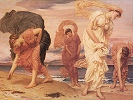

  
[Intangible Textual Heritage](../../../index)  [Legends and
Sagas](../../index)  [Dunsany](../index)  [Index](index) 
[Previous](tago14)  [Next](tago16) 

------------------------------------------------------------------------

[Buy this Book on
Kindle](https://www.amazon.com/exec/obidos/ASIN/B002M3T6JE/internetsacredte)

------------------------------------------------------------------------

  
*Time and the Gods*, by Lord Dunsany, \[1905\], at Intangible Textual
Heritage

------------------------------------------------------------------------

MLIDEEN

Upon an evening of the forgotten years the gods were seated upon Mowrah
Nawut above Mlideen holding the avalanche in leash.

All in the Middle City stood the Temples of the city's priests, and
hither came all the people of Mlideen to bring them gifts, and there it
was the wont of the City's priests to carve them gods for Mlideen. For
in a room apart in the Temple of Eld in the midst of the temples that
stood in the Middle City of Mlideen there lay a book called the Book of
Beautiful Devices, writ in a language that no man may read and writ long
ago, telling how a man may make for himself gods that shall neither rage
nor seek revenge against a little people. And ever the priests came
forth from reading in the Book of Beautiful Devices and ever they sought
to make benignant gods, and all the gods that they made were different
from each other, only their eyes turned all upon Mlideen.

But upon Mowrah Nawut for all of the forgotten years the gods had waited
and forborne until the people of Mlideen should have carven one hundred
gods. Never came lightnings from Mowrah Nawut crashing upon Mlideen, nor
blight on harvests nor pestilence in the city, only upon Mowrah Nawut
the gods sat and smiled. The people of Mlideen had said: "Yoma is god."
And the gods sat and smiled. And after the forgetting of Yoma and the
passing of years the people had said: "Zungari is god." And the gods sat
and smiled.

Then on the altar of Zungari a priest had set a figure squat, carven in
purple agate, saying: "Yazun is god." Still the gods sat and smiled.

About the feet of Yonu, Bazun, Nidish and Sundrao had gone the worship
of the people of Mlideen, and still the gods sat holding the avalanche
in leash above the city.

There set a great calm towards sunset over the heights, and Mowrah Nawut
stood up still with gleaming snow, and into the hot city cool breezes
blew from his benignant slopes as Tarsi Zalo, high prophet of Mlideen,
carved out of a great sapphire the city's hundredth god, and then upon
Mowrah Nawut the gods turned away saying: "One hundred infamies have now
been wrought." And they looked no longer upon Mlideen and held the
avalanche no more in leash, and he leapt forward howling.

Over the Middle City of Mlideen now lies a mass of rocks, and on the
rocks a new city is builded wherein people dwell who know not old
Mlideen, and the gods are seated on Mowrah Nawut still. And in the new
city men worship carven gods, and the number of the gods that they have
carven is ninety and nine, and I, the prophet, have found a curious
stone and go to carve it into the likeness of a god for all Mlideen to
worship.

------------------------------------------------------------------------

[Next: The Secret of the Gods](tago16)

