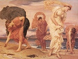

  
[Intangible Textual Heritage](../../../index)  [Legends and
Sagas](../../index)  [Dunsany](../index)  [Index](index) 
[Previous](tago25)  [Next](tago27) 

------------------------------------------------------------------------

[Buy this Book on
Kindle](https://www.amazon.com/exec/obidos/ASIN/B002M3T6JE/internetsacredte)

------------------------------------------------------------------------

  
*Time and the Gods*, by Lord Dunsany, \[1905\], at Intangible Textual
Heritage

------------------------------------------------------------------------

*V*

Then spake the prophet Thun, who was clad in seaweed and had no Temple,
but lived apart from men. All his life he had lived on a lonely beach
and had heard for ever the wailing of the sea and the crying of the wind
in hollows among the cliffs. Some said that having lived so long by the
full beating of the sea, and where always the wind cries loudest, he
could not feel the joys of other men, but only felt the sorrow of the
sea crying in his soul for ever.

"Long ago on the path of stars, midmost between the worlds, there strode
the gods of Old. In the bleak middle of the worlds They sat and the
worlds went round and round, like dead leaves in the wind at Autumn's
end, with never a life on one, while the gods went sighing for the
things that might not be. And the centuries went over the gods to go
where the centuries go, toward the End of Things, and with Them went the
sighs of all the gods as They longed for what might not be.

"One by one in the midst of the worlds, fell dead the gods of Old, still
sighing for the things that might not be, all slain by Their own
regrets. Only Shimono Kani, the youngest of the gods, made him a harp
out of the heart strings of all the elder gods, and, sitting upon the
Path of Stars in the Middle of Things, played upon the harp a dirge for
the gods of Old. And the song told of all vain regrets and of unhappy
loves of the gods in the olden time, and of Their great deeds that were
to adorn the future years. But into the dirge of Shimono Kani came
voices crying out of the heart strings of the gods, all sighing still
for the things that might not be. And the dirge and the voices crying,
go drifting away from the Path of Stars, away from the Midst of Things,
till they come twittering among the Worlds, like a great host of birds
that are lost by night. And every note is a life, and many notes become
caught up among the worlds to be entangled with flesh for a little while
before they pass again on their journey to the great Anthem that roars
at the End of Time. Shimono Kani hath given a voice to the wind and
added a sorrow to the sea. But when in lighted chambers after feasting
there arises the voice of the singer to please the King, then is the
soul of that singer crying aloud to his fellows from where he stands
chained to earth. And when at the sound of the singing the heart of the
King grows sad and his princes lament then they remember, though knowing
not that, they remember it, the sad face of Shimono Kani sitting by his
dead brethren, the elder gods, playing on the harp of crying heart
strings whereby he sent their souls among the worlds.

"And when the music of one lute is lonely on the hills at night, then
one soul calleth to his brother souls—the notes of Shimono Kani's dirge
which have not been caught among the worlds—and he knoweth not to whom
he calls or why, but knoweth only that minstrelsy is his only cry and
sendeth it out into the dark.

"But although in the prison houses of earth all memories must die, yet
as there sometimes clings to a prisoner's feet some dust of the fields
wherein he was captured, so sometimes fragments of remembrance cling to
a man's soul after it hath been taken to earth. Then a great minstrel
arises, and, weaving together the shreds of his memories, maketh some
melody such as the hand of Shimono Kani smites out of his harp; and they
that pass by say: 'Hath there not been some such melody before?' and
pass on sad at heart for memories which are not.

"Therefore, O King, one day the great gates of thy palace shall lie open
for a procession wherein the King comes down to pass through a people,
lamenting with lute and drum; and on the same day a prison door shall be
opened by relenting hands, and one more lost note of Shimono Kani's
dirge shall go back to swell his melody again.

"The dirge of Shimono Kani shall roll on till one day it shall come with
all its notes complete to overwhelm the Silence that sits at the End of
Things. Then shall Shimono Kani say to his brethren's bones: The things
that might not be have at last become.'

"But very quiet shall be the bones of the gods of Old, and only Their
voices shall live which cried from the harp of heart strings, for the
things which might not be."

------------------------------------------------------------------------

[Next: VI](tago27)

