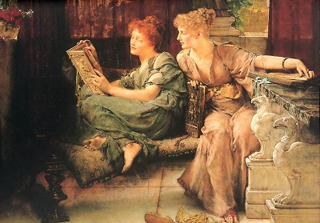

  
[Intangible Textual Heritage](../../../index)  [Legends and
Sagas](../../index)  [Dunsany](../index) 

------------------------------------------------------------------------

[Buy this Book on
Kindle](https://www.amazon.com/exec/obidos/ASIN/B002M3TLAI/internetsacredte)

------------------------------------------------------------------------

<table width="75%">
<colgroup>
<col style="width: 50%" />
<col style="width: 50%" />
</colgroup>
<tbody>
<tr class="odd">
<td width="50%" data-valign="TOP"></td>
<td width="50%" data-valign="CENTER"><h1 id="the-book-of-wonder" data-align="CENTER">The Book of Wonder</h1>
<h2 id="by-lord-dunsany" data-align="CENTER">by Lord Dunsany</h2>
<h4 id="section" data-align="CENTER">[1912]</h4></td>
</tr>
</tbody>
</table>

------------------------------------------------------------------------

[Contents](#contents)    [Start Reading](tbow00)    [Text
\[Zipped\]](tbow.txt.gz)

------------------------------------------------------------------------

|                                                                                                                           |
|---------------------------------------------------------------------------------------------------------------------------|
|  |

 [Title Page](tbow00)  
[Contents](tbow01)  
[Preface](tbow02)  
[The Bride of the Man-Horse](tbow03)  
[Distressing Tale of Thangobrind the Jeweller](tbow04)  
[The House of the Sphinx](tbow05)  
[Probable Adventure of the Three Literary Men](tbow06)  
[The Injudicious Prayers of Pombo the Idolater](tbow07)  
[The Loot of Bombasharna](tbow08)  
[Miss Cubbidge and the Dragon of Romance](tbow09)  
[The Quest of the Queen's Tears](tbow10)  
[The Hoard of the Gibbelins](tbow11)  
[How Nuth Would Have Practised His Art Upon the Gnoles](tbow12)  
[How One Came, As Was Foretold, to the City of Never](tbow13)  
[The Coronation of Mr. Thomas Shap](tbow14)  
[Chu-Bu and Sheemish](tbow15)  
[The Wonderful Window](tbow16)  
[Epilogue](tbow17)  
