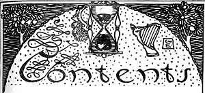

  
[Intangible Textual Heritage](../../../index)  [Sagas &
Legends](../../index)  [England](../index)  [Index](index) 
[Previous](boeb00)  [Next](boeb02) 

------------------------------------------------------------------------

p. 5

 

# CONTENTS

|                                     |                            |
|-------------------------------------|----------------------------|
|                                     | PAGE                       |
| Introduction                        | [7](boeb02.htm#page_7)     |
| Chevy Chace                         | [29](boeb03.htm#page_29)   |
| King Cophetua and the Beggar-Maid   | [43](boeb04.htm#page_43)   |
| King Leir and his Three Daughters   | [49](boeb05.htm#page_49)   |
| Fair Rosamond                       | [59](boeb06.htm#page_59)   |
| Phillida and Corydon                | [69](boeb07.htm#page_69)   |
| Fair Margaret and Sweet William     | [71](boeb08.htm#page_71)   |
| Annan Water                         | [76](boeb09.htm#page_76)   |
| The Bailiff's Daughter of Islington | [79](boeb10.htm#page_79)   |
| Barbara Allen's Cruelty             | [82](boeb11.htm#page_82)   |
| The Douglas Tragedy                 | [84](boeb12.htm#page_84)   |
| Young Waters                        | [89](boeb13.htm#page_89)   |
| Flodden Field                       | [93](boeb14.htm#page_93)   |
| Helen of Kirkconnell                | [97](boeb15.htm#page_97)   |
| p. 6       |                            |
| Robin Hood and Allen-a-Dale         | [100](boeb16.htm#page_100) |
| Robin Hood and Guy of Gisborne      | [106](boeb17.htm#page_106) |
| Robin Hood's Death and Burial       | [119](boeb18.htm#page_119) |
| The Twa Corbies                     | [124](boeb19.htm#page_124) |
| Waly, Waly, Love be Bonny           | [126](boeb20.htm#page_126) |
| The Nut-brown Maid                  | [129](boeb21.htm#page_129) |
| The Fause Lover                     | [148](boeb22.htm#page_148) |
| The Mermaid                         | [151](boeb23.htm#page_151) |
| The Battle of Otterburn             | [154](boeb24.htm#page_154) |
| The Lament of the Border Widow      | [169](boeb25.htm#page_169) |
| The Banks o' Yarrow                 | [171](boeb26.htm#page_171) |
| Hugh of Lincoln                     | [176](boeb27.htm#page_176) |
| Sir Patrick Spent                   | [180](boeb28.htm#page_180) |

 

 

------------------------------------------------------------------------

[Next: Introduction](boeb02)
