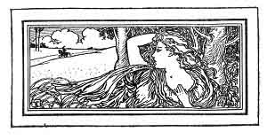

  
[Intangible Textual Heritage](../../../index)  [Sagas &
Legends](../../index)  [England](../index)  [Index](index) 
[Previous](boeb09)  [Next](boeb11) 

------------------------------------------------------------------------

p. 79

 

# The Bailiff's Daughter of Islington

THERE was a youthe, and a well-beloved youthe,  
  And he was a squire's son;  
He loved the bayliffe's daughter deare,  
  That lived in Islington.

Yet she was coye, and would not believe  
  That he did love her soe,  
Noe nor at any time would she  
  Any countenance to him showe.

But when his friendes did understand  
  His fond and foolish minde,  
They sent him up to faire London,  
  An apprentice for to binde.

And when he had been seven long yeares,  
  And never his love could see,--  
"Many a teare have I shed for her sake,  
  When she little thought of mee."

Then all the maids of Islington  
  Went forth to sport and playe,  
All but the bayliffe's daughter deare;  
  She secretly stole awaye.

She pulled off her gowne of greene,  
  And put on ragged attire,  
And to faire London she would go  
  Her true love to enquire.

And as she went along the high road,  
  The weather being hot and drye,  
She sat her downe upon a green bank,  
  And her true love came riding bye.

She started up, with a colour soe redd,  
  Catching hold of his bridle-reine;  
"One penny, one penny, kind sir," she sayd,  
  "Will ease me of much paine."

p. 81

"Before I give you one penny, sweet-heart,  
  Praye tell me where you were borne."  
"At Islington, kind sir," sayd shee,  
  "Where I have had many a scorne."

"I prythee, sweet-heart, then tell to mee,  
  O tell me, whether you knowe  
The bayliffes daughter of Islington."  
  "She is dead, sir, long agoe."

"If she be dead, then take my horse,  
  My saddle and bridle also;  
For I will into some farr countrye,  
  Where noe man shall me knowe."

"O staye, O staye, thou goodlye youthe,  
  She standeth by thy side;  
She is here alive, she is not dead,  
  And readye to be thy bride."

"O farewell griefe, and welcome joye,  
  Ten thousand times therefore;  
For nowe I have founde mine owne true love,  
  Whom I thought I should never see more."

------------------------------------------------------------------------

[Next: Barbara Allen's Cruelty](boeb11)
