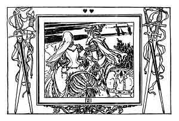
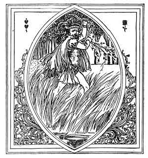

  
[Intangible Textual Heritage](../../../index)  [Sagas &
Legends](../../index)  [England](../index)  [Index](index) 
[Previous](boeb11)  [Next](boeb13) 

------------------------------------------------------------------------

p. 84

 

The Douglas Tragedy

"RISE up, rise up, now, Lord Douglas," she says,  
  "And put on your armour so bright;  
Sweet William will hae Lady Margaret awi'  
  Before that it be light.

"Rise up, rise up, my seven bold sons,  
  And put on your armour so bright,  
And take better care of your youngest sistèr,  
  For your eldest's awa' the last night."

He's mounted her on a milk-white steed,  
  And himself on a dapple grey,  
With a buglet horn hung down by his side  
  And lightly they rode away.

p. 85

Lord William lookit o'er his left shouldèr,  
  To see what he could see,  
And there he spied her seven brethren bold  
  Come riding o'er the lea.

"Light down, light down, Lady Margaret," he said,  
  "And hold my steed in your hand,  
Until that against your seven brethren bold,  
  And your father I make a stand."

She held his steed in her milk-white hand,  
  And never shed one tear,  
Until that she saw her seven brethren fa'  
  And her father hard fighting, who loved her so dear.

"O hold your hand, Lord William!" she said,  
  "For your strokes they are wondrous sair;  
True lovers I can get many a ane,  
  But a father I can never get mair."

O, she's ta'en out her handkerchief,  
  It was o' the holland sae fine,  
And aye she dighted her father's bloody wounds,  
  That were redder than the wine.

p. 86

"O chuse, O chuse, Lady Margaret," he said,  
  "O whether will ye gang or bide?"  
"I'll gang, I'll gang, Lord William," she said,  
  "For you have left me nae other guide."

He's lifted her on a milk-white steed,  
  And himself on a dapple grey,  
With a buglet horn hung down by his side,  
  And slowly they baith rade away.

O they rade on, and on they rade,  
  And a' by the light of the moon,  
Until they came to yon wan water,  
  And there they lighted down.

They lighted down to tak a drink  
  Of the spring that ran sae clear;  
And down the stream ran his gude heart's blood,  
  And sair she 'gan to fear.

"Hold up, hold up, Lord William," she says,  
  "For I fear that you are slain!"  
"'Tis naething but the shadow of my scarlet cloak,  
  That shines in the water sae plain."

p. 87

O they rade on, and on they rade,  
  And a' by the light of the moon,  
Until they came to his mother's ha' door,  
  And there they lighted down.

"Get up, get up, lady mother," he says,  
  "Get up, and let me in!  
Get up, get up, lady mother," he says,  
  "For this night my fair lady I've win.

"O mak my bed, lady mother," he says,  
  "O mak it braid and deep!  
And lay Lady Margaret close at my back,  
  And the sounder I will sleep."

Lord William was dead lang ere midnight,  
  Lady Margaret lang ere day:  
And all true lovers that go thegither,  
  May they have mair luck than they!

Lord William was buried in St. Marie's kirk,  
  Lady Margaret in Marie's quire;  
Out o' the lady's grave grew a bonny red rose,  
  And out o' the knight's a brier.

p. 88

And they twa met, and they twa plat  
  And fain they wad be near;  
And a' the world might ken right weel,  
  They were twa lovers dear.

But bye and rade the black Douglas  
  And wow but he was rough!  
For he pulled up the bonny brièr,  
  And flanged in St. Marie's Loch.

 

 

------------------------------------------------------------------------

[Next: Young Waters](boeb13)
