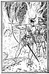
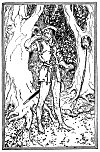
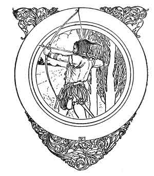

  
[Intangible Textual Heritage](../../../index)  [Sagas &
Legends](../../index)  [England](../index)  [Index](index) 
[Previous](boeb16)  [Next](boeb18) 

------------------------------------------------------------------------

p. 106

 

# Robin Hood and Guy of Gisborne

WHEN shaws beene sheene, and shradds full fayre,  
  And leaves both large and longe,  
Itt is merrye walkyng in the fayre forrèst  
  To heare the small birdes songe.

The woodweele sang, and wold not cease,  
  Sitting upon the spraye,  
Soe lowde, he wakened Robin Hood,  
  In the greenwood where he lay.

"Now, by my faye," sayd jollye Robin,  
  "A sweaven I had this night;  
I dreamt me of tow wighty yemen,  
  That fast with me can fight.

p. 107

"Methought they did mee beate and binde,  
  And tooke my bow mee froe;  
Iff I be Robin alive in this lande,  
  Ile be wroken on them towe."

"Sweavens are swift, master," quoth John,  
  "As the wind that blowes ore the hill;  
For if itt be never so loude this night,  
  To-morrow it may be still."

"Buske yee, bowne yee, my merry men all,  
  And John shall goe with mee,  
For Ile goe seeke yond wight yeomen,  
  In greenwood where the bee."

Then they cast on their gownes of grene,  
  And tooke theyr bowes each one;  
And they away to the greene forrèst  
  A shooting forth are gone;

Untill they came to the merry greenwood,  
  Where they had gladdest to bee;  
There were they ware of a wight yeomàn,  
  His body leaned to a tree.

p. 108

A sword and a dagger he wore by his side,  
  Of manye a man the bane;  
And he was clad in his capull hyde,  
  Topp and tayll and mayne.

"Stand you still, master," quoth Little John,  
  "Under this tree so grene,  
And I will go to yond wight yeomàn  
  To know what he doth meane."

"Ah! John, by me thou settest noe store,  
  And that I farley finde:  
How offt send I my men beffore,  
  And tarry my selfe behinde!

"It is no cunning a knave to ken,  
  And a man but heare him speake;  
And itt were not for bursting of my bowe,  
  John, I thy head wold breake."

As often wordes they breeden bale,  
  So they parted Robin and John;  
And John is gone to Barnesdale;  
  The gates he knoweth eche one.

p. 109

But when he came to Barnesdale,  
  Great heavinesse there hee hadd,  
For he found tow of his owne fellòwes  
  Were slaine both in a slade.

And Scarlette he was flying a-foote  
  Faste over stocke and stone,  
For the sheriffe with seven score men  
  Fast after him is gone.

"One shoote now I will shoote," quoth John,  
  "With Christ his might and mayne;  
Ile make yond fellow that flyes soe fast,  
  To stopp he shall be fayne."

Then John bent up his long bende-bowe,  
  And fetteled him to shoote:  
The bow was made of tender boughe,  
  And fell down to his foote.

"Woe worth, woe worth thee, wicked wood,  
  That ere thou grew on a tree;  
For now this day thou art my bale,  
  My boote when thou shold bee."

p. 110

His shoote it was but loosely shott,  
  Yet flewe not the arrowe in vaine,  
For itt mett one of the sherriffes men,  
  Good William a Trent was slaine.

It had bene better of William a Trent  
  To have bene abed with sorrowe,  
Than to be that day in the green-wood slade  
  To meet with Little Johns arrowe.

But as it is said, when men be mett  
  Fyve can doe more than three,  
The sheriffe hath taken Little John,  
  And bound him fast to a tree.

"Thou shalt be drawen by dale and downe,  
  And hanged hye on a hill;"  
But thou mayst fayle of thy purpose," quoth John,  
  If itt be Christ his will."

Lett us leave talking of Little John,  
  And thinke of Robin Hood,  
How he is gone to the wight yeomàn,  
  Where under the leaves he stood.

p. 111

 

 [  
Click to enlarge](img/11100.jpg)

 

"Good morrowe, good fellowe," sayd Robin so fayre,  
  "Good morrowe, good fellow," quoth he.  
"Methinks by this bowe thou beares in thy hande,  
  A good archere thou sholdst bee."

"I am wilfulle of my waye," quo' the yeoman,  
  "And of my morning tyde:"  
"Ile lead thee through the wood," sayd Robin,  
  "Good fellow, Ile be thy guide."

"I seeke an outlàwe," the straunger sayd,  
  "Men call him Robin Hood;  
Rather Ild meet with that proud outlàwe  
  Than fortye pound soe good."

"Now come with me, thou wight yemàn,  
  And Robin thou soone shalt see;  
But first let us some pastime find  
  Under the greenwood tree.

"First let us some masterye make  
  Among the woods so even;  
We may chance to meet with Robin Hood  
  Here att some unsett steven."

p. 112

They cutt them down two summer shroggs,  
  That grew both under a breere,  
And set them threescore rood in twaine,  
  To shoote the prickes y-fere.

"Leade on, good fellowe," quoth Robin Hood,  
  "Leade on, I doe bidd thee."  
"Nay, by my faith, good fellowe," hee sayd,  
  "My leader thou shalt bee."

The first time Robin shot at the pricke,  
  He mist but an inch it fro;  
The yeoman he was an archer good,  
  But he cold never shoote soe.

The second shoote had the wightye yeomàn,  
  He shote within the garlànde;  
But Robin he shott far better than hee,  
  For he clave the good pricke-wande.

A blessing upon thy heart," he sayd,  
  "Good fellowe, thy shooting is goode  
For an thy hart be as good as thy hand,  
  Thou wert better then Robin Hoode.

p. 113

Now tell me thy name, good fellowe," sayd he,  
  "Under the leaves of lyne."  
Nay, by my faith," quoth bolde Robin,  
  "Till thou have told me thine."

"I dwell by dale and downe," quoth hee,  
  "And Robin to take Ime sworne;  
And when I am called by my right name,  
  I am Guy of good Gisbòrne."

"My dwelling is in this wood," sayes Robin,  
  "By thee I set right nought:  
I am Robin Hood of Barnèsdale,  
  Whom thou so long hast sought."

He that had neither beene kithe nor kin,  
  Might have seen a full fayre sight,  
To see how together these yeomen went  
  With blades both browne and bright:

To see how these yeomen together they fought  
  Two howres of a summers day,  
Yett neither Robin Hood nor Sir Guy  
  Them fettled to flye away.

p. 114

Robin was reachles on a roote,  
  And stumbled at that tyde;  
And Guy was quicke and nimble with-all,  
  And hitt him ore the left side.

"Ah, deere Lady," sayd Robin Hood tho,  
  "Thou art but mother and may';  
I think it was never mans destinye  
  To dye before his day."

Robin thought on Our Ladye deere,  
  And soone leapt up againe,  
And strait he came with a 'backward' stroke,  
  And he Sir Guy hath slayne.

He took Sir Guy's head by the hayre,  
  And stuck itt upon his bowes end:  
"Thou hast beene a traytor all thy liffe,  
  Which thing must have an end."

Robin pulled forth an Irish kniffe,  
  And nicked Sir Guy in the face,  
That he was never on woman born  
  Cold tell whose head it was.

 

 [  
Click to enlarge](img/11400.jpg)

 

p. 115

Sayes, "Lye there, lye there now, Sir Guy,  
  And with me be not wrothe;  
Iff thou have had the worst strokes at my hand,  
  Thou shalt have the better clothe."

Robin did off his gowne of greene,  
  And on Sir Guy did throwe,  
And hee put on that capull hyde,  
  That cladd him topp to toe.

"The bowe, the arrowes, and litle horne,  
  Now with me I will beare;  
For I will away to Barnèsdale,  
  To see how my men doe fare."

Robin Hood sett Guy's horne to his mouth,  
  And a loud blast in it did blow:  
That beheard the sheriffe of Nottingham,  
  As he leaned under a lowe.

Hearken, hearken," sayd the sheriffe,  
  "I heare nowe tydings good,  
For yonder I heare Sir Guy's horne blowe,  
  And he hath slaine Robin Hoode.

p. 116

"Yonder I heare Sir Guy's horne blowe,  
  Itt blowes soe well in tyde,  
And yonder comes that wightye yeomàn,  
  Cladd in his capull hyde.

"Come hyther, come hyther, thou good Sir Guy,  
  Aske what thou wilt of mee."  
"O I will none of thy gold," sayd Robin,  
  "Nor I will none of thy fee.

"But now I have slaine the master," he sayes,  
  "Let me goe strike the knave;  
For this is all the rewarde I aske.  
  Nor noe other will I have."

"Thou art a madman," said the sheriffe,  
  "Thou sholdst have had a knightes fee;  
But seeing thy asking hath beene soe bad,  
  Well granted it shale be."

When Little John heard his master speake,  
  Well knewe he it was his steven;  
Now shall I be looset," quoth Little John,  
  With Christ his might in heaven."

p. 117

Fast Robin hee hyed him to Little John,  
  He thought to loose him belive:  
The sheriffe and all his companye  
  Fast after him can drive.

"Stand abacke, stand abacke," sayd Robin;  
  "Why draw you mee so neere?  
Itt was never the use in our countryè,  
  Ones shrift another shold heere."

But Robin pulled forth an Irysh knife,  
  And losed John hand and foote,  
And gave him Sir Guy's bow into his hand,  
  And bade it be his boote.

Then John he took Guy's bow in his hand,  
  His boltes and arrowes eche one:  
When the sheriffe saw Little John bend his bow,  
  He fettled him to be gone.

Towards his house in Nottingham towne  
  He fled full fast away,  
And soe did all the companye,  
  Not one behind wold stay.

p. 118

But he cold neither runne soe fast,  
  Nor away soe fast cold ryde,  
But Little John with an arrowe soe broad  
  He shott him into the 'backe'-syde.

 

 

------------------------------------------------------------------------

[Next: Robin Hood's Death and Burial](boeb18)
