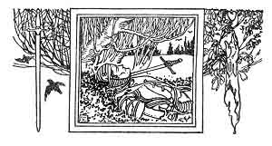
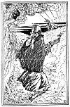
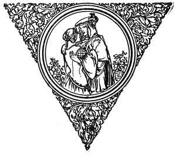

  
[Intangible Textual Heritage](../../../index)  [Sagas &
Legends](../../index)  [England](../index)  [Index](index) 
[Previous](boeb18)  [Next](boeb20) 

------------------------------------------------------------------------

p. 124

 

# The Twa Corbies

As I was walking all alane,  
I heard twa corbies making a maen:  
The tane unto the t'ither did say,  
"Whaur shall we gang and dine the day?"

"O doun beside yon auld fail dyke,  
I wot there lies a new-slain knight;  
And naebody kens that he lies there  
But his hawk, his hound, and his lady fair.

"His hound is to the hunting gane,  
His hawk to fetch the wild-fowl hame,  
His lady's ta'en another mate,  
Sae we may mak' our dinner sweet.

 

 [  
Click to enlarge](img/12401.jpg)

 

O we'll sit on his white hause bane,  
And I'll pyke out his bonny blue e'en;  
Wi' ae lock o' his gowden hair  
We'll theek our nest when it blaws bare.

"Mony a ane for him makes maen,  
But nane shall ken whaur he is gane.  
Over his banes when they are bare,  
The wind shall blaw for evermair."

 

 

------------------------------------------------------------------------

[Next: Waly, Waly, Love be Bonny](boeb20)
