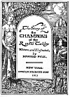

  
[Intangible Textual Heritage](../../../index)  [Sagas &
Legends](../../index)  [England](../index)  [Index](index) 
[Next](crt01) 

------------------------------------------------------------------------

# The Story of the Champions of the Round Table

## Written and Illustrated by Howard Pyle

#### New York: Charles Scribner's Sons

#### \[1905\]

###### Scanned at Intangible Textual Heritage, April 2004. John Bruno Hare, redactor. This text is in the public domain. These files may be used for any non-commercial purpose, provided this notice of attribution is left intact.

[  
Click to enlarge](img/front.jpg)  
Sir Launcelot of the Lake  

[  
Click to enlarge](img/title.jpg)

 

------------------------------------------------------------------------

[Next: Foreword](crt01)
