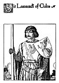
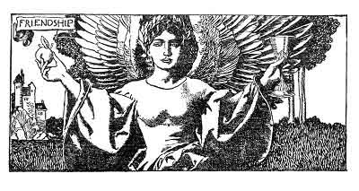
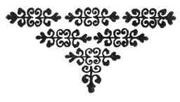

  
[Intangible Textual Heritage](../../../index)  [Sagas &
Legends](../../index)  [England](../index)  [Index](index) 
[Previous](crt23)  [Next](crt25) 

------------------------------------------------------------------------

p. 184

[  
Click to enlarge](img/18400.jpg)  
Sir Lamorack of Gales  

p. 185

 

### Chapter First

How Sir Lamorack of Gales came to Tintagel and how he and Sir Tristram
sware friendship together in the forest.

AFTER these happenings, Sir Tristram abode for awhile at the Court of
Cornwall, for so King Mark commanded him to do. And he sought in every
way to distract his mind from his sorrows by deeds of prowess. So during
this time he performed several adventures of which there is not now
space to tell you. But these adventures won such credit to his
knighthood that all the world talked of his greatness.

And ever as he grew more and more famous, King Mark hated him more and
more. For he could not bear to see Sir Tristram so noble and so
sorrowful with love of the Lady Belle Isoult.

Also Sir Tristram spent a great deal of time at chase with hawk and
hound; for he hoped by means also of such sports to drive away, in some
measure, his grief for the loss of Belle Isoult.

Now the season whereof this chapter speaketh was in the autumn of the
year, what time all the earth is glorious with the brown and gold of the
woodlands. For anon, when the wind would blow, then the leaves would
fall down from the trees like showers of gold so that everywhere they
lay heaped like flakes of gold upon the russet sward, rustling dry and
warm beneath the feet, and carpeting all the world with splendor. And
the deep blue sky overhead was heaped full of white, slow-moving clouds,
and everywhere the warm air was fragrant with the perfume of

p. 186

the forest, and at every strong breeze the nuts would fall pattering
down upon the ground like hailstones.

And because the world was so beautiful and so lusty, Sir Tristram took
great pleasure in life in spite of that trouble that lay upon him. So he

|                                |
|--------------------------------|
| *Sir Tristram rides ahunting*. |

and his court rode very joyfully amid the trees and thickets, making the
woodlands merry with the music of winding horns and loud-calling voices
and with the baying of hounds sounding like sweet tolling bells in the
remoter aisles of the forest spaces.

Thus Sir Tristram made sport all one morning, in such an autumn season,
and when noon had come he found himself to be anhungered. So he gave
orders to those who were in attendance upon him that food should be
spread at a certain open space in the forest; and therewith, in
accordance with those orders, they in attendance immediately opened
sundry hampers of wicker, and therefrom brought forth a noble pasty of
venison, and manchets of bread and nuts and apples and several flasks
and flagons of noble wine of France and the Rhine countries. This
abundance of good things they set upon a cloth as white as snow which
they had laid out upon the ground.

Now just as Sir Tristram was about to seat himself at this goodly feast
he beheld amid the thin yellow foliage that there rode through a forest
path not far away a very noble-seeming knight clad all in shining armor
and with vestments and trappings of scarlet so that he shone like a
flame of fire in the woodlands.

Then Sir Tristram said to those who stood near him, "Know ye who is
yonder knight who rides alone?" They say, "No, Lord, we know him not."
Sir Tristram said, "Go and bid that knight of his courtesy that he come
hither and eat with me."

So three or four esquires ran to where that knight was riding, and in a
little they came attending him to where Sir Tristram was, and Sir
Tristram went to meet him.

Then Sir Tristram said: "Sir Knight, I pray you for to tell me your name
and degree, for it seems to me that you are someone very high in order
of knighthood."

"Messire," quoth the other, "I shall be very glad to tell you my name if
so be you will do the like courtesy unto me. I am Sir Lamorack of Gales,

|                                    |
|------------------------------------|
| *Sir Lamorack meets Sir Tristram*. |

and I am son of the late King Pellinore, who was in his days held to be
the foremost knight in this realm. I come to these parts seeking Sir
Tristram of Lyonesse, of whose fame I hear told in every court of
chivalry whither I go. For I have never beheld Sir Tristram, and I have
a great desire to do so."

p. 187

"Well," quoth Sir Tristram, "meseems I should be greatly honored that
you should take so much trouble for nothing else than that; for lo! I am
that very Sir Tristram of Lyonesse whom you seek."

Then Sir Lamorack immediately leaped down from his war-horse and putting
up the umbril of his helmet, he came to Sir Tristram and took him by the
hand and kissed him upon the cheek. And Sir Tristram kissed Sir Lamorack
again, and each made great joy of the other.

After that, Sir Lamorack, with the aid of these esquires attendant upon
Sir Tristram, put aside his armor, and bathed his face and neck and
hands in a cold forest brook, as clear as crystal, that came brawling
down out of the woodlands. Therewith, being greatly refreshed he and Sir
Tristram sat down to that bountiful feast together, and ate and drank
with great joy and content of spirit. And whiles they ate each made
inquiry of the other what he did, and each told the other many things
concerning the goodly adventures that had befallen him.

And after they were through eating and drinking, Sir Tristram took his
harp in hand and sang several excellent ballads and rondels

|                                       |
|---------------------------------------|
| *Sir Tristram sings to Sir Lamorack*. |

which he had made in honor of Belle Isoult, and Sir Lamorack listened
and made great applause at each song that Sir Tristram sang. And so each
knight loved the other more and more the longer they sat together.

Then, after a while, Sir Tristram said: "Dear friend, let us swear
brotherhood to one another, for I find that my heart goeth out to thee
with a wonderful strength."

"Ha, Tristram," said Sir Lamorack, "I would rather live in brotherhood
with thee than with any man whom I know, for I find that the longer I am
with thee, the greater and the stronger my love groweth for thee."

Then Sir Tristram drew from his finger a very splendid ring (for the
ring held an emerald carved into the likeness of the head of a beautiful
woman, and that emerald was set into the gold of the ring) and Sir
Tristram said: "Give me that ring upon thy finger, O Lamorack! and take
thou this ring in its stead; so we shall have confirmed our brotherhood
to one another."

Then Sir Lamorack did very joyfully as Sir Tristram bade him, and he
took the ring that Sir Tristram gave him and kissed it and put it upon
his finger; and Sir Tristram kissed the ring that Sir Lamorack gave him
and put it upon his finger.

Thus they confirmed brotherhood with one another that day as they sat
together in the forest at feast, with the golden leaves falling about
them. And so they sat together all that afternoon and until the sun
began to hang

p. 188

low in the west; after that, they arose and took horse, and rode away
together toward Tintagel in great pleasure of companionship.

Now all the court at Tintagel was greatly rejoiced at the presence of so
famous a knight as Sir Lamorack of Gales; so there was great celebration

|                                        |
|----------------------------------------|
| *Sir Lamorack is honored at Tintagel*. |

upon that account, and everybody did the most that he was able to give
pleasure to Sir Lamorack. And during the time that Sir Lamorack was at
Tintagel there were several joustings held in his honor, and in all
these assays at arms Sir Lamorack himself took part and overthrew
everyone who came against him, so that he approved himself to be so
wonderful a champion that all men who beheld his performance exclaimed
with astonishment at his prowess.

But from all these affairs at arms Sir Tristram held himself aloof, and
would not take part in them. For he took such pleasure in Sir Lamorack's
glory that he would not do anything that might imperil the credit that
his friend thus gained by his prowess. For though Sir Tristram dearly
loved such affairs, he would ever say to himself: "Perhaps if I should
enter the lists against my friend it might be my mishap to overthrow him
and then his glory would be forfeited unto me."

Now upon a certain time there was held a great day of jousting in honor
of Sir Lamorack, and in that affair at arms twenty of the best knights,

|                                    |
|------------------------------------|
| *Sir Lamorack does famous battle*. |

both of Cornwall and the countries circumadjacent, took
[the](errata.htm#2) field to hold it against all comers. Of these
knights, several were well-known champions, so that they maintained the
field for a long while, to the great credit both of themselves and of
Cornwall. But some while after the prime of day, there came Sir Lamorack
into that field, and, the day being cool and fresh, he was filled with a
wonderful strength and spirit of battle. So he challenged first one of
those Cornish champions and then another, and in all such challenges he
was successful, so that he overthrew of those knights, the one after the
other, fifteen men, some of whom were sorely hurt in the encounter. Upon
this, the other five of those champions, beholding the prowess and
strength and skill of Sir Lamorack said to one another: "Why should we
venture against this man? Of a verity, this knight is no mere man, but a
demon of strength and skill. Wherefore no man may hope to stand against
him in an assault of arms; for lo! if he doth but touch a man with his
lance that man straightway falleth from his saddle." So they withdrew
themselves from that encounter and would not have to do with Sir
Lamorack.

Now at that time Sir Tristram was sitting with the court of the King,
and not far from the Lady Belle Isoult, overlooking the meadow of
battle.

p. 189

\[paragraph continues\] To him King Mark said: "Messire, why do you take
no part against this knight? Is it that you fear him?"

To this Sir Tristram replied with great calmness: "Nay, I fear not him
nor any man alive, and that you know, Lord, better than anyone in all of
the world."

"I am glad to hear of your courage and fearlessness," quoth King Mark,
"for meseems it is a great shame to all of us that this gentleman, who
is a stranger amongst us, should win so much credit to the disadvantage
of all the knights of Cornwall. Now, as you say you have no fear of him,
I pray you go down into the field and do battle with him in our behalf."
So said King Mark, for he thought to himself: "Perhaps Sir Lamorack may
overthrow Sir Tristram, and so bring him into disrepute with those who
praise him so greatly."

But Sir Tristram said: "No; I will not go down to battle against Sir
Lamorack this day whatever I may do another day. For I have sworn
brotherhood to that noble and gentle champion, and it would ill beseem
me to assault him now, when he is weary and short of breath from this
great battle which he hath done to-day against such odds. For if I
should overthrow him now, it would bring great shame upon him. Some
other day and in some other place I may assay him in friendliness, with
honor and credit both to myself and him."

"Well," said King Mark, "as for that, I do not choose to wait. Nor am I
pleased that you should sit by and suffer this knight to carry away all
the credit of arms from Cornwall in despite of the knights

|                                                 |
|-------------------------------------------------|
| *King Mark commands Sir Tristram to do battle*. |

of Cornwall. For not only would this be a great shame to the knights of
Cornwall (of whom you are the acknowledged champion), but it would be
equally a shame unto this lady whom you have fetched hither from Ireland
to be Queen of Cornwall. So I lay this command upon you-not only because
I am your King, but because I am he who made you knight--that you
straightway go down into yonder meadow and do battle with this knight
who beareth himself so proudly in our midst."

Then Sir Tristram looked upon King Mark with great anger and bitterness,
and he said: "This is great shame and despite which you seek to put upon
me by giving such commands unto me. Verily, it would seem that in all
ways you seek to put shame and sorrow upon me. And yet I have ever been
your true knight, and have saved your kingdom from truage to Ireland and
have served you very faithfully in all ways. Would to God I had been
made knight by any man in the world rather than by you."

At this King Mark smiled very bitterly upon Tristram. "Sirrah,"

p. 190

quoth he, "meseems you speak very outrageously to me who am your King.
Now I herewith command you to go straightway down into that field
without any further words and to do my bidding against yonder knight."

Then Sir Tristram groaned in spirit, and then he said, "I go."

So Sir Tristram arose and went away from that place very full of
bitterness and anger against the King and his court. For whiles there
were some of that court who were sorry for the affront that King Mark
had put upon him in public before the eyes of the entire court, yet
there were others who smiled and were glad of his humiliation. For even
so true and noble a gentleman as Sir Tristram, when he groweth great and
famous, is like to have as many enemies as friends. For there are ever
those who envy truth and nobility in a man, as well as others who hate
meanness and falsity, and so Sir Tristram ever had many enemies
whithersoever he went. And that also was the case with Sir Launcelot and
Sir Lamorack, and with other noble knights at that time.

But though Sir Tristram was so filled with indignation he said nothing

|                              |
|------------------------------|
| *Sir Tristram arms himself*. |

to any man, but went to his lodging and summoned Gouvernail, and bade
Gouvernail to help him to his armor and his horse.

Gouvernail said: "Lord, what would you do for to arm and horse yourself
at this hour?" Sir Tristram made reply: "The King hath commanded me to
do battle with Sir Lamorack, and yet Sir Lamorack is my very dear friend
and sworn brother-in-arms. He is already weary with battle, and of a
surety I shall be very likely to overthrow him in an assault at arms at
this time." Gouvernail said, "Lord, that would be great shame to you as
well as to him." And Sir Tristram said, "Yea, it is great shame." Then
Gouvernail beheld Sir Tristram's face, how it was all filled with a
passion of shame and indignation, and so he guessed what had passed, and
held his peace.

So when Sir Tristram was armed and mounted, he rode down into the meadow
of battle, where was Sir Lamorack parading with great glory before the
applause of all who looked down upon that field.

But when Sir Lamorack beheld that it was Sir Tristram who came against

|                                        |
|----------------------------------------|
| *Sir Lamorack speaks to Sir Tristram*. |

him, he was greatly astonished, and cried out: "Ha, Tristram, how is
this? Is it you who come against me? Have you then forgot that I am your
brother-in-arms and a fellow of the Round Table?"

To this Sir Tristram said: "Messire, I come not of my own free will, but
only because I must needs come, being so commanded by the King of
Cornwall."

"Very well," said Sir Lamorack, "so be it as you will, though I am very
much surprised that you should do battle against me, after all that hath

p. 191

passed betwixt us. More especially at this season when, as you very well
know, I am weary and winded with battle."

Thereupon and without further parley, each knight took stand for the
encounter at the position assigned to him. Then when they were in all
ways prepared, the marshal of the field blew upon his trumpet a call for
the assault.

So rushed those two together like two stones, flung each out of a
catapult; and therewith they two smote together in the midst of their
course like to a clap of thunder.

In that encounter the spear of Sir Lamorack brake into as many as twenty
or thirty pieces; but the spear of Sir Tristram held,

|                                         |
|-----------------------------------------|
| *Sir Tristram overthrows Sir Lamorack*. |

so that the horse of Sir Lamorack, which was weary with the several
charges he had made, was overthrown into a great cloud of dust.

But Sir Lamorack did not fall with his steed; for he voided his saddle
with a very wonderful agility and dexterity, so that he himself kept his
feet, although his horse fell as aforesaid. Then he was filled with
great rage and shame that he had been so overthrown before all those who
looked upon him; wherefore he immediately drew his sword and cried out
aloud: "Come down, Sir Knight, and do battle with me afoot, for though
my horse hath failed me because of his weariness, yet you shall find
that my body shall not so fail me."

But that while Sir Tristram sat very sorrowful, and he said: "Nay, I
will not have to do with thee again this day, for it was against my will
that I came hither to do battle with thee, and it is to my shame that I
did so. Wherefore I will not now do further battle with thee. But wait
until to-morrow and until thou art fresh, and then I will give thee the
chance of battle again."

To this Sir Lamorack made answer very bitterly: "Sir, I think you talk
to amuse me; for first you put shame upon me in this encounter, and then
you bid me wait until to-morrow ere I purge me of that shame. Now I
demand of you to do battle with me upon this moment and not to-morrow."

Sir Tristram said: "I will not do battle with thee, Lamorack, for I have
done wrong already, and I will not do more wrong."

Upon this, Sir Lamorack was so filled with anger that he scarce knew
what to say or to do. Wherefore he turned him to several who had come
down into the meadow of battle, and he said: "Hear ye all,

|                                       |
|---------------------------------------|
| *Sir Lamorack reproves Sir Tristram*. |

and listen to my words: This knight came against me in this field after
I had had to do with fifteen other knights. In that encounter he
overthrew me, because of the weariness of my horse. Having

p. 192

done that unknightly deed, he now refuseth me any further test of
battle, but allows me to lie beneath that shame which he put upon me.
Now I bid you who stand here to take this word to Sir Launcelot of the
Lake; I bid ye tell Sir Launcelot that Sir Tristram of Lyonesse, having
sworn brotherhood-in-arms to me, and being a fellow-knight of the Round
Table, hath come against me when I was weary with battle and he was
fresh. Tell Sir Launcelot that so Sir Tristram overthrew me with shame
to himself and with discredit to me, and that he then refused me all
satisfaction such as one true knight should afford another."

Then Sir Tristram cried out in a loud voice, "I pray you, hear me speak,
Messire!" But Sir Lamorack replied, "I will not hear thee!" and
therewith turned and went away, leaving Sir Tristram where he was. And
Sir Tristram sat there without movement, like to a statue of stone.

After that Sir Lamorack did not tarry longer at Tintagel, but
immediately left the King's court without making speech with anyone. And
thereafter

|                                 |
|---------------------------------|
| *Sir Lamorack leaves Tintagel*. |

he went down to the seashore and embarked in a boat with intent to sail
to Camelot where King Arthur was then holding court. For his heart was
still so bitter against Sir Tristram that he intended to lay complaint
against him before the court of chivalry at Camelot.

But Sir Lamorack did not reach Camelot upon that voyage; for, whilst he
was in passage, there suddenly arose a great tempest of wind, and in
spite of all that the mariners could do, that small ship wherein he
sailed was driven upon a cruel headland of rocks and cliffs where it was
dashed to pieces.

But Sir Lamorack had foreseen that that small boat was to be wrecked,
wherefore, before the end came, he stripped himself entirely naked and
leaped into the waters and swam for his life.

So he swam for a long time until he was well-nigh exhausted and upon the
point of drowning in the waters. But at that moment he came by

|                                                    |
|----------------------------------------------------|
| *Sir Lamorack is shipwrecked upon a strange land*. |

good hap to where was a little bay of quiet water, whereinto he swam and
so made shift to come safe to land--but faint and weak, and so sick that
he feared that he was nigh to death. Then Sir Lamorack perceived that
there was heather at that place growing upon the rocks of the hillside,
so he crawled into the heather and lay him down therein in a dry spot
and immediately fell into such a deep sleep of weariness that it was
more like to the swoon of death than to slumber.

Now the lord of that country whereunto Sir Lamorack had come was

p. 193

a very wicked knight, huge of frame and very cruel and hard of heart.
The name of this knight was Sir Nabon, surnamed le Noir; for he was very
swarth of hue, and he always wore armor entirely of

|                         |
|-------------------------|
| *Of Sir Nabon le Noir*. |

black. This knight had several years before slain the lord of that land,
and had seized upon all of the island as his own possession, and no one
dared to come against him for to recover these possessions, for his
prowess was so remarkable and his body so huge that all the world was
afraid of him. So he dwelt there unmolested in a strong castle of stone
built up upon a rock near to the seashore, whence he might behold all
the ships that passed him by. Then, whenever he would see such a ship
pass by, he would issue forth in his own ships and seize upon that other
vessel, and either levy toll upon it or sink it with all upon board. And
if he found any folk of high quality aboard such a ship, that one he
would seize and hold for ransom. So Sir Nabon made himself the terror of
all that part of the world, and all men avoided the coasts of so
inhospitable a country. Such was the land upon which Sir Lamorack had
been cast by the tempest.

Now whilst Sir Lamorack lay sleeping in the heather in that wise as
aforetold, there came by that way several fisher-folk; these,

|                                        |
|----------------------------------------|
| *The fisher-folk disarm Sir Lamorack*. |

when they saw him lying there, thought at first that he was dead. But as
they stood talking concerning him, Sir Lamorack was aware of their
voices and woke and sat up and beheld them.

Then the chiefest of those fisher-folk spake and said, "Who are you, and
how came you here?" Him Sir Lamorack answered: "Alas! friend! I am a
poor soul who was cast ashore from a shipwreck, naked as you see me. Now
I pray you, give me some clothes to cover my nakedness, and give me some
food to eat, and lend me such succor as man may give to man in
distress."

Then the chief fisherman perceived the ring upon Sir Lamorack's finger
that Sir Tristram had given him, and he said, "How got you that ring
upon your finger?" Sir Lamorack said, "He who was my friend gave it to
me." "Well," quoth the fisherman, "I will give you clothes to wear and
food to eat, but if I do so you must give me that ring that I see upon
your hand. As for lending you aid, I must tell you that the lord of this
island hath ordained upon peril of our lives that all who come hither
must straightway be brought before him to be dealt with as he may deem
fitting. Wherefore, after I have fed you and clothed you I must
immediately take you to him."

"Alas!" quoth Sir Lamorack, "this is certes an inhospitable land into
which I have come! Ne'ertheless, as I am naked and starving, I see that

p. 194

\[paragraph continues\] I have no choice other than that which ye put
upon me." So therewith he gave the chief of the fisher-folk the ring
that Sir Tristram had given him, and in return the fishermen gave him
such garments

|                                                       |
|-------------------------------------------------------|
| *The fisher-folk give Sir Lamorack clothes and food*. |

as they could spare to cover his nakedness; and they gave him black
bread and cheese to eat, and bitter ale to drink from a skin that they
carried with them. After that they tied Sir Lamorack's hands behind his
back, and so, having made him prisoner, they brought him to the castle
of Sir Nabon, and before Sir Nabon who was there at that time.

Now it chanced that the swineherd of Sir Nabon's castle had been slain
in a quarrel with one of his fellows, so that when Sir Nabon beheld Sir
Lamorack, that he was big and sturdy of frame, he said: "I will spare
this fellow his life, but I will make him my swineherd. So take ye him
away and let him herd my swine."

So they led Sir Lamorack away, and he became swineherd to Sir Nabon

|                                 |
|---------------------------------|
| *Sir Lamorack turns swineherd*. |

surnamed le Noir, and presently in a little while he grew so rough and
shaggy that his own mother would hardly have known him had she beheld
him.

 

So endeth this adventure of Sir Lamorack. And now it shall be told how
it befel with Sir Tristram after Sir Lamorack had left Tintagel as
aforetold.

 

 

------------------------------------------------------------------------

[Next: Chapter Second](crt25)
