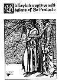
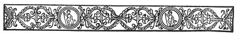
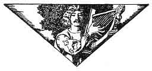

  
[Intangible Textual Heritage](../../../index)  [Sagas &
Legends](../../index)  [England](../index)  [Index](index) 
[Previous](crt37)  [Next](crt39) 

------------------------------------------------------------------------

p. 316

[  
Click to enlarge](img/31600.jpg)  
Sir Kay interrupts ye meditations of Sir Percival  

p. 317

 

### Chapter Fifth

How Sir Percival repaid Sir Kay the buffet he one time gave Yelande the
Dumb Maiden, and how, thereafter, he went forth to seek his own lady of
love.

NOW, after these adventures aforesaid, Sir Percival remained for a long
while at Beaurepaire, and during that time he was the knight-champion to
the Lady Blanchefleur. And the Lady Blanchefleur loved Sir Percival
every day with a greater and greater passion, but Sir Percival showed no
passion of love for her in return, and thereat Lady Blanchefleur was
greatly troubled.

Now one day the Lady Blanchefleur and Sir Percival were walking together
on a terrace; and it was then come to be the fall of the year, so that
the leaves of the trees were showering all down about them

|                                                         |
|---------------------------------------------------------|
| *Sir Percival and the Lady Blanchefleur walk together*. |

like flakes of gold. And that day the Lady Blanchefleur loved Sir
Percival so much that her heart was pierced with that love as though
with a great agony. But Sir Percival wist not of that.

Then the Lady Blanchefleur said: "Messire, I would that thou wouldst
stay here always as our knight-champion."

"Lady," quoth Percival, "that may not be, for in a little while now I
must leave you. For, though I shall be sad to go from such a friendly
place as this is, yet I am an errant knight, and as I am errant I must
fulfil many adventures besides the one I have accomplished here."

"Messire," said the Lady Blanchefleur, "if you will but remain here,
this castle shall be yours and all that it contains."

At this Sir Percival was greatly astonished, wherefore he said: "Lady,
how may that be? Lo! this castle is yours, and no one can take it away
from you, nor can you give it to me for mine own."

Then the Lady Blanchefleur turned away her face and bowed her head, and
said in a voice as though it were stifling her for to speak: "Percival,
it needs not to take the castle from me; take thou me for thine own, and
then the castle and all shall be thine."

At that Sir Percival stood for a space very still as though without
breathing.

p. 318

\[paragraph continues\] Then by and by he said: "Lady, meseems that no
knight could have greater honor paid to him than that which you pay to
me. Yet

|                                              |
|----------------------------------------------|
| *Sir Percival denies the Lady Blanchefleur*. |

should I accept such a gift as you offer, then I would be doing such
dishonor to my knighthood that would make it altogether unworthy of that
high honor you pay it. For already I have made my vow to serve a lady,
and if I should forswear that vow, I would be a dishonored and unworthy
knight."

Then the Lady Blanchefleur cried out in a great voice of suffering: "Say
no more, for I am ashamed."

Sir Percival said: "Nay, there is no shame to thee, but great honor to
me." But the Lady Blanchefleur would not hear him, but brake away from
him in great haste, and left him standing where he was.

So Sir Percival could stay no longer at that place; but as soon as might
be, he took horse and rode away. Nor did he see Blanchefleur again after
they had thus talked together upon that terrace as aforesaid.

And after Sir Percival had gone, the Lady Blanchefleur abandoned herself
to great sorrow, for she wept a long while and a very great deal; nor
would she, for a long while, take any joy in living or in the world in
which she lived.

 

So Sir Percival performed that adventure of setting free the duress of
the castle of Beaurepaire. And after that and ere the winter came, he

|                                              |
|----------------------------------------------|
| *Of the further adventures of Sir Percival*. |

performed several other adventures of more or less fame. And during that
time, he overthrew eleven knights in various affairs at arms and in all
those adventures he met with no mishap himself. And besides such
encounters at arms, he performed several very worthy works; for he slew
a wild boar that was a terror to all that dwelt nigh to the forest of
Umber; and he also slew a very savage wolf that infested the moors of
the Dart. Wherefore, because of these several adventures, the name of
Sir Percival became very famous in all courts of chivalry, and many
said: "Verily, this young knight must be the peer of Sir Launcelot of
the Lake himself."

Now one day toward eventide (and it was a very cold winter day) Sir
Percival came to the hut of a hermit in the forest of Usk; and he abode
all night at that place.

Now when the morning had come he went out and stood in front of the hut,
and he saw that during the night a soft snow had fallen so that all the
earth was covered with white. And he saw that it likewise had happened
that a hawk had struck a raven in front of the hermit's habitation, and
that some of the raven's feathers and some of its blood lay upon the
snow.

p. 319

Now when Sir Percival beheld the blood and the black feathers upon that
white snow, he said to himself: "Behold! that snow is not whiter than
the brow and the neck of my lady; and that red is not redder

|                                      |
|--------------------------------------|
| *Sir Percival stands in meditation*. |

than her lips; and that black is not blacker than her hair." Therewith
the thought of that lady took great hold upon him and he sighed so
deeply that he felt his heart lifted within him because of that sigh. So
he stood and gazed upon that white and red and black, and he forgot all
things else in the world than his lady-love.

Now it befell at that time that there came a party riding through those
parts, and that party were Sir Gawaine and Sir Geraint and Sir Kay. And
when they saw Sir Percival where he stood leaning against a tree and
looking down upon the ground in deep meditation, Sir Kay said: "Who is
yonder knight?" (For he wist not that that knight was Sir Percival.) And
Sir Kay said further: "I will go and bespeak that knight and ask him who
he is."

But Sir Gawaine perceived that Sir Percival was altogether sunk in deep
thought, wherefore he said: "Nay, thou wilt do ill to disturb that
knight; for either he hath some weighty matter upon his mind, or else he
is bethinking him of his lady, and in either case it would be a pity to
disturb him until he arouses himself."

But Sir Kay would not heed what Sir Gawaine said, but forthwith he went
to where Sir Percival stood; and Sir Percival was altogether unaware of
his coming, being so deeply sunk in his thoughts. Then Sir

|                                           |
|-------------------------------------------|
| *Sir Kay shakes the arm of Sir Percival*. |

Kay said: "Sir Knight,"--but Sir Percival did not hear him. And Sir Kay
said: "Sir Knight, who art thou?" But still Sir Percival did not reply.
Then Sir Kay said: "Sir Knight, thou shalt answer me!" And therewith he
catched Sir Percival by the arm and shook him very roughly.

Then Sir Percival aroused himself, and he was filled with indignation
that anyone should have laid rough hands upon his person. And Sir
Percival did not recognize Sir Kay because he was still entangled

|                                         |
|-----------------------------------------|
| *Sir Percival smites Sir Kay a buffet*. |

in that network of thought, but he said very fiercely: "Ha, sirrah!
wouldst thou lay hands upon me!" and therewith he raised his fist and
smote Sir Kay so terrible a buffet beside the head that Sir Kay
instantly fell down as though he were dead and lay without sense of
motion upon the ground. Then Sir Percival perceived that there were two
other knights standing not far off, and therewith his thoughts of other
things came back to him again and he was aware of what he had done in
his anger, and was very sorry and ashamed that he should have been so
hasty as to have struck that blow.

p. 320

Then Sir Gawaine came to Sir Percival and spake sternly to him saying:
Sir Knight, why didst thou strike my companion so unknightly a blow

|                                    |
|------------------------------------|
| *Sir Gawaine chides Sir Percival*. |

as that?"

To which Sir Percival said: "Messire, it grieves me sorely that I should
have been so hasty, but I was bethinking me of my lady, and this knight
disturbed my thoughts; wherefore I smote him in haste."

To this Sir Gawaine made reply: "Sir, I perceive that thou hadst great
excuse for thy blow. Ne'theless, I am displeased that thou shouldst have
struck that knight. Now I make demand of thee what is thy name and
condition?"

And Sir Percival said: "My name is Percival, and I am a knight of King
Arthur's making."

At that, when Sir Gawaine and Sir Geraint heard what Sir Percival said,
they cried out in great amazement; and Sir Gawaine said: "Ha, Sir
Percival!

|                                                          |
|----------------------------------------------------------|
| *Sir Gawaine and Sir Geraint rejoice over Sir Percival*. |

this is indeed well met, for my name is Gawaine and I am a nephew unto
King Arthur and am of his court; and this knight is Sir Geraint, and he
also is of King Arthur's court and of his Round Table. And we have been
in search of thee for this long time for to bring thee unto King Arthur
at Camelot. For thy renown is now spread all over this realm, so that
they talk of thee in every court of chivalry."

And Sir Percival said: "That is good news to me, for I wist not that I
had so soon won so much credit. But, touching the matter of returning
unto King Arthur's court with you; unto that I crave leave to give my
excuses. For, since you tell me that I now have so much credit of
knighthood, it behooves me to go immediately unto my lady and to offer
my services unto her. For when I parted from her I promised her that I
would come to her as soon as I had won me sufficient credit of
knighthood. As for this knight whom I have struck, I cannot be sorry for
that buffet, even if it was given with my fist and not with my sword as
I should have given it. For I have promised Sir Kay by several mouths
that I would sometime repay him with just such a buffet as that which he
struck the damosel Yelande. So now I have fulfilled my promise and have
given him that buffet."

Then Sir Gawaine and Sir Geraint laughed, and Sir Gawaine said: "Well,
Sir Percival, thou hast indeed fulfilled thy promise in very good
measure. For I make my vow that no one could have been better served
with his dessert than was Sir Kay."

Now by this time Sir Kay had recovered from that blow, so that he rose
up very ruefully, looking about as though he wist not yet just where he
was.

p. 321

Then Sir Gawaine said to Sir Percival: "As to thy coming unto the court
of the King, thou dost right to fulfil thy promise unto thy lady before
undertaking any other obligation. For, even though the

|                                          |
|------------------------------------------|
| *Sir Percival will not return to court*. |

King himself bid thee come, yet is thy obligation to thy lady superior
to the command of the King. So now I bid thee go in quest of thy lady in
God's name; only see to it that thou comest to the King's court as soon
as thou art able."

So it was that Sir Percival fulfilled the promise of that buffet unto
Sir Kay.

And now you shall hear how he found the Lady Yvette the Fair.

 

Now after Sir Percival had parted from Sir Gawaine, and Sir Geraint and
Sir Kay, he went his way in that direction he wist, and by and by,
toward eventide, he came again to the castle of Sir Percydes.

|                                                      |
|------------------------------------------------------|
| *Sir Percival cometh to the castle of Sir Percydes*. |

And Sir Percydes was at home and he welcomed Sir Percival with great joy
and congratulations. For the fame of Sir Percival was now abroad in all
the world, so that Sir Percydes welcomed him with great acclaim.

So Sir Percival sat down with Sir Percydes and they ate and drank
together, and, for the time, Sir Percival said nothing of that which was
upon his heart--for he was of a very continent nature and was in no wise
hasty in his speech.

But after they had satisfied themselves with food and drink, then Sir
Percival spake to Sir Percydes of that which was upon his mind, saying:
"Dear friend, thou didst tell me that when I was ready for to come to
thee with a certain intent thou wouldst tell me who is the lady whose
ring I wear and where I shall find her. Now, I believe that I am a great
deal more worthy for to be her knight than I was when I first saw thee;
wherefore I am now come to beseech thee to redeem thy promise to me. Now
tell me, I beg of thee, who is that lady and where does she dwell?"

Then Sir Percydes said: "Friend, I will declare to thee that which thou
dost ask of me. Firstly, that lady is mine own sister, hight Yvette, and
she is the daughter of King Pecheur. Secondly, thou shalt

|                                                  |
|--------------------------------------------------|
| *Sir Percydes declares himself to Sir Percival*. |

find her at the castle of my father, which standeth upon the west coast
of this land. Nor shalt thou have any difficulty in finding that castle,
for thou mayst easily come to it by inquiring the way of those whom thou
mayst meet in that region. But, indeed, it hath been two years since I
have seen my father and my sister, and I know not how it is with them.

Then Sir Percival came to Sir Percydes and he put his arm about him

p. 322

and kissed him upon either cheek, and he said: "Should I obtain the kind
regard of that lady, I know nothing that would more rejoice me than to
know that thou art her brother. For, indeed, I entertain a great deal of
love for thee."

At that Sir Percydes laughed for joy and he said: "Percival, wilt thou
not tell me of what house thou art come?" Percival said: "I will tell
thee what thou dost ask: my father is King Pellinore who was a very
good, noble knight of the court of King Arthur and of his Round Table."

Then Sir Percydes cried out with great amazement, saying: "That is very
marvellous! I would that I had known this before, for thy mother and my
mother were sisters of one father and one mother. So we are cousins
german."

Then Sir Percival said: "This is great joy to me!" And his heart was
expanded with pleasure at finding that Sir Percydes was of his kindred
and that he was no longer alone in that part of the world.

So Sir Percival abided for two days with Sir Percydes and then he betook
his way to the westward in pursuance of that adventure. And he was

|                                                        |
|--------------------------------------------------------|
| *Sir Percival departs for the castle of King Pecheur*. |

upon the road three days, and upon the morning of the fourth day he
came, through diligent inquiry, within sight of the castle of King
Pecheur. This castle stood upon a high crag of rock from which it arose
against the sky so that it looked to be a part. of the crag. And it was
a very noble and stately castle, having many tall towers and many
buildings within the walls thereof. And a village of white houses of the
fisher-folk gathered upon the rocks beneath the castle walls like chicks
beneath the shadow of their mother's wings.

And, behold! Percival saw the great sea for the first time in all his
life, and was filled with wonder at the huge waves that ran toward the
shore and burst upon the rocks, all white like snow. And he was amazed
at the multitude of sea fowl that flew about the rocks in such
prodigious numbers that they darkened the sky. Likewise he was
astonished at the fisher-boats that spread their white sails against the
wind, and floated upon the water like swans, for he had never seen their
like before. So he sat his horse upon a high rock nigh to the sea and
gazed his fill upon those things that were so wonderful to him.

Then after a while Sir Percival went forward to the castle. And as he
drew nigh to the castle he became aware that a very reverend man, whose
hair and beard were as white as snow, sat upon a cushion of crimson
velvet upon a rock that overlooked the sea. Two pages, richly clad in
black and silver, stood behind him; and the old man gazed out across the
sea, and Sir Percival saw that he neither spake nor moved. But when Sir

p. 323

\[paragraph continues\] Percival came near to him the old man arose and
went into the castle, and the two pages took up the two crimson velvet
cushions and followed him.

But Percival rode up to the castle, and he saw that the gateway of the
castle stood open, wherefore he rode into the courtyard of the castle.
And when he had come into the courtyard, two attendants immediately
appeared and took his horse and assisted him to dismount; but neither of
these attendants said aught to him, but both were as silent as
deaf-mutes. Then Percival entered the hall and there he saw the old man
whom he had before seen, and the old man sat in a great carved chair
beside a fire of large logs of wood. And Sir Percival saw that the eyes
of

|                                    |
|------------------------------------|
| *Sir Percival finds King Pecheur*. |

the old man were all red and that his cheeks were channeled with
weeping; and Percival was abashed at the sadness of his aspect.
Ne'ertheless, he came to where the old man sat and saluted him with
great reverence, and he said: "Art thou King Pecheur?" And the old man
answered, "Aye, for I am both a fisher and a sinner" (for that word
Pecheur meaneth both fisher and sinner).

Then Sir Percival said: "Sire, I bring thee greetings from thy son, Sir
Percydes, who is a very dear friend to me. And likewise I bring thee
greeting from myself: for I am Percival, King Pellinore's son, and thy
Queen and my mother are sisters. And likewise I come to redeem a pledge,
for, behold, here is the ring of thy daughter Yvette, unto whom I am
pledged for her true knight. Wherefore, having now achieved a not
dishonorable renown in the world of chivalry, I am come to beseech her
kindness and to redeem my ring which she hath upon her finger and to
give her back her ring again."

Then King Pecheur fell to weeping in great measure and he said:
"Percival thy fame hath reached even to this remote place, for every one
talketh of thee with great unction. But, touching my daughter Yvette, if
thou wilt come with me I will bring thee to her."

So King Pecheur arose and went forth and Sir Percival followed him. And
King Pecheur brought Sir Percival to a certain tower; and he brought him
up a long and winding stair; and at the top of the stairway was a door.

And King Pecheur opened the door and Sir Percival entered the apartment.
The windows of the apartment stood open, and a cold wind came in thereat
from off the sea; and there stood a couch in the middle

|                                         |
|-----------------------------------------|
| *Sir Percival findeth the Lady Yvette*. |

of the room, and it was spread with black velvet; and the Lady Yvette
lay reclined upon the couch, and, lo! her face was like to wax for
whiteness, and she neither moved nor spake, but only lay there perfectly
still; for she was dead.

Seven waxen candles burned at her head, and seven others at her

p. 324

feet, and the flames of the candles spread and wavered as the cold wind
blew upon them. And the hair of her head (as black as those raven
feathers that Sir Percival had beheld lying upon the snow) moved like
threads of black silk as the wind blew in through the window--but the
Lady Yvette moved not nor stirred, but lay like a statue of marble all
clad in white.

Then at the first Sir Percival stood very still at the door-way as
though he had of a sudden been turned into stone. Then he went forward
and stood beside the couch and held his hands very tightly together and
gazed at the Lady Yvette where she lay. So he stood for a long while,
and he wist not why it was that he felt like as though he had been
turned into a stone, without such grief at his heart as he had thought
to feel thereat. (For indeed, his spirit was altogether broken though he
knew it not.)

Then he spake unto that still figure, and he said: "Dear lady, is it
thus I find thee after all this long endeavor of mine? Yet from
Paradise, haply,

|                                 |
|---------------------------------|
| *Of the grief of Sir Percival*. |

thou mayst perceive all that I have accomplished in thy behalf. So shalt
thou be my lady always to the end of my life and I will have none other
than thee. Wherefore I herewith give thee thy ring again and take mine
own in its stead." Therewith, so speaking, he lifted that hand (all so
cold like the snow) and took his ring from off her finger and put her
ring back upon it again.

Then King Pecheur said, "Percival, hast thou no tears?"

And Percival said, "Nay, I have none." Therewith he turned and left that
place, and King Pecheur went with him.

After that Sir Percival abided in that place for three days, and King
Pecheur and his lady Queen and their two young sons who dwelt at that
place made great pity over him, and wept a great deal. But Sir Percival
said but little in reply and wept not at all.

 

And now I shall tell you of that wonderful vision that came unto Sir
Percival at this place upon Christmas day.

For on the third day (which was Christmas day) it chanced that Sir
Percival sat alone in the hall of the castle, and he meditated upon the
great

|                                   |
|-----------------------------------|
| *Sir Percival beholds the grail*. |

sorrow that lay upon him. And as he sat thus this very wonderful thing
befell him: He suddenly beheld two youths enter that hall. And the faces
of the two youths shone with exceeding brightness, and their hair shone
like gold, and their raiment was very bright and glistering like to
gold. One of these youths bare in his hand a spear of mighty size, and
blood dropped from the point of the spear; and the other

p. 325

youth bare in his hand a chalice of pure gold, very wonderful to behold,
and he held the chalice in a napkin of fine cambric linen.

Then, at first, Sir Percival thought that that which he beheld was a
vision conjured up by the deep sorrow that filled his heart, and he was
afeard. But the youth who bare the chalice spake in a voice
extraordinarily high and clear. And he said. "Percival! Percival! be not
afraid! This which thou here beholdest is the Sangreal, and that is the
Spear of Sorrow. What then may thy sorrow be in the presence of these
holy things that brought with them such great sorrow and affliction of
soul that they have become entirely sanctified thereby! Thus, Percival,
should thy sorrow so sanctify thy life and not make it bitter to thy
taste. For so did this bitter cup become sanctified by the great sorrow
that tasted of it."

Percival said. "Are these things real or are they a vision that I
behold?"

He who bare the chalice said, "They are real." And he who bare the spear
said, "They are real."

Then a great peace and comfort came to Sir Percival's heart and they
never left him to the day of his death.

Then they who bare the Sangreal and the Spear went out of the hall, and
Sir Percival kneeled there for a while after they had gone and prayed
with great devotion and with much comfort and satisfaction.

And this was the first time that any of those knights that were of King
Arthur's Round Table ever beheld that holy chalice, the which Sir
Percival was one of three to achieve in after-years.

So when Sir Percival came forth from that hall, all those who beheld him
were astonished at the great peace and calmness that appeared to emanate
from him. But he told no one of that miraculous vision which he had just
beheld, and, though it appeareth in the history of these things, yet it
was not then made manifest.

Then Sir Percival said to King Pecheur, his uncle and to his aunt and to
their sons: "Now, dear friends, the time hath come when I must leave
you. For I must now presently go to the court of King Arthur in
obedience to his commands and to acknowledge myself unto my brother, Sir
Lamorack."

So that day Sir Percival set forth with intent to go to Camelot, where
King Arthur was then holding court in great estate of pomp.

|                                   |
|-----------------------------------|
| *Sir Percival departs for court*. |

And Sir Percival reached Camelot upon the fourth day from that time and
that was during the feasts of Christmas-tide.

 

Now King Arthur sat at those feasts and there were six score of very
noble company seated with him. And the King's heart was greatly uplifted
and expanded with mirth and good cheer. Then, while all were feasting
with

p. 326

great concord, there suddenly came into that hall an herald-messenger;
the whom, when King Arthur beheld him, he asked: "What message hast thou
brought?" Upon this the messenger said: "Lord, there hath come one
asking permission to enter here whom you will be very well pleased to
see." The King said, "Who is it?" And the herald-messenger said, "He
saith his name is Percival."

Upon this King Arthur arose from where he sat and all the others uprose
with him and there was a great sound of loud voices; for the fame of Sir
Percival had waxed very great since he had begun his adventures. So King
Arthur and the others went down the hall for to meet Sir Percival.

Then the door opened and Sir Percival came into that place, and his face
shone very bright with peace and good-will; and he was exceedingly
comely.

King Arthur said, "Art thou Percival?" And Percival said, "I am he."
Thereupon King Arthur took Sir Percival's head into his hands,

|                                      |
|--------------------------------------|
| *Sir Percival is received with joy*. |

and he kissed him upon the brow. And Sir Percival kissed King Arthur's
hand and he kissed the ring of royalty upon the King's finger, and so he
became a true knight in fealty unto King Arthur.

Then Sir Percival said: "Lord, have I thy leave to speak?" And King
Arthur said, "Say on." Sir Percival said, "Where is Sir Lamorack?" And
King Arthur said, "Yonder he is." Then Sir Percival perceived where Sir
Lamorack stood among the others, and he went to Sir Lamorack and knelt
down before him; and Sir Lamorack was very much astonished, and said:
"Why dost thou kneel to me, Percival?" Then Sir Percival said, "Dost
thou know this ring?"

Then Sir Lamorack knew his father's ring and he cried out in a loud
voice: "That is my father's ring; how came ye by it?"

Percival said: "Our mother gave it to me, for I am thy brother."

Upon this Sir Lamorack cried out with great passion; and he flung his

|                                                  |
|--------------------------------------------------|
| *Sir Percival declares himself to Sir Lamorack*. |

arms about Sir Percival, and he kissed him repeatedly upon the face. And
so ardent was the great love and the great passion that moved him that
all those who stood about could in no wise contain themselves, but wept
at that which they beheld.

Then, after a while, King Arthur said: "Percival, come with me, for I
have somewhat to show thee."

|                                                   |
|---------------------------------------------------|
| *Sir Percival is made Knight of the Round Table*. |

So King Arthur and Sir Lamorack and Sir Percival and several others went
unto that pavilion which was the pavilion of the Round Table, and there
King Arthur showed Sir Percival a seat which was immediately upon the
right hand of the Seat Perilous.

p. 327

And upon the back of that seat there was a name emblazoned in letters of
gold; and the name was this:

PERCIVAL OF GALES

Then King Arthur said: "Behold, Sir Percival, this is thy seat, for four
days ago that name appeared most miraculously, of a sudden, where thou
seest it; wherefore that seat is thine."

Then Sir Percival was aware that that name had manifested itself at the
time when the Sangreal had appeared unto him in the castle of King
Pecheur, and he was moved with a great passion of love and longing for
the Lady Yvette; so that, because of the strength of that passion, it
took upon it the semblance of a terrible joy. And he said to himself:
"If my lady could but have beheld these, how proud would she have been!
But, doubtless, she now, looketh down from Paradise and beholdeth us and
all that we do." Thereupon he lifted up his eyes as though to behold
her, but she was not there, but only the roof of that pavilion.

But he held his peace and said naught to anyone of those thoughts that
disturbed him.

With this I conclude for the present the adventures of Sir Percival with
only this to say: that thereafter, as soon as might be, he and Sir
Lamorack went up into the mountains where their mother dwelt and brought
her down thence into the world, and that she was received at the court
of King Arthur with great honor and high regard until, after a while,
she entered into a nunnery and took the veil.

Likewise it is to be said that Sir Percival lived, as he had vowed to
do, a virgin knight for all of his life; for he never paid court to any
lady from that time, but ever held within the sanctuary of his mind the
image of that dear lady who waited for him in Paradise until he should
come unto her in such season as God should see fit.

 

But you must not think that this is all that there is to tell of that
noble, gentle and worthy young knight whose history we have been
considering. For after this he performed many glorious services to the
great honor of his knighthood and achieved so many notable adventures
that the world spoke of him as being second in worship only to Sir
Launcelot of the Lake. Yea; there were many who doubted whether Sir
Launcelot himself was really a greater knight than Sir Percival; and
though I may admit that Sir Launcelot had the greater prowess, yet Sir
Percival was, certes, the more pure in heart and transparent of soul of
those two.

p. 328

So, hereafter, if God so wills, I shall tell more of Sir Percival, for I
shall have much to write concerning him when I have to tell of the
achievement of the Sangreal which he beheld in that vision at the Castle
of King Pecheur as aforetold.

So, for this time, no more of these adventures, but fare you well.

 

 

------------------------------------------------------------------------

[Next: Conclusion](crt39)
