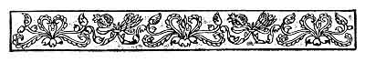
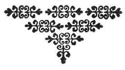

  
[Intangible Textual Heritage](../../../index)  [Sagas &
Legends](../../index)  [England](../index)  [Index](index) 
[Previous](crt38) 

------------------------------------------------------------------------

p. 329

 

# CONCLUSION.

THUS endeth the particular history of those three worthy, noble,
excellent knights-champion--Sir Launcelot of the Lake, Sir Tristram of
Lyonesse, and Sir Percival of Gales.

And I do hope that you may have found pleasure in considering their
lives and their works as I have done. For as I wrote of their behavior
and pondered upon it, meseemed they offered a very high example that
anyone might follow to his betterment who lives in this world where so
much that is ill needs to be amended.

But though I have told so much, yet, as I have just said, there remain
many other things to tell concerning Sir Launcelot and Sir Percival,
which may well afford anyone pleasure to read. These I shall recount in
another volume at another time, with such particularity as those
histories may demand.

 

 
