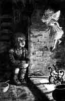

  
[Intangible Textual Heritage](../../../index)  [Legends and
Sagas](../../index)  [English Folklore](../index)  [Index](index) 
[Previous](efft39)  [Next](efft41) 

------------------------------------------------------------------------

# AINSEL  [1](#fn_46)

 [  
Click to enlarge](img/09.jpg)  
"A BEAUTIFUL LITTLE FIGURE DESCENDED THE CHIMNEY."

A WIDOW and her son, a little boy, lived together in a cottage in or
near the village of Rothley, Northumberland. One winter's evening the
child refused to go to bed with his mother, as he wished to sit up for a
while longer, "for," said he, "I am not sleepy." The mother, finding
remonstrance in vain, at last told him that if he sat up by himself the
fairies would most certainly come and take him away. The boy laughed as
his mother went to bed, leaving him sitting by the fire. He had not been
there long, watching the fire and enjoying its cheerful warmth, till a
beautiful little figure, about the size of a child's doll, descended the
chimney and alighted on the hearth! The little fellow was somewhat
startled at first, but its prepossessing smile as it paced to and fro
before him soon overcame his fears, and he inquired familiarly: "What do
they ca' thou?" "Ainsel," answered the little thing haughtily, at the
same time retorting the question: "And what do they Ca' thou?" "My
ainsel," answered the boy; and they commenced playing together like two
children newly acquainted. Their gambols continued quite innocently
until the fire began to grow dim; the boy then took up the poker to stir
it, when a hot cinder accidentally fell upon the foot of his playmate.
Her tiny voice was instantly raised to a most terrific roar, and the boy
had scarcely time to crouch into the bed behind his mother, before the
voice of the old fairy-mother was heard shouting:

"Who's done it? Who's done it?" "Oh! it was my ainsel!" answered the
daughter.

"Why, then," said the mother, as she kicked her up the chimney, "what's
all this noise for; there's nyon (i.e. no one) to blame."

------------------------------------------------------------------------

### Footnotes

[1](efft40.htm#fr_46) T . Keightley, *The Fairy
Mythology*, p. 313, quoting the M. A. Richardson *The Local Historian's
Table Book*.

------------------------------------------------------------------------

[Next: Legend of the Rollright Stones](efft41)
