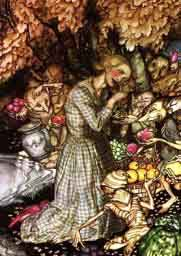

  
[Intangible Textual Heritage](../../../index)  [Legends and
Sagas](../../index)  [English Folklore](../index) 

------------------------------------------------------------------------

<table width="75%">
<colgroup>
<col style="width: 50%" />
<col style="width: 50%" />
</colgroup>
<tbody>
<tr class="odd">
<td width="50%" data-valign="TOP"></td>
<td width="50%" data-valign="TOP"><h1 id="english-fairy-and-other-folk-tales" data-align="CENTER">English Fairy and Other Folk Tales</h1>
<h2 id="by-edwin-sidney-hartland" data-align="CENTER">by Edwin Sidney Hartland</h2>
<h4 id="section" data-align="CENTER">[1890]</h4></td>
</tr>
</tbody>
</table>

------------------------------------------------------------------------

[Title Page](efft00)  

### Nursery Tales

[Jack the Giant Killer](efft01)  
[The Princess of Canterbury](efft02)  
[The Princess of Colchester](efft03)  
[Mr Fox](efft04)  
[Tom Tit Tot](efft05)  
[Jack and the Bean-stalk](efft06)  

### Historical and Local

[The Story of Sain Kenelm](efft07)  
[Wild Edric](efft08)  
[Lady Godiva](efft09)  
[The Legend of the Sons of the Conqueror](efft10)  
[The Lgend of Becket's Parents](efft11)  
[The Fause Fable of the Lord Lathom](efft12)  
[Whittington and his Cat](efft13)  
[The Pedlar of Swaffham](efft14)  
[The Lampton Worm](efft15)  
[Bomere Pool](efft16)  

### Giants

[The Origin of the Wrekin](efft17)  
[The Blinded Giant](efft18)  

### Fairies

[Worcestershire Fairies](efft19)  
[The Fairy Midwife](efft20)  
[The Adventure of Cherry of Zennor](efft21)  
[The Fairy Funeral](efft22)  
[The Piskies in the Cellar](efft23)  
[Edwin and Sir Topaz](efft24)  
[The Two Serving Damsels](efft25)  
[The Tulip Bed](efft26)  
[The Fisherman and the Piskies](efft27)  
[A Fairy Caught](efft28)  
[Colman Grey](efft29)  
[The King of the Cats](efft30)  
[A Myth of Midridge](efft31)  
[The Green Children](efft32)  
[The Fairy Banquet](efft33)  
[The Fairy Horn](efft34)  
[The Fairy Fair](efft35)  
[The Fairies' Caldron](efft36)  
[The Cauld Lad of Hilton](efft37)  
[The Fairy Thieves](efft38)  
[The Boggart](efft39)  
[Ainsel](efft40)  
[Legend of the Rollright Stones](efft41)  

### Goblins

[Dando and His Dogs](efft42)  
[The Demon Tregeagle](efft43)  
[The Pason and Clerk](efft44)  
[Outwitting the Bogie](efft45)  
[The Hunted Hare](efft46)  
[The Well of St. Ludgvan](efft47)  
[The Hedley Kow](efft48)  

### Witchcraft

[The Lord of Pengerswick](efft49)  
[The Witch and the Toad](efft50)  
[Witch and Hare](efft51)  
[The Hand of Glory](efft52)  
[Betty Chidley The Witch](efft53)  
[The Bag of Flour](efft54)  
[Kentsham Bell](efft55)  

### Ghosts

[A Bishop's Ghost](efft56)  
[A Clergyman's Ghost](efft57)  
[The Haunted House](efft58)  
[Ghost-Laying Stories](efft59)  
[The Roaring Bull of Bagbury](efft60)  
[The White Lady of Blenkinsopp](efft61)  
[The Haunted Widower](efft62)  
[The Ghost of Rosewarne](efft63)  
[The Lady with the Lantern](efft64)  
[Spectre-Dogs](efft65)  
[Billy B----'s Adventure](efft66)  

### Drolls

[The Wise Fools of Gotham](efft67)  
[The Three Wishes](efft68)  
[The Miller at the Professor's Examination](efft69)  
[Stupid's Mistaken Cries](efft70)  
[The Three Sillies](efft71)  
[Mr Vinegar](efft72)  
[Lazy Jack](efft73)  
[The History of Tom Thumb](efft74)  
