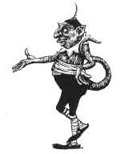
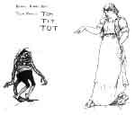

  
[Intangible Textual Heritage](../../../index)  [Legends and
Sagas](../../index)  [English Folklore](../index)  [Index](index) 
[Previous](eft01)  [Next](eft03) 

------------------------------------------------------------------------

# Tom Tit Tot

ONCE upon a time there was a woman, and she baked five pies. And when
they came out of the oven, they were that overbaked the crusts were too
hard to eat. So she says to her daughter:

'Darter,' says she, 'put you them there pies on the shelf, and leave 'em
there a little, and they'll come again.' - She meant, you know, the
crust would get soft.

But the girl, she says to herself: 'Well, if they'll come again, I'll
eat 'em now.' And she set to work and ate 'em all, first and last.

Well, come supper-time the woman said: 'Go you, and get one o' them
there pies. I dare say they've come again now.'

The girl went and she looked, and there was nothing but the dishes. So
back she came and says she: 'Noo, they ain't come again.'

'Not one of 'em?' says the mother.

'Not one of' 'em,' says she.

'Well, come again, or not come again,' said the woman, 'I'll have one
for supper.'

'But you can't, if they ain't come,' said the girl.

'But I can,' says she. 'Go you, and bring the best of 'em.'

'Best or worst,' says the girl, 'I've ate 'em all, and you can't have
one till that's come again.'

Well, the woman she was done, and she took her spinning to the door to
spin, and as she span she sang:

'My darter ha' ate five, five pies today.  
My darter ha' ate five, five pies today.'

The king was coming down the street, and he heard her sing, but what she
sang he couldn't hear, so he stopped and said:

'What was that you were singing, my good woman?'

The woman was ashamed to let him hear what her daughter had been doing,
so she sang, instead of that:

'My darter ha' spun five, five skeins today.  
My darter ha' spun five, five skeins today.'

'Stars o' mine!' said the king, 'I never heard tell of anyone that could
do that.' Then he said: 'Look you here, I want a wife, and I'll marry
your daughter. But look you here,' says he, 'eleven months out of the
year she shall have all she likes to eat, and all the gowns she likes to
get, and all the company she likes to keep; but the last month of the
year she'll have to spin five skeins every day, and if she don't I shall
kill her.'

'All right,' says the woman; for she thought what a grand marriage that
was. And as for the five skeins, when the time came, there'd be plenty
of ways of getting out of it, and likeliest, he'd have forgotten all
about it.

Well, so they were married. And for eleven months the girl had all she
liked to eat, and all the gowns she liked to get, and all the company
she liked to keep.

But when the time was getting over, she began to think about the skeins
and to wonder if he had 'em in mind. But not one word did he say about
'em, and she thought he'd wholly forgotten 'em.

However, the last day of the last month he takes her to a room she'd
never set eyes on before. There was nothing in it but a spinning-wheel
and a stool. And says he: 'Now, my dear, here you'll be shut in tomorrow
with some victuals and some flax, and if you haven't spun five skeins by
the night, your head'll go off.'

And away he went about his business.

Well, she was that frightened, she'd always been such a gatless girl,
that she didn't so much as know how to spin, and what was she to do
tomorrow with no one to come nigh her to help her? She sate down on a
stool in the kitchen, and law! how she did cry!

However, all of a sudden she heard a sort of a knocking low down on the
door. She upped and oped it, and what should she see but a small little
black thing with a long tail. That looked up at her right curious, and
that said:

'What are you a-crying for?'

'What's that to you?' says she.

'Never you mind,' that said, 'but tell me what you're a-crying for.'

'That won't do me no good if I do,' says she.

'You don't know that,' that said, and twirled that's tail round.

'Well,' says she, 'that won't do no harm, if that don't do no good,' and
she upped and told about the pies, and the skeins, and everything.

'This is what I'll do,' says the little black thing. 'I'll come to your
window every morning and take the flax and bring it spun at night.'

'What's your pay?' says she.

That looked out of the corner of that's eyes, and that said:

'I'll give you three guesses every night to guess my name, and if you
haven't guessed it before the month's up you shall be mine.'

Well, she thought, she'd be sure to guess that's name before the month
was up. 'All right,' says she, 'I agree.'

 [  
Click to enlarge](img/001.jpg)

'All right,' that says, and law! how that twirled that's tail.

Well, the next day, her husband took her into the room, and there was
the flax and the day's food.

'Now, there's the flax,' says he, 'and if that ain't spun up this night,
off goes your head.' And then he went out and locked the door.

He'd hardly gone, when there was a knocking against the window.

She upped and she oped it, and there sure enough was the little old
thing sitting on the ledge.

'Where's the flax?' says he.

'Here it be,' says she. And she gave it to him.

Well, come the evening a knocking came again to the window. She upped
and she oped it, and there was the little old thing with five skeins of
flax on his arm.

'Here it be,' says he, and he gave it to her.

'Now, what's my name?' says he.

'What, is that Bill?' says she.

'Noo, that ain't,' says he, and he twirled his tail. 'Is that Ned?' says
she.

'Noo, that ain't,' says he, and he twirled his tail. 'Well, is that
Mark?' says she.

'Noo, that ain't,' says he, and he twirled his tail harder, and away he
flew.

Well, when her husband came in, there were the five skeins ready for
him. 'I see I shan't have to kill you tonight, my dear,' says he;
'you'll have your food and your flax in the morning,' says he, and away
he goes.

Well, every day the flax and the food were brought, and every day that
there little black impet used to come mornings and evenings. And all the
day the girl sate trying to think of names to say to it when it came at
night. But she never hit on the right one. And as it got towards the end
of the month, the impet began to look so maliceful, and that twirled
that's tail faster and faster each time she gave a guess.

At last it came to the last day but one. The impet came at night along
with the five skeins, and that said:

'What, ain't you got my name yet?'

'Is that Nicodemus?' says she.

'Noo, 't ain't,' that says.

'Is that Sammle?' says she.

'Noo, 't ain't,' that says.

'A-well, is that Methusalem?' says she.

'Noo, 't ain't that neither,' that says.

Then that looks at her with that's eyes like a coal of fire, and that
says: 'Woman, there's only tomorrow night, and then you'll be mine!' And
away it flew.

Well, she felt that horrid. However, she heard the king coming along the
passage. In he came, and when he sees the five skeins, he says, says he:

'Well, my dear,' says he. 'I don't see but what you'll have your skeins
ready tomorrow night as well, and as I reckon I shan't have to kill you,
I'll have supper in here tonight.' So they brought supper, and another
stool for him, and down the two sate.

Well, he hadn't eaten but a mouthful or so, when he stops and begins to
laugh.

'What is it?' says she.

'A-why,' says he, 'I was out a-hunting today, and I got away to a place
in the wood I'd never seen before. And there was an old chalk-pit. And I
heard a kind of a sort of humming. So I got off my hobby, and I went
right quiet to the pit, and I looked down. Well, what should there be
but the funniest little black thing you ever set eyes on. And what was
that doing, but that had a little spinning-wheel, and that was spinning
wonderful fast, and twirling that's tail. And as that span that sang:

'Nimmy nimmy not  
My name's Tom Tit Tot.'

Well, when the girl heard this, she felt as if she could have jumped out
of her skin for joy, but she didn't say a word.

Next day that there little thing looked so maliceful when he came for
the flax. And when night came she heard that knocking against the window
panes. She oped the window, and that come right in on the ledge. That
was grinning from ear to ear, and Oo! that's tail was twirling round so
fast.

'What's my name?' that says, as that gave her the skeins.

'Is that Solomon?' she says, pretending to be afeard.

'Noo, 'tain't,' that says, and that came further into the room.

'Well, is that Zebedee?' says she again.

'Noo, 'tain't,' says the impet. And then that laughed and twirled that's
tail till you couldn't hardly see it.

'Take time, woman,' that says; 'next guess, and you're mine.' And that
stretched out that's black hands at her.

Well, she backed a step or two, and she looked at it, and then she
laughed out, and says she, pointing her finger at it:

 [  
Click to enlarge](img/002.jpg)

'Nimmy nimmy not  
Your name's Tom Tit Tot.'

Well, when that heard her, that gave an awful shriek and away that flew
into the dark, and she never saw it any more.

------------------------------------------------------------------------

[Next: The Three Sillies](eft03)
