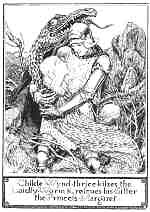
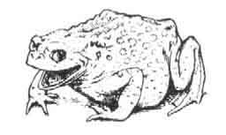

  
[Intangible Textual Heritage](../../../index)  [Legends and
Sagas](../../index)  [English Folklore](../index)  [Index](index) 
[Previous](eft33)  [Next](eft35) 

------------------------------------------------------------------------

# The Laidly Worm of Spindleston Heugh

  
IN Bamborough Castle once lived a king who had a fair wife and two
children, a son named Childe Wynd and a daughter named Margaret. Childe
Wynd went forth to seek his fortune, and soon after he had gone the
queen his mother died. The king mourned her long and faithfully, but one
day while he was hunting he came across a lady of great beauty, and fell
so much in love with her that he determined to marry her. So he sent
word home that he was going to bring a new queen to Bamborough Castle.

Princess Margaret was not very glad to hear of her mother's place being
taken, but she did not repine, but did her father's bidding, and at the
appointed day came down to the castle gate with the keys all ready to
hand over to her stepmother. Soon the procession drew near, and the new
queen came towards Princess Margaret, who bowed low and handed her the
keys of the castle. She stood there with blushing cheeks and eyes on
ground, and said: 'O welcome, father dear, to your halls and bowers, and
welcome to you, my new mother, for all that's here is yours,' and again
she offered the keys. One of the king's knights who had escorted the new
queen cried out in admiration: 'Surely this Northern princess is the
loveliest of her kind.' At that the new queen flushed up and cried out:
'At least your courtesy might have excepted me,' and then she muttered
below her breath: 'I'll soon put an end to her beauty.'

 [  
Click to enlarge](img/051.jpg)

That same night the queen, who was a noted witch, stole down to a lonely
dungeon wherein she did her magic and with spells three times three, and
with passes nine times nine she cast Princess Margaret under her spell.
And this was her spell:

I weird ye to be a Laidly Worm,  
And borrowed shall ye never be,  
Until Childe Wynd, the King's own son  
Come to the Heugh and thrice kiss thee;  
Until the world comes to an end,  
Borrowed shall ye never be.

So Lady Margaret went to bed a beauteous maiden, and rose up a Laidly
Worm. And when her maidens came in to dress her in the morning they
found coiled up on the bed a dreadful dragon, which uncoiled itself and
came towards them. But they ran away shrieking, and the Laidly Worm
crawled and crept, and crept and crawled till it reached the Heugh or
rock of the Spindleston round which it coiled itself, and lay there
basking with its terrible snout in the air.

Soon the country round about had reason to know of the Laidly Worm of
Spindleston Heugh. For hunger drove the monster out from its cave and it
used to devour everything it could come across. So at last they went to
a mighty warlock and asked him what they should do. Then he consulted
his works and familiar, and told them: 'The Laidly Worm is really the
Princess Margaret and it is hunger that drives her forth to do such
deeds. Put aside for her seven kine, and each day as the sun goes down,
carry every drop of milk they yield to the stone trough at the foot of
the Heugh, and the Laidly Worm will trouble the country no longer. But
if ye would that she be borrowed to her natural shape, and that she who
bespelled her be rightly punished, send over the seas for her brother,
Childe Wynd.'

All was done as the warlock advised; the Laidly Worm lived on the milk
of the seven kine, and the country was troubled no longer. But when
Childe Wynd heard the news, he swore a mighty oath to rescue his sister
and revenge her on her cruel stepmother. And three-and-thirty of his men
took the oath with him. Then they set to work and built a long ship, and
its keel they made of the rowan-tree. And when all was ready, they out
with their oars and pulled sheer for Bamborough Keep.

But as they got near the keep the stepmother felt by her magic power
that something was being wrought against her, so she summoned her
familiar imps and said: 'Childe Wynd is coming over the seas; he must
never land. Raise storms, or bore the hull, but nohow must he touch the
shore.' Then the imps went forth to meet Childe Wynd's ship, but when
they got near they found they had no power over the ship, for its keel
was made of the rowan-tree. So back they came to the queen witch, who
knew not what to do. She ordered her men-at-arms to resist Childe Wynd
if he should land near them, and by her spells she caused the Laidly
Worm to wait by the entrance of the harbour.

As the ship came near, the Worm unfolded its coils, and, dipping into
the sea, caught hold of the ship of Childe Wynd, and banged it off the
shore. Three times Childe Wynd urged his men on to row bravely and
strong, but each time the Laidly Worm kept it off the shore. Then Childe
Wynd ordered the ship to be put about, and the witch-queen thought he
had given up the attempt. But instead of that, he only rounded the next
point and landed safe and sound in Buddle Creek, and then, with sword
drawn and bow bent, rushed up, followed by his men, to fight the
terrible Worm that had kept him from landing.

But the moment Childe Wynd had landed, the witch-queen's power over the
Laidly Worm had gone, and she went back to her bower all alone, not an
imp, nor a man-at-arms to help her, for she knew her hour was come. So
when Childe Wynd came rushing up to the Laidly Worm it made no attempt
to stop him or hurt him, but just as he was going to raise his sword to
slay it, the voice of his own sister Margaret came from its jaws,
saying:

'O, quit your sword, unbend your bow,  
And give me kisses three;  
For though I am a poisonous worm,  
No harm I'll do to thee.'

Childe Wynd stayed his hand, but he did not know what to think if some
witchery were not in it. Then said the Laidly Worm again:

'O, quit your sword, unbend your bow,  
And give me kisses three;  
If I'm not won ere set of sun,  
Won never shall I be.'

Then Childe Wynd went up to the Laidly Worm and kissed it once; but no
change came over it. Then Childe Wynd kissed it once more; but yet no
change came over it. For a third time he kissed the loathsome thing, and
with a hiss and a roar the Laidly Worm reared back and before Childe
Wynd stood his sister Margaret. He wrapped his cloak about her, and then
went up to the castle with her. When he reached the keep, he went off to
the witch-queen's bower, and when he saw her, he touched her with a twig
of a rowan-tree. No sooner had he touched her than she shrivelled up and
shrivelled up, till she became a huge ugly toad, with bold staring eyes
and a horrible hiss. She croaked and she hissed, and then hopped away
down the castle steps, and Childe Wynd took his father's place as king,
and they all lived happy afterwards.

But to this day a loathsome toad is seen at times haunting the
neighbourhood of Bamborough Keep, and the wicked witch-queen is that
Laidly Toad.

 

------------------------------------------------------------------------

[Next: The Cat and the Mouse](eft35)
