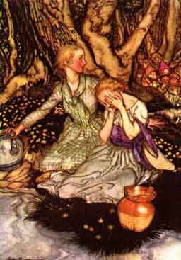

  
[Intangible Textual Heritage](../../../index)  [Legends and
Sagas](../../index)  [English Folklore](../index) 

------------------------------------------------------------------------

<table width="75%">
<colgroup>
<col style="width: 50%" />
<col style="width: 50%" />
</colgroup>
<tbody>
<tr class="odd">
<td width="50%" data-valign="TOP"></td>
<td width="50%" data-valign="TOP"><h1 id="english-fairy-tales" data-align="CENTER">English Fairy Tales</h1>
<h2 id="by-joseph-jacobs" data-align="CENTER">by Joseph Jacobs</h2>
<h4 id="section" data-align="CENTER">[1890]</h4></td>
</tr>
</tbody>
</table>

------------------------------------------------------------------------

[Title Page](eft00)  
[Preface](eft01)  
[Tom Tit Tot](eft02)  
[The Three Sillies](eft03)  
[The Rose-Tree](eft04)  
[The Old Woman and Her Pig](eft05)  
[How Jack Went to Seek his Fortune](eft06)  
[Mr Vinegar](eft07)  
[Nix Nought Nothing](eft08)  
[Jack Hannaford](eft09)  
[Binnorie](eft10)  
[Mouse and Mouser](eft11)  
[Cap O' Rushes](eft12)  
[Teeny-Tiny](eft13)  
[Jack and the Beanstalk](eft14)  
[The Story of the Three Little Pigs](eft15)  
[The Master and His Pupil](eft16)  
[Titty Mouse and Tatty Mouse](eft17)  
[Jack and His Golden Snuff-Box](eft18)  
[The Story of the Three Bears](eft19)  
[Jack the Giant-Killer](eft20)  
[Henny-Penny](eft21)  
[Childe Rowland](eft22)  
[Molly Whuppie](eft23)  
[The Red Ettin](eft24)  
[The Golden Arm](eft25)  
[The History of Tom Thumb](eft26)  
[Mr Fox](eft27)  
[Lazy Jack](eft28)  
[Johnny-Cake](eft29)  
[Earl Mar's Daughter](eft30)  
[Mr Miacca](eft31)  
[Whittington and His Cat](eft32)  
[The Strange Visitor](eft33)  
[The Laidly Worm of Spindleston Heugh](eft34)  
[The Cat and the Mouse](eft35)  
[The Fish and the Ring](eft36)  
[The Magpie's Nest](eft37)  
[Kate Crackernuts](eft38)  
[The Cauld Lad of Hilton](eft39)  
[The Ass, The Table and the Stick](eft40)  
[Fairy Ointment](eft41)  
[The Well of the World's End](eft42)  
[Master of all Masters](eft43)  
[The Three Heads of the Well](eft44)  
[Introductory Notes](eft45)  
[Notes](eft46)  
