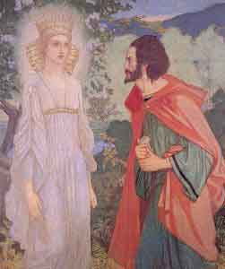

  
[Intangible Textual Heritage](../../../index)  [Sagas &
Legends](../../index)  [England](../index) 

------------------------------------------------------------------------

Also of interest: [Stories from the Faerie Queene](../sfq/index)

------------------------------------------------------------------------

<table width="75%">
<colgroup>
<col style="width: 50%" />
<col style="width: 50%" />
</colgroup>
<tbody>
<tr class="odd">
<td width="50%" data-valign="CENTER"></td>
<td width="50%" data-valign="CENTER"><h1 id="the-faerie-queene" data-align="CENTER">The Faerie Queene</h1>
<h2 id="by-edmund-spenser" data-align="CENTER">by Edmund Spenser</h2>
<h4 id="section" data-align="CENTER">[1596]</h4></td>
</tr>
</tbody>
</table>

------------------------------------------------------------------------

[Title Page](fq00)  
[Dedication](fq01)  

### Book 1

[The Legende of the Knight of the Red Crosse or Of Holinesse](fq02)  
[Canto I](fq03)  
[Canto II](fq04)  
[Canto III](fq05)  
[Canto IIII](fq06)  
[Canto V](fq07)  
[Canto VII](fq08)  
[Canto VIII](fq09)  
[Canto X](fq10)  
[Canto XI](fq11)  
[Canto XII](fq12)  

### Book 2

[The Legend of Sir Gvyon, or Of Temperaunce](fq13)  
[Canto I](fq14)  
[Canto II](fq15)  
[Canto III](fq16)  
[Canto IIII](fq17)  
[Canto V](fq18)  
[Canto VI](fq19)  
[Canto VII](fq20)  
[Canto VIII](fq21)  
[Canto IX](fq22)  
[Canto X](fq23)  
[Canto XI](fq24)  
[Canto XII](fq25)  

### Book 3

[The Legend of Britomartis or Of Chastitie](fq26)  
[Canto I](fq27)  
[Canto II](fq28)  
[Canto III](fq29)  
[Canto IIII](fq30)  
[Canto V](fq31)  
[Canto VI](fq32)  
[Canto VII](fq33)  
[Canto VIII](fq34)  
[Canto IX](fq35)  
[Canto X](fq36)  
[Canto XI](fq37)  
[Canto XII](fq38)  

### Book 4

[The Legend of Cambel and Telamond, or Of Friendship](fq39)  
[Canto I](fq40)  
[Canto II](fq41)  
[Canto III](fq42)  
[Canto IIII](fq43)  
[Canto V](fq44)  
[Canto VI](fq45)  
[Canto VII](fq46)  
[Canto VIII](fq47)  
[Canto IX](fq48)  
[Canto X](fq49)  
[Canto XI](fq50)  
[Canto XII](fq51)  

### Book 5

[The Legend of Artegall or Of Ivstice](fq52)  
[Canto I](fq53)  
[Canto II](fq54)  
[Canto III](fq55)  
[Canto IIII](fq56)  
[Canto V](fq57)  
[Canto VI](fq58)  
[Canto VII](fq59)  
[Canto VIII](fq60)  
[Canto IX](fq61)  
[Canto X](fq62)  
[Canto XI](fq63)  
[Canto XII](fq64)  

### Book 6

[The Legend of S. Calidore or Of Covrtesie](fq65)  
[Canto I](fq66)  
[Canto II](fq67)  
[Canto III](fq68)  
[Canto IIII](fq69)  
[Canto V](fq70)  
[Canto VI](fq71)  
[Canto VII](fq72)  
[Canto VIII](fq73)  
[Canto IX](fq74)  
[Canto X](fq75)  
[Canto XI](fq76)  
[Canto XII](fq77)  

### The Cantos of Mutabilitie

[The Cantos of Mutabilitie](fq78)  
[Canto VI](fq79)  
[Canto VII](fq80)  
[Canto VIII](fq81)  

### Letter to Raleigh and Commendatory Poems, &c.

[Letter to Raleigh and Commendatory Poems, &c.](fq82)  
[Commendatory Poems and Sonnets to Persons of Rank](fq83)  
