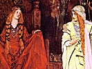

  
[Intangible Textual Heritage](../../../index)  [Legends and
Sagas](../../index)  [England](../index)  [Index](index) 
[Previous](gem00)  [Next](gem02) 

------------------------------------------------------------------------

[Buy this Book at
Amazon.com](https://www.amazon.com/exec/obidos/ASIN/1406795151/internetsacredte)

------------------------------------------------------------------------

  
*Histories of the Kings of Britain, by Geoffry of Monmouth*, tr. by
Sebastian Evans, \[1904\], at Intangible Textual Heritage

------------------------------------------------------------------------

p. 1

### CONTENTS

|                           |                                                            |
|---------------------------|------------------------------------------------------------|
|                           | PAGE |
| BOOK I.                   | [3](gem02.htm#page_3)                                      |
| BOOK II.                  | [36](gem03.htm#page_36)                                    |
| BOOK III.                 | [58](gem04.htm#page_58)                                    |
| BOOK IV.                  | [83](gem05.htm#page_83)                                    |
| BOOK V.                   | [110](gem06.htm#page_110)                                  |
| BOOK VI.                  | [136](gem07.htm#page_136)                                  |
| BOOK VII.                 | [170](gem08.htm#page_170)                                  |
| BOOK VIII.                | [189](gem09.htm#page_189)                                  |
| BOOK IX.                  | [226](gem10.htm#page_226)                                  |
| BOOK X.                   | [259](gem11.htm#page_259)                                  |
| BOOK XI.                  | [288](gem12.htm#page_288)                                  |
| BOOK XII.                 | [302](gem13.htm#page_302)                                  |
| THE TRANSLATOR'S EPILOGUE | [329](gem14.htm#page_329)                                  |

------------------------------------------------------------------------

[Next: Book I](gem02)
