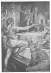
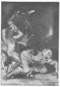
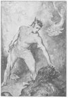
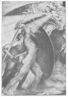
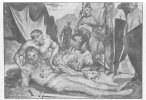

  
[Intangible Textual Heritage](../../../index) 
[Myths/Sagas](../../index)  [England](../index)  [Index](index) 
[Previous](hml04)  [Next](hml06) 

------------------------------------------------------------------------

[Buy this Book at
Amazon.com](https://www.amazon.com/exec/obidos/ASIN/1859580017/internetsacredte)

------------------------------------------------------------------------

p. 1

# CHAPTER I: BEOWULF

### Introduction

THE figure which meets us as we enter on the study of Heroes of the
British Race is one which appeals to us in a very special way, since he
is the one hero in whose legend we may see the ideals of our English
forefathers before they left their Continental home to settle in this
island. Opinions may differ as to the date at which the poem of
"Beowulf" was written, the place in which it was localised, and the
religion of the poet who combined the floating legends into one epic
whole, but all must accept the poem as embodying the life and feelings
of our Forefathers who dwelt in North Germany on the shores of the North
Sea and of the Baltic. The life depicted, the characters portrayed, the
events described, are such as a simple warrior race would cherish in
tradition and legend as relics of the life lived by their ancestors in
what doubtless seemed to them the Golden Age. Perhaps stories of a
divine Beowa, hero and ancestor of the English, became merged in other
myths of sun-hero and marsh-demon, but in any case the stories are now
crystallized around one central human figure, who may even be considered
an historical hero, Beowulf, the thane of Hygelac, King of the Geats. It
is this grand primitive hero who embodies the ideal of English heroism.
Bold to rashness for himself, prudent for his comrades, daring,
resourceful, knowing no fear, loyal to his king and his kinsmen,
generous in war and in peace, self-sacrificing, Beowulf stands for all
that is best in manhood in an age of strife. It is fitting that our
first British hero should be physically and mentally strong, brave to
seek danger and brave to look on death and Fate undaunted, one whose
life is a struggle against evil

p. 2

forces, and whose death comes in a glorious victory over the powers of
evil, a victory gained for the sake of others to whom Beowulf feels that
he owes protection and devotion.

### The Story. The Coming and Passing of Scyld

Once, long ago, the Danish land owned the sway of a mighty monarch,
Scyld Scefing, the founder of a great dynasty, the Scyldings. This great
king Scyld had come to Denmark in a mysterious manner, since no man knew
whence he sprang. As a babe he drifted to the Danish shore in a vessel
loaded with treasures; but no man was with him, and there was no token
to show his kindred and race. When Scyld grew up he increased the power
of Denmark and enlarged her borders; his fame spread far and wide among
men, and his glory shone undimmed until the day when, full of years and
honours, he died, leaving the throne securely established in his family.
Then the sorrowing Danes restored him to the mysterious ocean from which
he had come to them. Choosing their goodliest ship, they laid within it
the corpse of their departed king, and heaped around him all their best
and choicest treasures, until the venerable countenance of Scyld looked
to heaven from a bed of gold and jewels; then they set up, high above
his head, his glorious gold-wrought banner, and left him alone in state.
The vessel was loosed from the shore where the mourning Danes bewailed
their departing king, and drifted slowly away to the unknown west from
which Scyld had sailed to his now sorrowing people; they watched until
it was lost in the shadows of night and distance, but no man under
heaven knoweth what shore now holds the vanished Scyld. The descendants
of Scyld ruled and prospered till the days of his great-grandson
Hrothgar,

p. 3

one of a family of four, who can all be identified historically with
various Danish kings and princes.

### Hrothgar's Hall

Hrothgar was a mighty warrior and conqueror, who won glory in battle,
and whose fame spread wide among men, so that nobly born warriors, his
kinsmen, were glad to serve as his bodyguard and to fight for him
loyally in strife. So great was Hrothgar's power that he longed for some
outward sign of the magnificence of his sway; he determined to build a
great hall, in which he could hold feasts and banquets, and could
entertain his warriors and thanes, and visitors from afar. The hall rose
speedily, vast, gloriously adorned, a great meeting-place for men; for
Hrothgar .had summoned all his people to the work, and the walls towered
up high and majestic, ending in pinnacles and gables resembling the
antlers of a stag. At the great feast which Hrothgar gave first in his
new home the minstrels chanted the glory of the hall, "Heorot," "The
Hart," as the king named it; Hrothgar's desire was well fulfilled, that
he should build the most magnificent or banquet-halls. Proud were the
mighty warriors who feasted within it, and proud the heart of the king,
who from his high seat on the daïs saw his brave thanes carousing at the
long tables below him, and the lofty rafters of the hall rising black
into the darkness.

### Grendel

Day by day the feasting continued, until its noise and the festal joy of
its revellers aroused a mighty enemy, Grendel, the loathsome
fen-monster. This monstrous being, half-man, half-fiend, dwelt in the
fens near the hill on which Heorot stood. Terrible was he, dangerous to
men, of extraordinary strength, human

p. 4

in shape but gigantic of stature, covered with a green horny skin, on
which the sword would not bite. His race, all sea-monsters, giants,
goblins, and evil demons, were offspring of Cain, outcasts from the
mercy of the Most High, hostile to the human race; and Grendel was one
of mankind's most bitter enemies; hence his hatred of the joyous shouts
from Heorot, and his determination to stop the feasting.

|                                |                              |
|--------------------------------|------------------------------|
| "This the dire mighty fiend,   | he who in darkness dwelt,    |
| Suffered with hatred fierce,   | that every day and night     |
| He heard the festal shouts     | loud in the lofty hall;      |
| Sound of harp echoed there,    | and gleeman's sweet song.    |
| Thus they lived joyously,      | fearing no angry foe         |
| Until the hellish fiend        | wrought them great woe.      |
| Grendel that ghost was called, | grisly and terrible,         |
| Who, hateful wanderer,         | dwelt in the moorlands,      |
| The fens and wild fastnesses;  | the wretch for a while abode |
| In homes of the giant-race,    | since God had cast him out.  |
| When night on the earth fell,  | Grendel departed             |
| To visit the lofty hall,       | now that the warlike Danes   |
| After the gladsome feast       | nightly slept in it.         |
| A fair troop of warrior-thanes | guarding it found he;        |
| Heedlessly sleeping,           | they reeked not of sorrow.   |
| The demon of evil,             | the grim wight unholy,       |
| With his fierce ravening,      | greedily grasped them,       |
| Seized in their slumbering     | thirty right manly thanes;   |
| Thence he withdrew again,      | proud of his lifeless prey,  |
| Home to his hiding-place,      | bearing his booty,           |
| In peace to devour it."        |                              |

When dawn broke, and the Danes from their dwellings around the hall
entered Heorot, great was the lamentation, and dire the dismay, for
thirty noble champions had vanished, and the blood-stained tracks of the
monster showed but too well the fate that had overtaken them. Hrothgar's
grief was profound, for he had lost thirty of his dearly loved
bodyguard, and he himself was too old to wage a conflict against the
foe--a foe who repeated night by night his awful deeds,

 

[  
Click to enlarge](img/00400.jpg)  
''The demon of evil, with his fierce ravening, greedily grasped them''  

[  
Click to enlarge](img/00500.jpg)  
Beowulf replies haughtily to Hunferth  

 

p. 5

in spite of all that valour could do to save the Danes from his terrible
enmity. At last no champion would face the monster, and the Danes, in
despair, deserted the glorious hall of which they had been so proud.
Useless stood the best of dwellings, for none dared remain in it, but
every evening the Danes left it after their feast, and slept elsewhere.
This affliction endured for twelve years, and all that time the
beautiful hall ref Heorot stood empty when darkness was upon it. By
night the dire fiend visited it in search of prey, and in the morning
his footsteps showed that his deadly enmity was not yet appeased, but
that any effort to use the hall at night would bring down his fatal
wrath on the careless sleepers.

Far and wide spread the tidings of this terrible oppression, and many
champions came from afar to offer King Hrothgar their aid, but none was
heroic enough to conquer the monster, and many a mighty warrior lost his
life in a vain struggle against Grendel. At length even these bold
adventurers ceased to come; Grendel remained master of Heorot, and the
Danes settled down in misery under the bondage of a perpetual nightly
terror, while Hrothgar grew old in helpless longing for strength to
rescue his people from their foe.

### Beowulf

Meanwhile there had come to manhood and full strength a hero destined to
make his name famous for mighty deeds of valour throughout the whole of
the Teutonic North. In the realm of the Geats (Götaland, in the south of
Sweden) ruled King Hygelac, a mighty ruler who was ambitious enough to
aim at conquering his neighbours on the mainland of Germany. His only
sister, daughter of the dead king Hrethel, had

p. 6

married a great noble, Ecgtheow, and they had one son, Beowulf, who from
the age of seven was brought up at the Geatish court. The boy was a lad
of great stature and handsome appearance, with fair locks and gallant
bearing; but he greatly disappointed his grandfather, King Hrethel, by
his sluggish character. Beowulf as a youth had been despised by all for
his sloth and his unwarlike disposition; his good-nature and his rarely
stirred wrath made others look upon him with scorn, and the mighty
stature to which he grew brought him nothing but scoffs and sneers and
insults in the banquet-hall when the royal feasts were held. Yet wise
men might have seen the promise of great strength in his powerful sinews
and his mighty hands, and the signs of great force of character in the
glance of his clear blue eyes and the fierceness of his anger when he
was once aroused. At least once already Beowulf had distinguished
himself in a great feat--a swimming-match with a famous champion, Breca,
who had been beaten in the contest. For this and other victories, and
for the bodily strength which gave Beowulf's hand-grip the force of
thirty men, the hero was already famed when the news of Grendel's
ravages reached Geatland. Beowulf, eager to try his strength against the
monster, and burning to add to his fame, asked and obtained permission
from his uncle, King Hygelac, to seek the stricken Danish king and offer
his help against Grendel; then, choosing fourteen loyal comrades and
kinsfolk, he took a cheerful farewell of the Geatish royal family and
sailed for Denmark.

Thus it happened that one day the Warden of the Coast, riding on his
round along the Danish shores, saw from the white cliffs a strange
war-vessel running in to shore. Her banners were unknown to him, her
crew were strangers and all in war-array, and as the

p. 7

\[paragraph continues\] Warden watched
them they ran the ship into a small creek among the mountainous cliffs,
made her fast to a rock with stout cables, and then landed and put
themselves in readiness for a march. Though there were fifteen of the
strangers and the Warden was alone, he showed no hesitation, but, riding
boldly down into their midst, loudly demanded:

|                                |                              |
|--------------------------------|------------------------------|
| "What are ye warlike men       | wielding bright weapons,     |
| Wearing grey corslets          | and boar-adorned helmets,    |
| Who o’er the water-paths       | come with your foaming keel  |
| Ploughing the ocean surge?     | I was appointed              |
| Warden of Denmark's shores;    | watch hold I by the wave     |
| That on this Danish coast      | no deadly enemy              |
| Leading troops over sea        | should land to injure.       |
| None have here landed yet      | more frankly coming          |
| Than this fair company:        | and yet ye answer not        |
| The password of warriors,      | and customs of kinsmen.      |
| Ne’er have mine eyes beheld    | a mightier warrior,          |
| An earl more lordly, than      | is he, the chief of you;     |
| He is no common man;           | if looks belie him not,      |
| He is a hero bold,             | worthily weaponed.           |
| Anon must I know of you        | kindred and country,         |
| Lest ye as spies should go     | free on our Danish soil.     |
| Now ye men from afar,          | sailing the surging sea,     |
| Have heard my earnest thought: | best is a quick reply,       |
| That I may swiftly know        | whence ye have hither come." |

So the aged Warden sat on his horse, gazing attentively on the faces of
the fifteen strangers, but watching most carefully the countenance of
the leader; for the mighty stature, the clear glance of command, the
goodly armour, and the lordly air of Beowulf left no doubt as to who was
the chieftain of that little band. When the questions had been asked the
leader of the new-corners moved forward till his mighty figure stood
beside the Warden's horse, and as he gazed up into the old man's eyes he
answered: "We are warriors of the Geats, members of King Hygelac's
bodyguard. My father, well

p. 8

known among men of wisdom, was named Ecgtheow, a wise counsellor who
died full of years and famous for his wisdom, leaving a memory dear to
all good men."

|                               |                            |
|-------------------------------|----------------------------|
| "We come to seek thy king     | Healfdene's glorious son,  |
| Thy nation's noble lord,      | with friendly mind.        |
| Be thou a guardian good       | to us strangers here!      |
| We have an errand grave       | to the great Danish king,  |
| Nor will I hidden hold        | what I intend!             |
| Thou canst tell if it is      | truth (as we lately heard) |
| That some dire enemy,         | deadly in evil decd,       |
| Cometh in dark of night,      | sateth his secret hate,    |
| Worketh through fearsome awe, | slaughter and shame.       |
| I can give Hrothgar bold      | counsel to conquer him,    |
| How he with valiant mind      | Grendel may vanquish,      |
| If he would ever lose         | torment of burning care,   |
| If bliss shall bloom again    | and woe shall vanish."     |

The aged Warden replied: "Every bold warrior of noble mind must
recognise the distinction between words and deeds. I judge by thy speech
that you are all friends to our Danish king; therefore I bid you go
forward, in warlike array, and I myself will guide you to King Hrothgar;
I will also bid my men draw your vessel up the beach, and make her fast
with a barricade of oars against any high tide. Safe she shall he until
again she bears you to your own land. May your expedition prove
successful."

Thus speaking, he turned his horse's head and led the way up the steep
cliff paths, while the Geats followed him, resplendent in shining
armour, with boar-crests on their helmets, shields and spears in their
hands, and mighty swords hanging in their belts: a goodly band were
they, as they strode boldly after the Warden. Anon there appeared a
roughly trodden path, which soon became a stone-paved road, and the way
led on to where the great hall, Heorot, towered aloft, gleaming white in
the sun; very glorious it seemed,

p. 9

with its pinnacled gables and its carved beams and rafters, and the
Geats gazed at it with admiration as the Warden of the Coast said:
"Yonder stands our monarch's hall, and your way lies clear before you.
May the All-Father keep you safe in the conflict! Now it is time for me
to return; I go to guard our shores from every foe."

### Hrothgar and Beowulf

The little band of Geats, in their shining war-gear, strode along the
stone-paved street, their ring-mail sounding as they went, until they
reached the door or Heorot; and there, setting down their broad shields
and their keen spears against the wall, they prepared to enter as
peaceful guests the great hail of King Hrothgar. Wulfgar, one of
Hrothgar's nobles, met them at the door and asked whence such a splendid
band of warlike strangers, so well armed and so worthily equipped, had
come. Their heroic bearing betokened some noble enterprise. Beowulf
answered: "We are Hygelac's chosen friends and companions, and I am
Beowulf. To King Hrothgar, thy master, will I tell mine errand, it the
son of Healfdene will allow us to approach him."

Wulfgar, impressed by the words and bearing or the hero, replied: "I
will announce thy coming to my lord, and bring back his answer"; and
then made his way up the hail to the high seat where Hrothgar sat on the
dais amidst his bodyguard of picked champions. Bowing respectfully, he
said:

|                                |                                                  |
|--------------------------------|--------------------------------------------------|
| "Here are come travelling      | over the sea-expanse,                            |
| Journeying from afar,          | heroes of Geatland.                              |
| Beowulf is the name            | of their chief warrior.                          |
| This is their prayer; my lord, | that they may speak with thee;                   |
| Do not thou give them          | a hasty refusal! p. 10 |
| Do not deny them               | the gladness of converse!                        |
| They in their war-gear seem    | worthy of men's respect.                         |
| Noble their chieftain seems,   | he who the warriors                              |
| Hither has guided."            |                                                  |

At these words the aged king aroused himself from the sad reverie into
which he had fallen and answered: "I knew him as a boy. Beowulf is the
son of Ecgtheow, who wedded the daughter of the Geat King Hrethel. His
fame has come hither before him; seafarers have told me that he has the
might of thirty men in his hand-grip. Great joy it is to know of his
coming, for he may save us from the terror of Grendel. If he succeeds in
this, great treasures will I bestow upon him. Hasten; bring in hither
Beowulf and his kindred thanes, and bid them welcome to the Danish
folk!"

Wulfgar hurried down the hall to the place where Beowulf stood with his
little band; he led them gladly to the high seat, so that they stood
opposite to Hrothgar, who looked keenly at the well-equipped troop, and
kindly at its leader. A striking figure was Beowulf as he stood there in
his gleaming ring-mail, with the mighty sword by his side. It was,
however, but a minute that Hrothgar looked in silence, for with
respectful greeting Beowulf spoke:

|                                 |                                                     |
|---------------------------------|-----------------------------------------------------|
| "Hail to thee, Hrothgar King!   | Beowulf am I,                                       |
| Hygelac's kinsman               | and loyal companion.                                |
| Great deeds of valour           | wrought I in my youth.                              |
| To me in my native land         | Grendel's ill-doing                                 |
| Came as an oft-heard tale       | told by our sailors.                                |
| They say that this bright hall, | noblest of buildings,                               |
| Standeth to every man           | idle and useless                                    |
| After the evening-light         | fails in the heavens.                               |
| Thus, Hrothgar, ancient king,   | all my friends urged me,                            |
| Warriors and prudent thanes,    | that I should seek thee,                            |
| Since they themselves had known | my might in battle. p. 11 |
| Now I will beg of thee,         | lord of the glorious Danes,                         |
| Prince of the Scylding race,    | Folk-lord most friendly,                            |
| Warden of warriors,             | only one boon.                                      |
| Do not deny it me,              | since I have come from far;                         |
| 1 with my men alone,            | this troop of heroes good,                          |
| Would without help from thee    | cleanse thy great hall!                             |
| Oft have I also heard           | that the fierce monster                             |
| Through his mad recklessness    | scorns to use weapons;                              |
| Therefore will I forego         | (so may lying Hygelac,                              |
| My friendly lord and king,      | find in me pleasure                                 |
| That I should bear my sword     | and my broad yellow shield                          |
| Into the conflict:              | with my hand-grip alone                             |
| I ’gainst the foe will strive,  | and struggle for my life--                          |
| He shall endure God's doom      | whom death shall bear away.                         |
| I know that he thinketh         | in this hail of conflict                            |
| Fearless to eat me,             | if he can compass it,                               |
| As he has oft devoured          | heroes of Denmark.                                  |
| Then thou wilt not need         | my head to hide away,                               |
| Grendel will have me            | all mangled and gory;                               |
| Away will he carry,             | if death then shall take me,                        |
| My body with gore stained       | will he think to feast on,                          |
| On his lone track will bear it  | and joyously eat it,                                |
| And mark with my life-blood     | his lair in the moorland;                           |
| Nor more for my welfare         | wilt thou need to care then.                        |
| Send thou to Hygelac,           | if strife shall take me,                            |
| That best of byrnies            | which my breast guardeth,                           |
| Brightest of war-weeds,         | the work of Smith Weland,                           |
| Left me by Hrethel.             | Ever Wyrd has her way."                             |

The aged King Hrothgar, who had listened attentively while the hero
spoke of his plans and of his possible fate, now greeted him saying:
"Thou hast sought my court for honour and for friendship's sake, O
Beowulf: thou hast remembered the ancient alliance between Ecgtheow, thy
father, and myself, when I shielded him, a fugitive, from the wrath of
the Wilfings, paid them the due wergild for his crime, and took his oath
of loyalty to myself. Long ago that time is; Ecgtheow is dead, and I am
old and in misery. It were too long now to tell of all the woe

p. 12

that Grendel has wrought, but this I may say, that many a hero has
boasted of the great valour he would display in strife with the monster,
and has awaited his coming in this hall; in the morning there has been
no trace of each hero but the dark blood-stains on benches and tables.
How many times has that happened! But sit down now to the banquet and
tell thy plans, if such be thy will."

Thereupon room was made for the Geat warriors on the long benches, and
Beowulf sat in the place of honour opposite to the king: great respect
was shown to him, and all men looked with wonder on this mighty hero,
whose courage led him to hazard this terrible combat. Great carved horns
of ale were borne to Beowulf and his men, savoury meat was placed before
them, and while they ate and drank the minstrels played and sang to the
harp the deeds of men of old. The mirth of the feast was redoubled now
men hoped that a deliverer had come indeed.

### The Quarrel

Among all the Danes who were rejoicing over Beowulf's coming there was
one whose heart was sad and his brow gloomy--one thane whom jealousy
urged to hate any man more distinguished than himself. Hunferth, King
Hrothgar's orator and speech-maker, from his official post at Hrothgar's
feet watched Beowulf with scornful and jealous eyes. He waited until a
pause came in the clamour of the feast, and suddenly spoke, coldly and
contemptuously: "Art thou that Beowulf who strove against Breca, the son
of Beanstan, when ye two held a swimming contest in the ocean and risked
your lives in the deep waters? In vain all your friends urged you to
forbear--ye would go on the hazardous journey; ye plunged in, buffeting
the

p. 13

wintry waves through the rising storm. Seven days and nights ye toiled,
but Breca overcame thee: he had greater strength and courage. Him the
ocean bore to shore, and thence he sought his native land, and the fair
city where he ruled as lord and chieftain. Fully he performed his boast
against thee. So I now look for a worse issue for thee, for thou wilt
find Grendel fiercer in battle than was Breca, if thou darest await him
this night."

Beowulf's brow flushed with anger as he replied haughtily: "Much hast
thou spoken, friend Hunferth, concerning Breca and our swimming contest;
but belike thou art drunken, for wrongly hast thou told the tale. A
youthful folly of ours it was, when we two boasted and challenged each
other to risk our lives in the ocean; that indeed we did. Naked swords
we bore in our hands as we swam, to defend ourselves against the
sea-monsters, and we floated together, neither outdistancing the other,
for five days, when a storm drove us apart. Cold were the surging waves,
bitter the north wind, rough was the swelling flood, under the darkening
shades of night. Yet this was not the worst: the sea-monsters, excited
by the raging tempest, rushed at me with their deadly tusks and bore me
to the abyss. Well was it then for me that I wore my well-woven
ring-mail, and had my keen sword in hand; with point. and edge I fought
the deadly beasts, and killed them. Many a time the hosts of monsters
bore me to the ocean-bottom, but I slew numbers among them, and thus we
battled all the night, until in the morning came light from the east,
and I could see the windy cliffs along the shore, and the bodies of the
slain sea-beasts floating on the surge. Nine there were of them, for
Wyrd is gracious to the man who is valiant and unafraid. Never have I
heard of a

p. 14

sterner conflict, nor a more unhappy warrior lost in the waters; yet I
saved my life, and landed on the shores of Finland. Breca wrought not so
mightily as I, nor have I heard of such warlike deeds on thy part, even
though thou, O Hunferth, didst murder thy brothers and nearest kinsmen.

|                                |                              |
|--------------------------------|------------------------------|
| "Truly I say to thee,          | O son of Ecglaf bold,        |
| Grendel the grisly fiend       | ne’er dared have wrought     |
| So many miseries,              | such shame and anguish dire, |
| To thy lord, Hrothgar old,     | in his bright Heorot,        |
| Hadst thou shown valiant mood, | sturdy and battle-fierce,    |
| As thou now boastest."         |                              |

Very wroth was Hunferth over the reminder of his former wrongdoing and
the implied accusation of cowardice, but he had brought it on himself by
his unwise belittling of Beowulf's feat, and the applause of both Danes
and Geats showed him that he dared no further attack the champion; he
had to endure in silence Beowulf's boast that he and his Geats would
that night await Grendel in the hall, and surprise him terribly, since
the fiend had ceased to expect any resistance from the warlike Danes.
The feast continued, with laughter and melody, with song and boast,
until the door from the women's bower, in the upper end of the hall,
opened suddenly, and Hrothgar's wife, the fair and gracious Queen
Wealhtheow, entered. The tumult lulled for a short space, and the queen,
pouring mead into a goblet, presented it to her husband; joyfully he
received and drank it. Then she poured mead or ale for each man, and in
due course came to Beowulf, as to the guest of honour. Gratefully
Wealhtheow greeted the lordly hero, and thanked him for the friendship
which brought him to Denmark to risk his life against Grendel. Beowulf,
rising respectfully and taking the cup from the queen's hand, said with
dignity:

p. 15

|                            |                              |
|----------------------------|------------------------------|
| "This I considered well    | when I the ocean sought,     |
| Sailed in the sea-vessel   | with my brave warriors,      |
| That I alone would win     | thy folk's deliverance,      |
| Or in the fight would fall | fast in the demon's grip.    |
| Needs must I now perform   | knightly deeds in this hall, |
| Or here must meet my doom  | in darksome night."          |

Well pleased, Queen Wealhtheow went to sit beside her lord, where her
gracious smile cheered the assembly. Then the clamour of the feast was
renewed, until Hrothgar at length gave the signal for retiring. In-deed,
it was necessary to leave Heorot when darkness fell, for the fiend came
each night when sunlight faded. So the whole assembly arose, each man
bade his comrades "Good night," and the Danes dispersed; but Hrothgar
addressed Beowulf half joyfully, half sadly, saying:

|                                    |                               |
|------------------------------------|-------------------------------|
| "Never before have I               | since I held spear and shield |
| Given o’er to any man              | this mighty Danish hall,      |
| Save now to thee alone.            | Keep thou and well defend     |
| This best of banquet-halls.        | Show forth thy hero-strength, |
| Call up thy bravery,               | watch for the enemy!          |
| Thou shalt not lack gifts of worth | if thou alive remain          |
| Winner in this dire strife."       |                               |

Thus Hrothgar departed, to seek slumber in a less dangerous abode,
where, greatly troubled in mind, he awaited the dawn with almost
hopeless expectation, and Beowulf and his men prepared themselves for
the perils of the night.

### Beowulf and Grendel

The fourteen champions of the Geats now made ready for sleep; but while
the others lay down in their armour, with weapons by their sides,
Beowulf took off his mail, unbelted his sword, unhelmed himself, and
gave his sword to a thane to bear away. For, as he

p. 16

said to his men, "I will strive against this fiend weaponless. With no
armour, since he wears none, will I wrestle with him, and try to
overcome him. I will conquer, if I win, by my hand-grip alone; and the
All-Father shall judge between us, and grant the victory to whom He
will."

The Geats then lay down--brave men who slept calmly, though they knew
they were risking their lives, for none of them expected to see the
light of day again, or to revisit their native land: they had heard,
too, much during the feast of the slaughter which Grendel had wrought.
So night came, the voices of men grew silent, and the darkness shrouded
all alike--calm sleepers, anxious watchers, and the deadly, creeping
foe.

When everything was still Grendel came. From the fen-fastnesses, by
marshy tracts, through mists and swamp-born fogs, the hideous monster
made his way to the house he hated so bitterly. Grendel strode fiercely
to the door of Heorot, and would fain have opened it as usual, but it
was locked and bolted. Then the fiend's wrath was roused; he grasped the
door with his mighty hands and burst it in. As he entered he seemed to
fill the hall with his monstrous shadow, and from his eves shone a green
and uncanny light, which showed him a troop of warriors lying asleep in
their war-gear; it seemed that all slept, and the fiend did not notice
that one man half rose, leaning on his elbow and peering keenly into the
gloom. Grendel hastily put forth his terrible scaly hand and seized one
hapless sleeper. Tearing him limb from limb, so swiftly that its cry of
agony was unheard, he drank the warm blood and devoured the flesh; then,
excited by the hideous food, he reached forth again. Great was Grendel's
amazement to find that his hand was seized in a grasp such as he had
never felt before, and to know that he

 

[  
Click to enlarge](img/01600.jpg)  
Beowulf tears off the arm and shoulder of Grendel  

[  
Click to enlarge](img/01700.jpg)  
Beowulf finds the head of Aschere  

 

p. 17

had at last found an antagonist whom even he must fight warily. Beowulf
sprang from his couch as the terrible claws of the monster fell upon
him, and wrestled with Grendel in the darkness and gloom of the
unlighted hall, where the flicker of the fire had died down to a dingy
glow in the dull embers. That was a dreadful struggle, as the
combatants, in deadly conflict, swayed up and down the hall, overturning
tables and benches, trampling underfoot dishes and goblets in the
darkling wrestle for life. The men of the Geats felt for their weapons,
but they could not see the combatants distinctly, though they heard the
panting and the trampling movements, and occasion-ally caught a gleam
from the fiend's eyes as his face was turned towards them. When they
struck their weapons glanced harmlessly off Grendel's scaly hide. The
struggle continued for some time, and the hall was an utter wreck
within, when Grendel, worsted for once, tried to break away and rush out
into the night; but Beowulf held him fast in the grip which no man on
earth could equal or endure, and the monster writhed in anguish as he
vainly strove to free himself--vainly, for Beowulf would not loose his
grip. Suddenly, with one great cry, Grendel wrenched himself free, and
staggered to the door, leaving behind a terrible blood-trail, for his
arm and shoulder were torn off and left in the victor's grasp. So the
monster fled wailing over the moors to his home in the gloomy mere, and
Beowulf sank panting on a shattered seat, scarce believing in his
victory, until his men gathered round, bringing a lighted torch, by the
flaring gleam of which the green, scaly arm of Grendel looked ghastly
and threatening. But the monster had fled, and after such a wound as the
loss of his arm and shoulder must surely die; therefore the Geats raised
a shout of

p. 18

triumph, and then took the hateful trophy and fastened it high up on the
roof of the hall, that all who entered might see the token of victory
and recognise that the Geat hero had performed his boast, that he would
conquer with no weapon, but by the strength of his hands alone.

In the morning many a warrior came to Heorot to learn the events of the
night, and all saw the grisly trophy, praised Beowulf's might and
courage, and followed with eager curiosity the bloodstained track of the
fleeing demon till it came to the brink of the gloomy lake, where it
disappeared, though the waters were stained with gore, and boiled and
surged with endless commotion. There on the shore the Danes rejoiced
over the death of their enemy, and returned to Heorot carefree and glad
at heart. Meanwhile Beowulf and his Geats stayed in Heorot, for Hrothgar
had not yet come to receive an account of their night-watch. Throughout
the day there was feasting and rejoicing, with horse-races, and
wrestling, and manly contests of skill and endurance; or the Danes
collected around the bard as he chanted the glory of Sigmund and his son
Fitela. Then came King Hrothgar himself, with his queen and her maiden
train, and they paused to gaze with horror on the dreadful trophy, and
to turn with gratitude to the hero who had delivered them from this evil
spirit. Hrothgar said: "Thanks be to the All-Father for this happy
sight! Much sorrow have I endured at the hands of Grendel, many warriors
have I lost, many uncounted years of misery have I lived, but now my woe
has an end! Now a youth has performed, with his unaided strength, what
all we could not compass with our craft! Well might thy father, O
Beowulf, rejoice in thy fame! Well may thy mother, if she yet lives,
praise the All-Father for

p. 19

the noble son she bore! A son indeed shalt thou be to me in love, and
nothing thou desirest shalt thou lack, that I can give thee. Often have
I rewarded less heroic deeds with great gifts, and to thee I can deny
nothing."

Beowulf answered: "We have performed our boast, O King, and have driven
away the enemy. I intended to force him down on one of the beds, and to
deprive him of his life by mere strength of my hand-grip, but in this I
did not succeed, for Grendel escaped from the hall. Yet he left here
with me his hand, his arm, and shoulder as a token of his presence, and
as the ransom with which he bought off the rest of his loathsome body;
yet none the longer will he live thereby, since he bears with him so
deadly a wound."

Then the hall was cleared of the traces of the conflict and hasty
preparation was made for a splendid banquet. There was joy in Heorot.
The Danes assembled once again free from fear in their splendid hall,
the walls were hung with gold-wrought embroideries and hangings of
costly stuffs, while richly chased goblets shone on the long tables, and
men's tongues waxed loud as they discussed and described the heroic
struggle of the night before. Beowulf and King Hrothgar sat on the high
seats opposite to each other, and their men, Danes and Geats, sitting
side by side, shouted and cheered and drank deeply to the fame of
Beowulf. The minstrels sang of the Fight in Finnsburg and the deeds of
Finn and Hnæf, of Hengest and Queen Hildeburh. Long was the chant, and
it roused the national pride of the Danes to hear of the victory of
their Danish fore fathers over Finn of the Frisians; and merrily the
banquet went forward, gladdened still more by the presence of Queen
Wealhtheow. Now Hrothgar

p. 20

showed his lavish generosity and his thankfulness by the gifts with
which he loaded the Geat chief; and not only Beowulf, but every man of
the little troop. Beowulf received a gold-embroidered banner, a
magnificent sword, helmet, and corslet, a goblet of gold, and eight
fleet steeds. On the back of the best was strapped a cunningly wrought
saddle, Hrothgar's own, with gold ornaments. When the Geat hero had
thanked the king fittingly, Queen Wealhtheow arose from her seat, and,
lifting the great drinking-cup, offered it to her lord, saying:

|                             |                              |
|-----------------------------|------------------------------|
| "Take thou this goblet,     | my lord and my ruler,        |
| O giver of treasure,        | O gold-friend of heroes,     |
| And speak to the Geats      | fair speeches of kindness,   |
| Be mirthful and joyous,     | for so should a man be!      |
| To the Geats be gracious,   | mindful of presents          |
| Now that from far and near  | thou hast firm peace!        |
| Tidings have come to me     | that thou for son wilt take  |
| This mighty warrior         | who has cleansed Heorot,     |
| Brightest of banquet-halls! | Enjoy while thou mayest      |
| These manifold pleasures,   | and leave to thy kinsmen     |
| Thy lands and thy lordships | when thou must journey forth |
| To meet thy death."         |                              |

Turning to Beowulf, the queen said: "Enjoy thy reward, O dear Beowulf,
while thou canst, and live noble and blessed! Keep well thy widespread
fame, and be a friend to my sons in time to come, should they ever need
a protector." Then she gave him two golden armlets, set with jewels,
costly rings, a corslet of chain-mail and a wonderful jewelled collar of
exquisite ancient workmanship, and, bidding them continue their
feasting, with her maidens she left the hall. The feast went on till
Hrothgar also departed to his dwelling, and left the Danes, now secure
and careless, to prepare their beds, place each warrior's shield at the
head, and go to sleep in their armour ready for an

p. 21

alarm. Meanwhile Beowulf and the Geats were joyfully escorted to another
lodging, where they slept soundly without disturbance.

### Grendel's Mother

In the darkness of the night an avenger came to Heorot, came in silence
and mystery as Grendel had done, with thoughts of murder and hatred
raging in her heart. Grendel had gone home to die, but his mother, a
fiend scarcely less terrible than her son, yet lived to avenge his
death. She arose from her dwelling in the gloomy lake, followed the fen
paths and moorland ways to Heorot, and opened the door. There was a
horrible panic when her presence became known, and men ran hither and
thither vainly seeking to attack her; yet there was less terror among
them than before when they saw the figure of a horrible woman. In spite
of all, the monster seized Aschere, one of King Hrothgar's thanes, and
bore him away to the fens, leaving a house of lamentation where men had
feasted so joyously a few hours before. The news was brought to King
Hrothgar, who bitterly lamented the loss of his wisest and dearest
counsellor, and bade them call Beowulf to him, since he alone could help
in this extremity. When Beowulf stood before the king he courteously
inquired if his rest had been peaceful. Hrothgar answered mournfully:
"Ask me not of peace, for care is renewed in Heorot. Dead is Aschere, my
best counsellor and friend, the truest of comrades in fight and in
council. Such as Aschere was should a true vassal be! A deadly fiend has
slain him in Heorot, and I know not whither she has carried his lifeless
body. This is doubtless her vengeance for thy slaying of Grendel; he is
dead, and his kinswoman has come to avenge him."

p. 22

|                                    |                                |
|------------------------------------|--------------------------------|
| "I have heard it reported          | by some of my people           |
| That they have looked on           | two such unearthly ones,       |
| Huge-bodied march-striders         | holding the moor wastes;       |
| One of them seemed to be           | shaped like a woman,           |
| Her fellow in exile                | bore semblance of manhood,     |
| Though huger his stature           | than man ever grew to:         |
| In years that are long gone by     | Grendel they named him,        |
| But know not his father            | nor aught of his kindred.      |
| Thus these dire monsters           | dwell in the secret lands,     |
| Haunt the hills loved by wolves,   | the windy nesses,              |
| Dangerous marshy paths,            | where the dark moorland stream |
| ’Neath the o’erhanging cliffs      | downwards departeth,           |
| Sinks in the sombre earth.         | Not far remote from us         |
| Standeth the gloomy mere,          | round whose shores cluster     |
| Groves with their branches mossed, | hoary with lichens grey,       |
| A wood firmly rooted               | o’ershadows the water.         |
| There is a wonder seen             | nightly by wanderers,          |
| Flame in the waterflood:           | liveth there none of men       |
| Ancient or wise enough             | to know its bottom.            |
| Though the poor stag may be        | hard by the hounds pursued,    |
| Though he may seek the wood,       | chased by his cruel foes,      |
| Yet will he yield his life         | to hunters on the brink        |
| Ere he will hide his head          | in the dark waters.            |
| ’Tis an uncanny place.             | Thence the surge swelleth up   |
| Dark to the heavens above,         | when the wind stirreth oft     |
| Terrible driving storms,           | till the air darkens,          |
| The skies fall to weeping."        |                                |

Then Hrothgar burst forth in uncontrollable emotion: "O Beowulf, help us
if thou canst! Help is only to be found in thee. But yet thou knowest
not the dangerous place thou must needs explore if thou seek the fiend
in her den. I will richly reward thy valour if thou returnest alive from
this hazardous journey."

Beowulf was touched by the sorrow of the grey-haired king, and replied:

|                              |                              |
|------------------------------|------------------------------|
| "Grieve not, O prudent King! | Better it is for each        |
| That he avenge his friend,   | than that he mourn him much. |
| Each man must undergo        | death at the end of life.    |
| Let him win while he may     | warlike fame in the world!   |
| That is best after death     | for the slain warrior."      |

p. 23

\[paragraph continues\] "Arise, my lord;
let us scan the track left by the monster, for I promise thee I will
never lose it, wheresoever it may lead me. Only have patience yet for
this one day of misery, as I am sure thou wilt."

Hrothgar sprang up joyously, almost youthfully, and ordered his horse to
be saddled; then, with Beowulf beside him, and a mixed throng of Geats
and Danes following, he rode away towards the home of the monsters, the
dread lake which all men shunned. The blood-stained tracks were easy to
see, and the avengers moved on swiftly till they came to the edge of the
mere, and there, with grief and horror, saw the head of Aschere lying on
the bank.

|                                |                                  |
|--------------------------------|----------------------------------|
| "The lake boiled with blood,   | with hot welling gore;           |
| The warriors gazed awe-struck, | and the dread horn sang          |
| From time to time fiercely     | eager defiance.                  |
| The warriors sat down there,   | and saw on the water             |
| The sea-dragons swimming       | to search the abysses.           |
| They saw on the steep nesses   | sea-monsters lying,              |
| Snakes and weird creatures:    | these madly shot away            |
| Wrathful and venomous          | when the sound smote their ears, |
| The blast of the war-horn."    |                                  |

As Beowulf stood on the shore and watched the uncouth sea-creatures,
serpents, nicors, monstrous beasts of all kinds, he suddenly drew his
bow and shot one of them to the heart. The rest darted furiously away,
and the thanes were able to drag the carcase of the slain beast on
shore, where they surveyed it with wonder.

### The Fight with Grendel's Mother

Meanwhile Beowulf had made ready for his task. He trusted to his
well-woven mail, the corslet fitting closely to his body and protecting
his breast, the shining helm guarding his head, bright with the
boar-image on the crest, and the mighty sword Hrunting,

p. 24

which Hunferth, his jealousy forgotten in admiration, pressed on the
adventurous hero.

|                                 |                             |
|---------------------------------|-----------------------------|
| That sword was called Hrunting, | an ancient heritage:        |
| Steel was the blade itself,     | tempered with poison-twigs, |
| Hardened with battle-blood:     | never in fight it failed    |
| Any who wielded it,             | when he would wage a strife |
| In the dire battlefield,        | folk-moot of enemies."      |

When Beowulf stood ready with naked sword in hand, he turned and looked
at his loyal followers, his friendly hosts, the grey old King Hrothgar,
the sun and the green earth, which he might never see again; but it was
with no trace of weakness or fear that he spoke:

|                                  |                               |
|----------------------------------|-------------------------------|
| "Forget not, O noble             | kinsman of Healfdene,         |
| Illustrious ruler,               | gold-friend of warriors,      |
| What we two settled              | when we spake together,       |
| If I for thy safety should       | end here my life-days,        |
| That thou wouldst be to me,      | though dead, as a father.     |
| Be to my kindred thanes,         | my battle-comrades,           |
| A worthy protector               | should death o’ertake me.     |
| Do thou, dear Hrothgar,          | send all these treasures here |
| Which thou hast given me,        | to my king, Hygelac.          |
| Then may the Geat king,          | brave son of Hrethel dead,    |
| Sec by the gold and gems,        | know by the treasures there,  |
| That I found a generous lord,    | whom I loved in my life.      |
| Give thou to Hunferth too my     | wondrous old weapon,          |
| The sword with its graven blade; | let the right valiant man     |
| Have the keen war-blade:         | I will win fame with his,     |
| With Hrunting, noble brand,      | or death shall take me."      |

Beowulf dived downward, as it seemed to him, for the space of a day ere
he could perceive the floor of that sinister lake, and all that time he
had to fight the sea-beasts, for they, attacking him with tusk and horn,
strove to break his ring-mail, but in vain. As Beowulf came near the
bottom he felt himself seized in long, scaly arms of gigantic strength.
The fierce claws

p. 25

of the wolfish sea-woman strove eagerly to reach his heart through his
mail, but in vain; so the she-wolf of the waters, a being awful and
loathsome, bore him to her abode, rushing through thick clusters of
horrible sea-beasts.

|                              |                                      |
|------------------------------|--------------------------------------|
| "The hero now noticed        | he was in some hostile hall,         |
| Where him the water-stream   | no whit might injure,                |
| Nor for the sheltering roof  | the rush of the raging flood         |
| Ever could touch him.        | He saw the strange flickering flame, |
| Weird lights in the water,   | shining with livid sheen:            |
| He saw, too, the ocean-wolf, | the hateful sea-woman."              |

Terrible and almost superhuman was the contest which now followed: the
awful sea-woman flung Beowulf down on his back and stabbed at him with
point and edge of her broad knife, seeking some vulnerable point; but
the good corslet resisted all her efforts, and Beowulf, exerting his
mighty force, overthrew her and sprang to his feet. Angered beyond
measure, he brandished the flaming sword Hrunting, and flashed one great
blow at her head which would have killed her had her scales and hair
been vulnerable; but alas! the edge of the blade turned on her scaly
hide, and the blow failed. Wrathfully Beowulf cast aside the useless
sword, and determined to trust once again to his hand-grip. Grendel's
mother now felt, in her turn, the deadly power of Beowulf's grasp, and
was borne to the ground; but the struggle continued long, for Beowulf
was weaponless, since the sword failed in its work. Yet some weapon he
must have.

|                              |                              |
|------------------------------|------------------------------|
| "So he gazed at the walls,   | saw there a glorious sword,  |
| An old brand gigantic,       | trusty in point and edge,    |
| An heirloom of heroes;       | that was the best of blades, |
| Splendid and stately,        | the forging of giants;       |
| But it was huger than        | any of human race            |
| Could bear to battle-strife, | save Beowulf only."          |

p. 26

This mighty sword, a relic of earlier and greater races, brought new
hope to Beowulf. Springing up, he snatched it from the wall and swung it
fiercely round his head. The blow fell with crushing force on the neck
of the sea-woman, the dread wolf of the abyss, and broke the bones. Dead
the monster sank to the ground, and Beowulf, standing erect, saw at his
feet the lifeless carcase of his foe. The hero still grasped his sword
and looked warily along the walls of the water-dwelling, lest some other
foe should emerge from its recesses; but as he gazed Beowulf saw his
former foe, Grendel, lying dead on a bed in some inner hall. He strode
thither, and, seizing the corpse by the hideous coiled locks, shore off
the head to carry to earth again. The poisonous hot blood of the monster
melted the blade of the mighty sword, and nothing remained but the hilt,
wrought with curious ornaments and signs of old time. This hilt and
Grendel's head were all that Beowulf carried off from the water-fiends'
dwelling; and laden with these the hero sprang up through the now clear
and sparkling water.

Meanwhile the Danes and Geats had waited long for his reappearance. When
the afternoon was well advanced the Danes departed sadly, lamenting the
hero's death, for they concluded no man could have survived so long
beneath the waters; but his loyal Geats sat there still gazing sadly at
the waves, and hoping against all hope that Beowulf would reappear. At
length they saw changes in the mere--the blood boiling upwards in the
lake, the quenching of the unholy light, then the flight of the
sea-monsters and a gradual clearing of the waters, through which at last
they could see their lord uprising. How gladly they greeted him! What
awe and wonder seized them as they surveyed his dreadful booty, the
ghastly

 

[  
Click to enlarge](img/02600.jpg)  
Beowulf shears off the head of Grendel  

[  
Click to enlarge](img/02700.jpg)  
''Both warriors stood behind the iron shield''  

 

p. 27

head of Grendel and the massive hilt of the gigantic sword! How eagerly
they listened to his story, and how they vied with one another for the
glory of bearing his armour, his spoils, and his weapons back over the
moorlands and the fens to Heorot. It was a proud and glad troop that
followed Beowulf into the hall, and up through the startled throng until
they laid down before the feet of King Hrothgar the hideous head of his
dead foe, and Beowulf, raising his voice that all might hear above the
buzz and hum of the great banquet-hall, thus addressed the king:

|                               |                               |
|-------------------------------|-------------------------------|
| "Lo! we this sea-booty,       | O wise son of Healfdene,      |
| Lord of the Scyldings, have   | brought for thy pleasure,     |
| In token of triumph,          | as thou here seest.           |
| From harm have I hardly       | escaped with my life,         |
| The war under water           | sustained I with trouble,     |
| The conflict was almost       | decided against me,           |
| If God had not guarded me!    | Nought could I conquer        |
| With Hrunting in battle,      | though ’tis a doughty blade.  |
| But the gods granted me       | that I saw suddenly           |
| Hanging high in the hall      | a bright brand gigantic:      |
| So seized I and swung it      | that in the strife I slew     |
| The lords of the dwelling.    | The mighty blade melted fast  |
| In the hot boiling blood,     | the poisonous battle-gore;    |
| But the hilt have I here      | borne from the hostile hall.  |
| I have avenged the crime,     | the death of the Danish folk, |
| As it behovèd me.             | Now can I promise thee        |
| That thou in Heorot           | carefree mayest slumber       |
| With all thy warrior-troop    | and all thy kindred thanes,   |
| The young and the aged:       | thou needst not fear for them |
| Death from these mortal foes, | as thou of yore hast done."   |

King Hrothgar was now more delighted than ever at the return of his
friend and the slaughter of his foes. He gazed in delight and wonder at
the gory head of the monster, and the gigantic hilt of the weapon which
struck it off. Then, taking the glorious hilt, and scanning eagerly the
runes which showed its history, as the

p. 28

tumult stilled in the hall, and all men listened for his speech, he
broke out: "Lo! this may any man say, who maintains truth and right
among his people, that good though he may be this hero is even better!
Thy glory is widespread, Beowulf my friend, among thine own and many
other nations, for thou hast fulfilled all things by patience and
prudence. I will surely perform what I promised thee, as we agreed
before; and I foretell of thee that thou wilt be long a help and
protection to thy people."

King Hrothgar spoke long and eloquently while all men listened, for he
reminded them of mighty warriors of old who had not won such glorious
fame, and warned them against pride and lack of generosity and
self-seeking; and then, ending with thanks and fresh gifts to Beowulf,
he bade the feast continue with increased jubilation. The tumultuous
rejoicing lasted till darkness settled on the land, and when it ended
all retired to rest free from fear, since no more fiendish monsters
would break in upon their slumbers; gladly and peacefully the night
passed, and with the morn came Beowulf's resolve to return to his king
and his native land.

When Beowulf had come to this decision he went to Hrothgar and said:

|                                  |                                                               |
|----------------------------------|---------------------------------------------------------------|
| "Now we sea-voyagers             | come hither from afar                                         |
| Must utter our intent            | to seek King Hygelac.                                         |
| Here were we well received,      | well hast thou treated us.                                    |
| If on this earth I can           | do more to win thy love,                                      |
| O prince of warriors,            | than I have wrought as yet,                                   |
| Here stand I ready now           | weapons to wield for thee.                                    |
| If I shall ever hear             | o’er the encircling flood                                     |
| That any neighbouring foes       | threaten thy nation's fall,                                   |
| As Grendel grim before,          | swift will I bring to thee                                    |
| Thousands of noble thanes,       | heroes to help thee.                                          |
| I know of Hygelac,               | King of the Geat folk,                                        |
| That he will strengthen me       | (though he is young in years) p. 29 |
| In words and warlike deeds       | to bear my warrior-spear                                      |
| Over the ocean surge,            | when arms would serve thy need,                               |
| Swift to thine aid.              | If thy son Hrethric young                                     |
| Comes to the Geat court,         | there to gain skill in arms,                                  |
| Then will he surely find         | many friends waiting him:                                     |
| Better in distant lands learneth | by journeying                                                 |
| He who is valiant."              |                                                               |

Hrothgar was greatly moved by the words of the Geat hero and his promise
of future help. He wondered to find such wisdom in so young a warrior,
and felt that the Geats could never choose a better king if battle
should cut off the son of Hygelac, and he renewed his assurance of
continual friendship between the two countries and of enduring personal
affection. Finally, with fresh gifts of treasure and with tears of
regret Hrothgar embraced Beowulf and bade him go speedily to his ship,
since a friend's yearning could not retain him longer from his native
land. So the little troop of Geats with their gifts and treasures
marched proudly to their vessel and sailed away to Geatland, their
dragon-prowed ship laden with armour and jewels and steeds, tokens of
remembrance and thanks from the grateful Danes.

### Beowulf's Return

Blithe-hearted were the voyagers, and gaily the ship danced over the
waves, as the Geats strained their eyes towards the cliffs of their home
and the well-known shores of their country. When their vessel approached
the land the coast-warden came hurrying to greet them, for he had
watched the ocean day and night for the return of the valiant wanderers.
Gladly he welcomed them, and bade his underlings help to bear their
spoils up to the royal palace, where King Hygelac, himself young and
valiant, awaited his victorious kinsman, with his beauteous queen, Hygd,
beside him. Then came Beowulf, treading proudly the rocky paths

p. 30

to the royal abode, for messengers had gone in advance to announce to
the king his nephew's success, and a banquet was being prepared, where
Beowulf would sit beside his royal kinsman.

Once more there was a splendid feast, with tumultuous rejoicing. Again a
queenly hand--that of the beauteous Hygd--poured out the first bowl in
which to celebrate the safe return of the victorious hero. And now the
wonderful story of the slaying of the fen-fiends must be told.

Beowulf was called upon to describe again his perils and his victories,
and told in glowing language of the grisly monsters and the desperate
combats, and of the boundless gratitude and splendid generosity of the
Danish king, and of his prophecy of lasting friendship between the Danes
and the Geats. Then he concluded:

|                                |                             |
|--------------------------------|-----------------------------|
| "Thus that great nation's king | lived in all noble deeds.   |
| Of guerdon I failed not,       | of meed for my valour,      |
| But the wise son of Healfdene  | gave to me treasures great, |
| Gifts to my heart's desire.    | These now I bring to thee,  |
| Offer them lovingly:           | now are my loyalty          |
| And service due to thee,       | O hero-king, alone!         |
| Near kinsmen have I few        | but thee, O Hygelac!"       |

As the hero showed the treasures with which Hrothgar had rewarded his
courage, he distributed them generously among his kinsmen and friends,
giving his priceless jewelled collar to Queen Hygd, and his best steed
to King Hygelac, as a true vassal and kinsman should. So Beowulf resumed
his place as Hygelac's chief warrior and champion, and settled down
among his own people.

### Fifty Years After

When half a century had passed away, great and sorrowful changes had
taken place in the two kingdoms

p. 31

of Denmark and Geatland . Hrothgar was dead, and had been succeeded by
his son Hrethric, and Hygelac had been slain in a warlike expedition
against the Hetware. In this expedition Beowulf had accompanied Hygelac,
and had done all a warrior could do to save his kinsman and his king.
When he saw his master slain he had fought his way through the
encircling foes to the sea-shore, where, though sorely wounded, he flung
himself into the sea and swam back to Geatland. There he had told Queen
Hygd of the untimely death of her husband, and had called on her to
assume the regency of the kingdom for her young son Heardred. Queen Hygd
called an assembly of the Geats, and there, with the full consent of the
nation, offered the crown to Beowulf, the wisest counsellor and bravest
hero among them; but he refused to accept it, and so swayed the Geats by
his eloquence and his loyalty that they unanimously raised Heardred to
the throne, with Beowulf as his guardian and protector. When in later
years Heardred also fell before an enemy, Beowulf was again chosen king,
and as he was now the next of kin he accepted the throne, and ruled long
and gloriously over Geatland. His fame as a warrior kept his country
free from invasion, and his wisdom as a statesman increased its
prosperity and happiness; whilst the vengeance he took for his kinsman's
death fulfilled all ideals of family and feudal duty held by the men of
his time. Beowulf, in fact, became an ideal king, as he was an ideal
warrior and hero, and he closed his life by an ideal act of
self-sacrifice for the good of his people.

### Beowulf and the Fire-Dragon

In the fiftieth year of Beowulf's reign a great terror fell upon the
land: terror of a monstrous fire-dragon, who flew forth by night from
his den in the rocks,

p. 32

lighting up the blackness with his blazing breath, and burning houses
and homesteads, men and cattle, with the flames from his mouth. The
glare from his fiery scales was like the dawn-glow in the sky, but his
passage left behind it every night a trail of black, charred desolation
to confront the rising sun. Yet the dragon's wrath was in some way
justified, since he had been robbed, and could not trace the thief.
Centuries before Beowulf's lifetime a mighty family of heroes had
gathered together, by feats of arms, and by long inheritance, an immense
treasure of cups and goblets, of necklaces and rings, of swords and
helmets and armour, cunningly wrought by magic spells; they had joyed in
their cherished hoard for long years, until all had died but one, and he
survived solitary, miserable, brooding over the fate of the dearly loved
treasure. At last he caused his servants to make a strong fastness in
the rocks, with cunningly devised entrances, known only to himself, and
thither, with great toil and labour of aged limbs, he carried and hid
the precious treasure. As he sadly regarded it, and thought of its
future fate, he cried aloud:

|                                  |                                                       |
|----------------------------------|-------------------------------------------------------|
| "Hold thou now fast, O earth,    | now men no longer can,                                |
| The treasure of mighty earls.    | From thee brave men won it                            |
| In days that are long gone by,   | but slaughter seized on them,                         |
| Death fiercely vanquished them,  | each of my warriors,                                  |
| Each one of my people,           | who closed their life-days here                       |
| After the joy of earth.          | None have I sword to wield                            |
| Or bring me the goblet,          | the richly wrought vessel.                            |
| All the true heroes have         | elsewhere departed!                                   |
| Now must the gilded helm         | lose its adornments,                                  |
| For those who polished it        | sleep in the gloomy grave,                            |
| Those who made ready erst        | war-gear of warriors.                                 |
| Likewise the battle-sark         | which in the fight endured                            |
| Bites of the keen-edged blades   | midst the loud crash of shields                       |
| Rusts, with its wearer dead.     | Nor may the woven mail                                |
| After the chieftain's death wide | with a champion rove. p. 33 |
| Gone is the joy of harp,         | gone is the music's mirth.                            |
| Now the hawk goodly-winged       | hovers not through the hall,                          |
| Nor the swift-footed mare        | tramples the castle court:                            |
| Baleful death far has sent       | all living tribes of men."                            |

When this solitary survivor of the ancient race died his hoard remained
alone, unknown, untouched, until at length the fiery dragon, seeking a
shelter among the rocks, found the hidden way to the cave, and, creeping
within, discovered the lofty inner chamber and the wondrous hoard. For
three hundred winters he brooded over it unchallenged, and then one day
a hunted fugitive, fleeing from the fury of an avenging chieftain, in
like manner found the cave, and the dragon sleeping on his gold.
Terrified almost to death, the fugitive eagerly seized a marvellously
wrought chalice and bore it stealthily away, feeling sure that such an
offering would appease his lord's wrath and atone for his offence. But
when the dragon awoke he discovered that he had been robbed, and his
keen scent assured him that some one of mankind was the thief. As he
could not at once see the robber, he crept around the outside of the
barrow snuffing eagerly to find traces of the spoiler, but it was in
vain; then, growing more wrathful, he flew over the inhabited country,
shedding fiery death from his glowing scales and flaming breath, while
no man dared to face this flying horror of the night.

The news came to Beowulf that his folk were suffering and dying, and
that no warrior dared to risk his life in an effort to deliver the land
from this deadly devastation; and although he was now an aged man he
decided to attack the fire-drake. Beowulf knew that he would not be able
to come to hand-grips with this foe as he had done with Grendel and his
mother: the fiery breath of this dragon was far too deadly, and

p. 34

he must trust to armour for protection. He commanded men to make a
shield entirely of iron, for he knew that the usual shield of
linden-wood would be instantly burnt up in the dragon's flaming breath.
He then chose with care eleven warriors, picked men of his own
bodyguard, to accompany him in this dangerous quest. They compelled the
unhappy fugitive whose theft had begun the trouble to act as their
guide, and thus they marched to the lonely spot where the dragon's
barrow stood close to the sea-shore. The guide went unwillingly, but was
forced thereto by his lord, because he alone knew the way.

### Beowulf Faces Death

When the little party reached the place they halted for a time, and
Beowulf sat down meditating sadly on his past life, and on the chances
of this great conflict which he was about to begin. When he had striven
with Grendel, when he had fought against the Hetware, he had been
confident of victory and full of joyous self-reliance, but now things
were changed. Beowulf was an old man, and there hung over him a sad
foreboding that this would be his last fight, and that he would rid the
land of no more monsters. Wyrd seemed to threaten him, and a sense of
coming woe lay heavy on his heart as he spoke to his little troop: "Many
great fights I had in my youth. How well I remember them all! I was only
seven years old when King Hrethel took me to bring up, and loved me as
dearly as his own sons, Herebeald, Hathcyn, or my own dear lord Hygelac.
Great was our grief when Hathcyn, hunting in the forest, slew all
unwittingly his elder brother: greater than ordinary sorrow, because we
could not avenge him on the murderer! It would have given no joy to
Hrethel to see his second

p. 35

son killed disgracefully as a murderer! So we endured the pain till King
Hrethel died, borne down by his bitter loss, and I wept for my
protector, my kinsman. Then Hathcyn died also, slain by the Swedes, and
my dear lord Hygelac came to the throne: he was gracious to me, a giver
of weapons, a generous distributor of treasure, and I repaid him as much
as I could in battle against his foes. Daghrefn, the Frankish warrior
who slew my king, I sent to his doom with my deadly hand-grip: he, at
least, should not show my lord's armour as trophy of his prowess. But
this fight is different: here I must use both point and edge, as I was
not wont in my youth: but here too will I, old though I be, work deeds
of valour. I will not give way the space of one foot, but will meet him
here in his own abode and make all my boasting good. Abide ye here, ye
warriors, for this is not your expedition, nor the work of any man but
me alone; wait till ye know which is triumphant, for I will win the gold
and save my people, or death shall take me." So saying he raised his
great shield, and, unaccompanied, set his face to the dark entrance,
where a stream, boiling with strange heat, flowed forth from the cave;
so hot was the air that he stood, unable to advance far for the
suffocating steam and smoke. Angered by his impotence, Beowulf raised
his voice and shouted a furious defiance to the awesome guardian of the
barrow. Thus aroused, the dragon sprang up, roaring hideously and
flapping his glowing wings together; out from the recesses of the harrow
came his fiery breath, and then followed the terrible beast himself.
Coiling and writhing he came, with head raised, and scales of burnished
blue and green, glowing with inner heat; from his nostrils rushed two
streams of fiery breath, and his flaming eyes shot flashes of consuming
fire. He half

p. 36

flew, half sprang at Beowulf. But the hero did not retreat one step. His
bright sword flashed in the air as he wounded the beast, but not
mortally, striking a mighty blow on his scaly head. The guardian of the
hoard writhed and was stunned for a moment, and then sprang at Beowulf,
sending forth so dense a cloud of flaming breath that the hero stood in
a mist of fire. So terrible was the heat that the iron shield glowed
red-hot and the ring-mail on the hero's limbs seared him as a furnace,
and his breast swelled with the keen pain: so terrible was the fiery
cloud that the Geats, seated some distance away, turned and fled,
seeking the cool shelter of the neighbouring woods, and left their
heroic lord to suffer and die alone.

### Beowulf's Death

Among the cowardly Geats, however, there was one who thought it shameful
to flee--Wiglaf, the son of Weohstan. He was young, but a brave warrior,
to whom Beowulf had shown honour, and on whom he had showered gifts, for
he was a kinsman, and had proved himself worthy. Now he showed that
Beowulf's favour had been justified, for he seized his shield, of yellow
linden-wood, took his ancient sword in hand, and prepared to rush to
Beowulf's aid. With bitter words he reproached his cowardly comrades,
saying: "I remember how we boasted, as we sat in the mead hall and drank
the foaming ale, as we took gladly the gold and jewels which our king
lavished upon us, that we would repay him for all his gifts, if ever
such need there were! Now is the need come upon him, and we are here!
Beowulf chose us from all his bodyguard to help him in this mighty
struggle, and we have betrayed and deserted him, and left him alone
against a terrible foe. Now the day has come when our lord should

p. 37

see our valour, and we flee from his side! Up, let us go and aid him,
even while the grim battle-flame flares around him. God knows that I
would rather risk my body in the fiery cloud than stay here while my
king fights and dies! Not such disloyalty has Beowulf deserved through
his long reign that he should stand alone in the death-struggle. He and
I will die together, or side by side will we conquer." The youthful
warrior tried in vain to rouse the courage of his companions: they
trembled, and would not move. So Wiglaf, holding on high his shield,
plunged into the fiery cloud and moved towards his king, crying aloud:
"Beowulf, my dear lord, let not thy glory be dimmed. Achieve this last
deed of valour, as thou didst promise in days of yore, that thy fame
should not fall, and I will aid thee."

The sound of another voice roused the dragon to greater fury, and again
came the fiery cloud, burning up like straw Wiglaf's linden shield, and
torturing both warriors as they stood behind the iron shield with their
heated armour. But they fought on manfully, and Beowulf, gathering up
his strength, struck the dragon such a blow on the head that his ancient
sword was shivered to fragments. The dragon, enraged, now flew at
Beowulf and seized him by the neck with his poisonous fangs, so that the
blood gushed out in streams, and ran down his corslet. Wiglaf was filled
with grief and horror at this dreadful sight, and, leaving the
protection of Beowulf's iron shield, dashed forth at the dragon,
piercing the scaly body in a vital part. At once the fire began to fade
away, and Beowulf, mastering his anguish, drew his broad knife, and with
a last effort cut the hideous reptile asunder. Then the agony of the
envenomed wound came upon him, and his limbs burnt and ached with
intolerable pain. In growing distress he staggered to a rough ancient
seat, carved out

p. 38

of the rock, hard by the door of the barrow. There he sank down, and
Wiglaf laved his brow with water from the little stream, which boiled
and steamed no longer. Then Beowulf partially recovered himself, and
said: "Now I bequeath to thee, my son, the armour which I also
inherited. Fifty years have I ruled this people in peace, so that none
of my neighbours durst attack us. I have endured and toiled much on this
earth, have held my own justly, have pursued none with crafty hatred,
nor sworn unjust oaths. At all this may I rejoice now that I lie
mortally wounded. Do thou, O dear Wiglaf, bring forth quickly from the
cave the treasures for which I lose my life, that I may see them and be
glad in my nation's wealth ere I die."

Thereupon Wiglaf entered the barrow, and was dazed by the bewildering
hoard of costly treasures. Filling his arms with such a load as he could
carry, he hastened out of the barrow, fearing even then to find his lord
dead. Then he flung down the treasures--magic armour, dwarf-wrought
swords, carved goblets, flashing gems, and a golden standard--at
Beowulf's feet, so that the ancient hero's dying gaze could fall on the
hoard he had won for his people. But Beowulf was now so near death that
he swooned away, till Wiglaf again flung water over him, and the dying
champion roused himself to say, as he grasped his kinsman's hand and
looked at the glittering heap before him:

|                            |                                                         |
|----------------------------|---------------------------------------------------------|
| "I thank God eternal,      | the great King of Glory,                                |
| For the vast treasures     | which I here gaze upon,                                 |
| That I ere my death-day    | might for my people                                     |
| 'Win so great wealth.      | Since I have given my life,                             |
| Thou must now look to      | the needs of the nation;                                |
| Here dwell I no longer,    | for Destiny calleth me!                                 |
| Bid thou my warriors       | after my funeral pyre                                   |
| Build me a burial-cairn    | high on the sea-cliff's head;                           |
| It shall for memory        | tower up on Hronesness, p. 39 |
| So that the seafarers      | Beowulf's Barrow                                        |
| Henceforth shall name it,  | they who drive far and wide                             |
| Over the mighty flood      | their foamy keels.                                      |
| Thou art the last of all   | the kindred of Wagmund!                                 |
| Wyrd has swept all my kin, | all the brave chiefs away!                              |
| Now must I follow them!"   |                                                         |

These last words spoken, Beowulf fell back, and his soul passed away, to
meet the joy reserved for all true and steadfast spirits. The hero was
dead, but amid his grief Wiglaf yet remembered that the dire monster too
lay dead, and the folk were delivered from the horrible plague, though
at terrible cost! Wiglaf, as he mourned over his dead lord, resolved
that no man should joy in the treasures for which so grievous a price
had been paid--the cowards who deserted their king should help to lay
the treasures in his grave and bury them far from human use and profit.
Accordingly, when the ten faithless dastards ventured out from the
shelter of the wood, and came shamefacedly to the place where Wiglaf
sat, sorrowing, at the head of dead Beowulf, he stilled their cries of
grief with one wave of the hand, which had still been vainly striving to
arouse his king by gentle touch, and, gazing scornfully at them, he
cried: "Lo! well may a truthful man say, seeing you here, safely in the
war-gear and ornaments which our dead hero gave you, that Beowulf did
but throw away his generous gifts, since all he bought with them was
treachery and cowardice in the day of battle! No need had Beowulf to
boast of his warriors in time of danger! Yet he alone avenged his people
and conquered the fiend--I could help him but little in the fray, though
I did what I could: all too few champions thronged round our hero when
his need was sorest. Now are all the joys of love and loyalty ended; now
is all prosperity gone from our nation, when foreign princes

p. 40

hear of your flight and the shameless deed of this day. Better is death
to every man than a life of shame!"

The Geats stood silent, abashed before the keen and deserved reproaches
of the young hero, and they lamented the livelong day. None left the
shore and their lord's dead corpse; but one man who rode over the cliff
near by saw the mournful little band, with Beowulf dead in the midst.
This warrior galloped away to tell the people, saying: "Now is our
ruler, the lord of the Geats, stretched dead on the plain, stricken by
the dragon which lies dead beside him; and at his head sits Wiglaf, son
of Weohstan, lamenting his royal kinsman. Now is the joy and prosperity
of our folk vanished! Now shall our enemies make raids upon us, for we
have none to withstand them! But let us hasten to bury our king, to bear
him royally to his grave, with mourning and tears of woe." These unhappy
tidings roused the Geats, and they hastened to see if it were really
true, and found all as the messenger had said, and wondered at the
mighty dragon and the glorious hoard of gold. They feared the monster
and coveted the treasure, but all felt that the command now lay with
Wiglaf. At last Wiglaf roused himself from his silent grief and said: "O
men of the Geats, I am not to blame that our king lies here lifeless. He
would fight the dragon and win the treasure; and these he has done,
though he lost his life therein; yea, and I aided him all that I might,
though it was but little I could do. Now our dear lord Beowulf bade me
greet you from him, and bid you to make for him, after his funeral pyre,
a great and mighty cairn, even as he was the most glorious of men in his
lifetime. Bring ye all the treasures, bring quickly a bier, and place
thereon our king's corpse, and let us bear our dear lord to Hronesness,

 

[  
Click to enlarge](img/04000.jpg)  
The Death of Beowulf  

[  
Click to enlarge](img/04100.jpg)  
''The Emperor remained in his own apartments and slept''  

 

p. 41

where his funeral fire shall be kindled, and his burial cairn built."

The Geats, bitterly grieving, fulfilled Wiglaf's commands. They gathered
wood for the fire, and piled it on the cliff-head; then eight chosen
ones brought thither the treasures, and threw the dragon's body over the
cliff into the sea; then a wain, hung with shields, was brought to bear
the corpse of Beowulf to Hronesness, where it was solemnly laid on the
funeral pile and consumed to ashes.

|                                  |                               |
|----------------------------------|-------------------------------|
| "There then the Weder Geats      | wrought for their ruler dead  |
| A cairn on the ocean cliff       | widespread and lofty,         |
| Visible far and near by vessels' | wandering crews.              |
| They built in ten days' space    | the hero's monument,          |
| And wrought with shining swords  | the earthen rampart wall,     |
| So that the wisest men           | worthy might deem it.         |
| Then in that cairn they placed   | necklets and rings and gems   |
| Which from the dragon's hoard    | brave men had taken.          |
| Back to the earth they gave      | treasures of ancient folk,    |
| Gold to the gloomy mould,        | where it now lieth            |
| Useless to sons of men           | as it e’er was of yore. '     |
| Then round the mound there rode  | twelve manly warriors,        |
| Chanting their bitter grief,     | singing the hero dead,        |
| Mourning their noble king        | in fitting words of woe       |
| They praised his courage high    | and his proud, valiant deeds, |
| Honoured him worthily,           | as it is meet for men         |
| Duly to praise in words          | their friendly lord and king  |
| When his soul wanders forth      | far from its fleshly home.    |
| So all the Geat chiefs,          | Beowulf's bodyguard,          |
| Wept for their leader's fall:    | sang in their loud laments    |
| That he of earthly kings         | mildest to all men was,       |
| Gentlest, most gracious,         | most keen to win glory."      |

 

------------------------------------------------------------------------

[Next: Chapter II. The Dream of Maxen Wledig](hml06)
