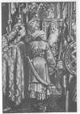
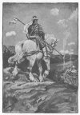
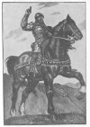
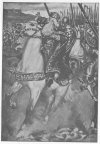
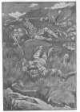
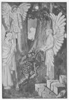
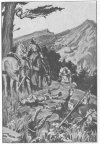
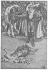

  
[Intangible Textual Heritage](../../../index) 
[Myths/Sagas](../../index)  [England](../index)  [Index](index) 
[Previous](hml10)  [Next](hml12) 

------------------------------------------------------------------------

[Buy this Book at
Amazon.com](https://www.amazon.com/exec/obidos/ASIN/1859580017/internetsacredte)

------------------------------------------------------------------------

p. 119

# CHAPTER VII: ROLAND, THE HERO OF EARLY FRANCE

### The Roland Legends

CHARLES THE GREAT, King of the Franks, world-famous as Charlemagne, won
his undying renown by innumerable victories for France and for the
Church. Charles as the head of the Holy Roman Empire and the Pope as the
head of the Holy Catholic Church equally dominated the imagination of
the mediæval world. Yet in romance Charlemagne's fame has been eclipsed
by that of his illustrious nephew and vassal, Roland, whose crowning
glory has sprung from his last conflict and heroic death in the valley
of Roncesvalles.

"Oh for a blast of that dread horn,  
On Fontarabian echoes borne,  
That to King Charles did come,  
When Roland brave, and Olivier,  
And every paladin and peer  
On Roncesvalles died."  
                                *Scott*.

Briefly, the historical facts are these: In A.D. 778 Charles was
returning from an expedition into Spain, where the dissensions of the
Moorish rulers had offered him the chance of extending his borders while
he fought for the Christian faith against the infidel. He had taken
Pampeluna, but had been checked before Saragossa, and had not ventured
beyond the Ebro; he was now making his way home through the Pyrenees.
When the main army had safely traversed the passes, the rear was
suddenly attacked by an overwhelming body of mountaineers, Gascons and
Basques, who, resenting the violation of their mountain sanctuaries, and
longing for plunder, drove the

p. 120

\[paragraph continues\] Frankish rearguard
into a little valley (now marked by the chapel of Ibagneta and still
called Roncesvalles), and there slew every man.

### The Historic Basis

The whole romantic legend of Roland has sprung from the simple words in
a contemporary chronicle, "In which battle was slain Roland, prefect of
the marches of Brittany." [1](#fn_11)

This same fight of Roncesvalles was the theme of an archaic poem, the
"Song of Altobiscar," written about 1835. In it we hear the exultation
of the Basques as they see the knights of France fall beneath their
onslaughts. The Basques are on the heights--they hear the trampling of a
mighty host which throngs the narrow valley below: its numbers are as
countless as the sands of the sea, its movement as resistless as the
waves which roll those sands on the shore. Awe fills the bosoms of the
mountain tribesmen, but their leader is undaunted. "Let us unite our
strong arms!" he cries aloud. "Let us tear our rocks from their beds and
hurl them upon the enemy! Let us crush and slay them all!" So said, so
done: the rocks roll plunging into the valley, slaying whole troops in
their descent. "And what mangled flesh, what broken bones, what seas of
blood! Soon of that gallant band not one is left alive; night covers
all, the eagles devour the flesh, and the bones whiten in this valley to
all eternity!"

### A Spanish Version

So runs the "Song of Altobiscar." But Spain too claims part of the
honour of the day of Roncesvalles.

p. 121

\[paragraph continues\] True, Roland was
in reality slain by Basques, not by Spaniards; but Spain, eager to share
the honour, has glorified a national hero, Bernardo del Carpio, who, in
the Spanish legend, defeats Roland in single combat and wins the day.

### The Italian Orlando

Italy has laid claim to Roland, and in the guise of Orlando, Orlando
Furioso, Orlando Innamorato, has made him into a fantastic, chivalrous
knight, a hero of many magical adventures.

### Roland in French Literature

Noblest of all, however, is the development of the "Roland Saga" in
French literature; for, even setting aside much legendary lore and
accumulated tradition, the Roland of the old epic is a perfect hero of
the early days of feudalism, when chivalry was in its very beginnings,
before the cult of the Blessed Virgin Mary added the grace of courtesy
to its heroism. Evidently Roland had grown in importance before the
"Chanson de Roland" took its present form, for we find the rearguard
skirmish magnified into a great battle, which manifestly contains
recollections of later Saracen invasions and Gascon revolts. As befits
the hero of an epic, Roland is now of royal blood, the nephew of the
great emperor, who has himself increased in age and splendour; this
heroic Roland can obviously only be overcome by the treachery of one of
the Franks themselves, so there appears the traitor Ganelon (a Romance
version of a certain Danilo or Nanilo), who is among the Twelve Peers
what Judas was among the Apostles; the mighty Saracens, not the
insignificant Basques, are now the victors; and the vengeance taken by
Charlemagne on the Saracens and on the traitor is boldly

p. 122

added to history, which leaves the disaster unavenged. Thus the bare
fact was embroidered over gradually by the historical imagination, aided
by patriotism, until a really national hero was evolved out of an
obscure Breton count.

### The "Chanson de Roland"

The "Song of Roland," as we now have it, seems to be a late version of
an Anglo-Norman poem, made by a certain Turoldus or Thorold; and it must
bear a close resemblance to that chant which fired the soldiers of
William the Norman at Hastings, when

"Taillefer, the noble singer,  
On his war-horse swift and fiery,  
Rode before the Norman host;  
Tossed his sword in air and caught it,  
Chanted loud the death of Roland,  
And the peers who perished with him  
At the pass of Roncevaux."  
                             *Roman de Rou*.

The "Song of Roland" bears an intimate relation to the development of
European thought, and the hero is doubly worth our study as hero and as
type of national character. Thus runs the story:

### The Story

The Emperor Charles the Great, Carolus Magnus, or Charlemagne, had been
for seven years in Spain, and had conquered it from sea to sea, except
Saragossa, which, among its lofty mountains, and ruled by its brave king
Marsile, had defied his power. Marsile still held to his idols, Mahomet,
Apollo, and Termagaunt, dreading in his heart the day when Charles would
force him to become a Christian.

p. 123

### The Saracen Council

The Saracen king gathered a council around him, as he reclined on a seat
of blue marble in the shade of an orchard, and asked the advice of his
wise men.

"'My lords,' quoth he, 'you know our grievous state.  
The mighty Charles, great lord of France the fair,  
Has spread his hosts in ruin o’er our land.  
No armies have I to resist his course,  
No people have I to destroy his hosts.  
Advise me now, what counsel shall I take  
To save my race and realm from death and shame?'"

### Blancandrin's Advice

A wily emir, Blancandrin, of Val-Fonde, was the only man who replied. He
was wise in counsel, brave in war, a loyal vassal to his lord.

"'Fear not, my liege,' he answered the sad king.  
'Send thou to Charles the proud, the arrogant,  
And offer fealty and service true,  
With gifts of lions, bears, and swift-foot hounds,  
Seven hundred camels, falcons, mules, and gold--  
As much as fifty chariots can convey--  
Yea, gold enough to pay his vassals all.  
Say thou thyself will take the Christian faith,  
And follow him to Aix to be baptized.  
If he demands thy hostages, then I  
And these my fellows give our sons to thee,  
To go with Charles to France, as pledge of truth.  
Thou wilt not follow him, thou wilt not yield  
To be baptized, and so our sons must die;  
But better death than life in foul disgrace,  
With loss of our bright Spain and happy days.'  
So cried the pagans all; but Marsile sat  
Thoughtful, and yet at last accepted all."

### An Embassy to Charlemagne

Now King Marsile dismissed the council with words of thanks, only
retaining near him ten of his most

p. 124

famous barons, chief of whom was Blancandrin; to them he said: "My
lords, go to Cordova, where Charles is at this time. Bear olive-branches
in your hands, in token of peace, and reconcile me with him. Great shall
be your reward if you succeed. Beg Charles to have pity on me, and I
will follow him to Aix within a month, will receive the Christian law,
and become his vassal in love and loyalty."

"Sire," said Blancandrin, "you shall have a good treaty!"

The ten messengers departed, bearing olive-branches in their hands,
riding on white mules, with reins of gold and saddles of silver, and
came to Charles as he rested after the siege of Cordova, which he had
just taken and sacked.

### Reception by Charlemagne

Charlemagne was in an orchard with his Twelve Peers and fifteen thousand
veteran warriors of France. The messengers from the heathen king reached
this orchard and asked for the emperor; their gaze wandered over groups
of wise nobles playing at chess, and groups of gay youths fencing, till
at last it rested on a throne of solid gold, set under a pine-tree and
overshadowed with eglantine. There sat Charles, the king who ruled fair
France, with white flowing beard and hoary head, stately of form and
majestic of countenance. No need was there of usher to cry: "Here sits
Charles the King."

The ambassadors greeted Charlemagne with all honour, and Blancandrin
opened the embassy thus:

"Peace be with you from God the Lord of Glory whom you adore! Thus says
the valiant King Marsile: He has been instructed in your faith, the way
of salvation, and is willing to be baptized; but you have been

 

[  
Click to enlarge](img/12400.jpg)  
''Here sits Charles the King!''  

[  
Click to enlarge](img/12500.jpg)  
''Ganelon rode away''  

 

p. 125

too long in our bright Spain, and should return to Aix. There will he
follow you and become your vassal, holding the kingdom of Spain at your
hand. Gifts have we brought from him to lay at your feet, for he will
share his treasures with you!"

### He is Perplexed

Charlemagne raised his hands in thanks to God, but then bent his head
and remained thinking deeply, for he was a man of prudent mind, cautious
and far-seeing, and never spoke on impulse. At last he said proudly: "Ye
have spoken fairly, but Marsile is my greatest enemy: how can I trust
your words?"

Blancandrin replied: "He will give hostages, twenty of our noblest
youths, and my own son will be among them. King Marsile will follow you
to the wondrous springs of Aix-la-Chapelle, and on the feast of St.
Michael will receive baptism in your court."

Thus the audience ended. The messengers were feasted in a pavilion
raised in the orchard, and the night passed in gaiety and
good-fellowship.

### He Consults his Twelve Peers

In the early morning Charlemagne arose and heard Mass; then, sitting
beneath a pine-tree; he called the Twelve Peers to council. There came
the twelve heroes, chief of them Roland and his loyal brother-in-arms
Oliver; there came Archbishop Turpin; and, among a thousand loyal
Franks, there came Ganelon the traitor. When all were seated in due
order Charlemagne began:

"My lords and barons, I have received an embassy of peace from King
Marsile, who sends me great gifts and offers, but on condition that I
leave Spain and return to Aix. Thither will he follow me, to receive

p. 126

the Faith, become a Christian and my vassal. Is he to be trusted?"

"Let us beware," cried all the Franks.

### Roland Speaks

Roland, ever impetuous, now rose without delay, and spoke: "Fair uncle
and sire, it would be madness to trust Marsile. Seven years have we
warred in Spain, and many cities have I won for you, but Marsile has
ever been treacherous. Once before when he sent messengers with
olive-branches you and the French foolishly believed him, and he
beheaded the two counts who were your ambassadors to him. Fight Marsile
to the end, besiege and sack Saragossa, and avenge those who perished by
his treachery."

### Ganelon Objects

Charlemagne looked out gloomily from under his heavy brows, he twisted
his moustache and pulled his long white beard, but said nothing, and all
the Franks remained silent, except Ganelon, whose hostility to Roland
showed clearly in his words:

"Sire, blind credulity were wrong and foolish, but follow up your own
advantage. When Marsile offers to become your vassal, to hold Spain at
your hand and to take your faith, any man who urges you to reject such
terms cares little for our death! Let pride no longer he your
counsellor, but hear the voice of wisdom."

The aged Duke Naimes, the Nestor of the army, spoke next, supporting
Ganelon: "Sire, the advice of Count Ganelon is wise, if wisely followed.
Marsile lies at your mercy; he has lost all, and only begs for pity. It
would be a sin to press this cruel war, since he offers full guarantee
by his hostages. You need

p. 127

only send one of your barons to arrange the terms of peace."

This advice pleased the whole assembly, and a murmur was heard: "The
Duke has spoken well."

### "Who Shall Go to Saragossa?"

"'My lords and peers, whom shall we send  
To Saragossa to Marsile?'  
'Sire, let me go,' replied Duke Naimes;  
'Give me your glove and warlike staff.'  
'No!' cried the king, 'my counsellor,  
Thou shalt not leave me unadvised--  
Sit down again; I bid thee stay.'

"'My lords and peers, whom shall we send  
To Saragossa to Marsile?'  
'Sire, I can go,' quoth Roland bold.  
'That canst thou not,' said Oliver;  
'Thy heart is far too hot and fierce--  
I fear for thee. But I will go,  
If that will please my lord the King.'  
'No!' cried the king, 'ye shall not go.  
I swear by this white flowing beard  
No peer shall undertake the task.'

"'My lords and peers, whom shall we send?'  
Archbishop Turpin rose and spoke:  
'Fair sire, let me be messenger.  
Your nobles all have played their part;  
Give me your glove and warlike staff,  
And I will show this heathen king  
In frank speech how a true knight feels.'  
But wrathfully the king replied:  
'By this white beard, thou shalt not go!  
Sit down, and raise thy voice no more.'"

### Roland Suggests Ganelon

"Knights of France," quoth Charlemagne, "choose me now one of your
number to do my errand to Marsile, and to defend my honour valiantly, if
need be."

p. 128

"Ah," said Roland, "then it must be Ganelon, my stepfather; for whether
he goes or stays, you have none better than he!"

This suggestion satisfied all the assembly, and they cried: "Ganelon
will acquit himself right manfully. If it please the King, he is the
right man to go."

Charlemagne thought for a moment, and then, raising his head, beckoned
to Ganelon. "Come hither, Ganelon," he said, "and receive this glove and
staff, which the voice of all the Franks gives to thee."

### Ganelon is Angry

"No," replied Ganelon, wrathfully. "This is the work of Roland, and I
will never forgive him, nor his friends, Oliver and the other Peers.
Here, in your presence, I bid them defiance!"

"Your anger is too great," said Charlemagne; "you will go, since it is
my will also."

"Yes, I shall go, but I shall perish as did your two former ambassadors.
Sire, forget not that your sister is my wife, and that Baldwin, my son,
will be a valiant champion if he lives. I leave to him my lands and
fiefs. Sire, guard him well, for I shall see him no more.

"Your heart is too tender," said Charlemagne. "You must go, since such
is my command."

### He Threatens Roland

Ganelon, in rage and anguish, glared round the council, and his face
drew all eyes, so fiercely he looked at Roland.

"Madman," said he, "all men know that I am thy stepfather, and for this
cause thou hast sent me to Marsile, that I may perish! But if I return I
will be revenged on thee."

p. 129

"Madness and pride," Roland retorted, "have no terrors for me; but this
embassy demands a prudent man, not an angry fool: if Charles consents, I
will do his errand for thee."

"Thou shalt not. Thou art not my vassal, to do my work, and Charles, my
lord, has given me his commands. I go to Saragossa; but there will I
find some way to vent my anger."

Now Roland began to laugh, so wild did his step-father's threats seem,
and the laughter stung Ganelon to madness. "I hate you," he cried to
Roland; "you have brought this unjust choice on me." Then, turning to
the emperor: "Mighty lord, behold me ready to fulfil your commands."

### But is Sent

"Fair Lord Ganelon," spoke Charlemagne, "bear this message to Marsile.
He must become my vassal and receive holy baptism. Half of Spain shall
be his fief; the other half is for Count Roland. If Marsile does not
accept these terms I will besiege Saragossa, capture the town, and lead
Marsile prisoner to Aix, where he shall die in shame and torment. Take
this letter, sealed with my seal, and deliver it into the king's own
right hand."

Thereupon Charlemagne held out his right-hand glove to Ganelon, who
would fain have refused it. So reluctant was he to grasp it that the
glove fell to the ground. "Ah, God! "cried the Franks, "what an evil
omen! What woes will come to us from this embassy!" "You shall hear full
tidings," quoth Ganelon. "Now, sire, dismiss me, for I have no time to
lose." Very solemnly Charlemagne raised his hand and made the sign of
the Cross over Ganelon, and gave him his blessing, saying, "Go, for the
honour of Jesus

p. 130

\[paragraph continues\] Christ, and for
your Emperor." So Ganelon took his leave, and returned to his lodging,
where he prepared for his journey, and bade farewell to the weeping
retainers whom he left behind, though they begged to accompany him. "God
forbid," cried he, "that so many brave knights should die! Rather will I
die alone. You, sirs, return to our fair France, greet well my wife,
guard my son Baldwin, and defend his fief!"

### He Plots with Marsile's Messengers

Then Ganelon rode away, and shortly overtook the ambassadors of the
Moorish king, for Blancandrin had delayed their journey to accompany
him, and the two envoys began a crafty conversation, for both were wary
and skilful, and each was trying to read the other's mind. The wily
Saracen began:

'Ah! what a wondrous king is Charles!  
How far and wide his conquests range!  
The salt sea is no bar to him:  
From Poland to far England's shores  
He stretches his unquestioned sway;  
But why seeks he to win bright Spain?'  
'Such is his will,' quoth Ganelon;  
'None can withstand his mighty power!'

"'How valiant are the Frankish lords  
But how their counsel wrongs their king  
To urge him to this long-drawn strife--  
They ruin both themselves and him!'  
'I blame not them,' quoth Ganelon,  
'But Roland, swollen with fatal pride.  
Near Carcassonne he brought the King  
An apple, crimson streaked with gold:  
"Fair sire," quoth he, "here at your feet  
I lay the crowns of all the kings."  
If he were dead we should have peace!' p. 131

"'How haughty must this Roland be,  
Who fain would conquer all the earth!  
Such pride deserves due chastisement!  
What warriors has he for the task?'  
'The Franks of France,' quoth Ganelon,  
'The bravest warriors ’neath the sun!  
For love alone they follow him  
(Or lavish gifts which he bestows)  
To death, or conquest of the world!'"

### To Betray Roland

The bitterness in Ganelon's tone at once struck Blancandrin, who cast a
glance at him and saw the Frankish envoy trembling with rage. He
suddenly addressed Ganelon in whispered tones: "Hast thou aught against
the nephew of Charles? Wouldst thou have revenge on Roland? Deliver him
to us, and King Marsile will share with thee all his treasures." Ganelon
was at first horrified, and refused to hear more, but so well did
Blancandrin argue and so skilfully did he lay his snare that before they
reached Saragossa and came to the presence of King Marsile it was agreed
that Roland should be destroyed by their means.

### Ganelon with the Saracens

Blancandrin and his fellow ambassadors conducted Ganelon into the
presence of the Saracen king, and announced Charlemagne's peaceable
reception of their message and the coming of his envoy. "Let him speak:
we listen," said Marsile.

Ganelon then began artfully: "Peace be to you in the name of the Lord of
Glory whom we adore! This is the message of King Charles: You shall
receive the Holy Christian Faith, and Charles will graciously grant you
one-half of Spain as a fief; the other half he intends for his nephew
Roland (and a haughty partner you will

p. 132

find him!). If you refuse he will take Saragossa, lead you captive to
Aix, and give you there to a shameful death."

### Marsile's Anger

Marsile's anger was so great at this insulting message that he sprang to
his feet, and would have slain Ganelon with his gold-adorned javelin;
but he, seeing this, half drew his sword, saying:

"'Sword, how fair and bright thou art!  
Come thou forth and view the light,  
Long as I can wield thee here  
Charles my Emperor shall not say  
That I die alone, unwept.  
Ere I fall Spain's noblest blood  
Shall be shed to pay my death.'"

### The Saracen Council

However, strife was averted, and Ganelon received praise from all for
his bold bearing and valiant defiance of his king's enemy. When quiet
was restored he repeated his message and delivered the emperor's letter,
which was found to contain a demand that the caliph, Marsile's uncle,
should be sent, a prisoner, to Charles, in atonement for the two
ambassadors foully slain before. The indignation of the Saracen nobles
was intense, and Ganelon was in imminent danger, but, setting his back
against a pine-tree, he prepared to defend himself to the last. Again
the quarrel was stayed, and Marsile, taking his most trusted leaders,
withdrew to a secret council, whither, soon, Blancandrin led Ganelon.
Here Marsile excused his former rage, and, in reparation, offered
Ganelon a superb robe of marten's fur, which was accepted; and then
began the tempting of the traitor. First demanding a pledge of secrecy,
Marsile

p. 133

pitied Charlemagne, so aged and so weary with rule. Ganelon praised his
emperor's prowess and vast power. Marsile repeated his words of pity,
and Ganelon replied that as long as Roland and the Twelve Peers lived
Charlemagne needed no man's pity and feared no man's power; his Franks,
also, were the best living warriors. Marsile declared proudly that he
could bring four hundred thousand men against Charlemagne's twenty
thousand French; but Ganelon dissuaded him from any such expedition.

### Ganelon Plans Treachery

"'Not thus will you overcome him;  
Leave this folly, turn to wisdom.  
Give the Emperor so much treasure  
That the Franks will be astounded.  
Send him, too, the promised pledges,  
Sons of all your noblest vassals.  
To fair France will Charles march homeward,  
Leaving (as I will contrive it)  
Haughty Roland in the rearguard.  
Oliver, the bold and courteous,  
Will be with him: slay those heroes,  
And King Charles will fall for ever!'  
'Fair Sir Ganelon,' quoth Marsile,  
'How must I entrap Count Roland?'  
'When King Charles is in the mountains  
He will leave behind his rearguard  
Under Oliver and Roland.  
Send against them half your army:  
Roland and the Peers will conquer,  
But be wearied with the struggle--  
Then bring on your untired warriors.  
France will lose this second battle,  
And when Roland dies, the Emperor  
Has no right hand for his conflicts--  
Farewell all the Frankish greatness  
Ne’er again can Charles assemble  
Such a mighty host for conquest,  
And you will have peace henceforward!'"

p. 134

### Welcomed by Marsile

Marsile was overjoyed at the treacherous advice, and embraced and richly
rewarded the felon knight. The death of Roland and the Peers was
solemnly sworn between them, by Marsile on the book of the Law of
Mahomet, by Ganelon on the sacred relics in the pommel of his sword.
Then, repeating the compact between them, and warning Ganelon against
treason to his friends, Marsile dismissed the treacherous envoy, who
hastened to return and put his scheme into execution.

### Ganelon Returns to Charles

In the meantime Charles had retired as far as Valtierra, on his way to
France, and there Ganelon found him, and delivered the tribute, the keys
of Saragossa, and a false message excusing the absence of the caliph. He
had, so Marsile said, put to sea with three hundred thousand warriors
who would not renounce their faith, and all had been drowned in a
tempest, not four leagues from land. Marsile would obey King Charles's
commands in all other respects. "Thank God!" cried Charlemagne.
"Ganelon, you have done well, and shall be well rewarded!"

### The French Camp. Charles Dreams

Now the whole Frankish army marched towards the Pyrenees, and, as
evening fell, found themselves among the mountains, where Roland planted
his banner on the topmost summit, clear against the sky, and the army
encamped for the night; but the whole Saracen host had also marched and
encamped in a wood not far from the Franks. Meanwhile, as Charlemagne
slept he had dreams of evil omen. Ganelon, in his dreams, seized

p. 135

the imperial spear of tough ash-wood, and broke it, so that the
splinters flew fir and wide. In another dream he saw himself at Aix
attacked by a leopard and a bear, which tore off his right arm; a
greyhound came to his aid, but he knew not the end of the fray, and
slept unhappily.

### A Morning Council

When morning light shone, and the army was ready to march, the clarions
of the host sounded gaily, and Charlemagne called his barons around him.

"'My lords and Peers, ye see these strait defiles:  
Choose ye to whom the rearguard shall be given.'  
'My stepson Roland,' straight quoth Ganelon.  
'’Mid all the Peers there is no braver knight:  
In him will lie the safety of your host.'  
Charles heard in wrath, and spoke in angry tones:  
'What fiendish rage has prompted this advice?  
Who then will go before me in the van?'  
The traitor tarried not, but answered swift:  
'Ogier the Dane will do that duty best.'"

When Roland heard that he was to command the rearguard he knew not
whether to be pleased or not. At first he thanked Ganelon for naming
him. "Thanks, fair stepfather, for sending me to the post of danger.
King Charles shall lose no man nor horse through my neglect." But when
Ganelon replied sneeringly, "You speak the truth, as I know right well,"
Roland's gratitude turned to bitter anger, and he reproached the
villain. "Ah, wretch! disloyal traitor! thou thinkest perchance that I,
like thee, shall basely drop the glove. But thou shalt see! Sir King,
give me your bow. I will not let my badge of office fall, as thou didst,
Ganelon, at Cordova. No evil omen shall assail the host through me."

p. 136

### Roland for the Rearguard

Charlemagne was very loath to grant his request, but on the advice of
Duke Naimes, most prudent of counsellors, he gave to Roland his bow, and
offered to leave with him half the army. To this the champion would not
agree, but would only have twenty thousand Franks from fair France.
Roland clad himself in his shining armour, laced on his lordly helmet,
girt himself with his famous sword Durendala, and hung round his neck
his flower-painted shield; he mounted his good steed Veillantif, and
took in hand his bright lance with the white pennon and golden fringe;
then, looking like the Archangel St. Michael, he rode forward, and easy
it was to see how all the Franks loved him and would follow where he
led. Beside him rode the famous Peers of France, Oliver the bold and
courteous, the saintly Archbishop Turpin, and Count Gautier, Roland's
loyal vassal. They chose carefully the twenty thousand French for the
rearguard, and Roland sent Gautier with one thousand of their number to
search the mountains. Alas! they never returned, for King Almaris, a
Saracen chief, met and slew them all among the hills; and only Gautier,
sorely wounded and bleeding to death, returned to Roland in the final
struggle.

Charlemagne spoke a mournful "Farewell" to his nephew and the rearguard,
and the mighty army began to traverse the gloomy ravine through the dark
masses of rocks, and to emerge on the other side of the Pyrenees. All
wept, most for joy to set eyes on that dear land of fair France, which
for seven years they had not seen; but Charles, with a sad foreboding of
disaster, hid his eyes beneath his cloak and wept in silence.

p. 137

### Charles is Sad

"What grief weighs on your mind, sire?" asked the wise Duke Naimes,
riding up beside Charlemagne.

"I mourn for my nephew. Last night in a vision I saw Ganelon break my
trusty lance--this Ganelon who has sent Roland to the rear. And now I
have left Roland in a foreign land, and, O God! if I lose him I shall
never find his equal!" And the emperor rode on in silence, seeing naught
but his own sad foreboding visions.

### The Saracen Pursuit

Meanwhile King Marsile, with his countless Saracens, had pursued so
quickly that the van of the heathen army soon saw waving the banners of
the Frankish rear. Then as they halted before the strife began, one by
one the nobles of Saragossa, the champions of the Moors, advanced and
claimed the right to measure themselves against the Twelve Peers of
France. Marsile's nephew received the royal glove as chief champion, and
eleven Saracen chiefs took a vow to slay Roland and spread the faith of
Mahomet.

"Death to the rearguard! Roland shall die! Death to the Peers! Woe to
France and Charlemagne! We will bring the Emperor to your feet! You
shall sleep at St. Denis! Down with fair France!" Such were their
confident cries as they armed for the conflict; and on their side no
less eager were the Franks.

"Fair Sir Comrade," said Oliver to Roland, "methinks we shall have a
fray with the heathen."

"God grant it," returned Roland. "Our duty is to hold this pass for our
king. A vassal must endure for his lord grief and pain, heat and cold,
torment and death; and a knight's duty is to strike mighty blows,

p. 138

that men may sing of him, in time to come, no evil songs. Never shall
such be sung of me."

### Oliver Descries the Saracens

Hearing a great tumult, Oliver ascended a hill am looked towards Spain,
where he perceived the great pagan army, like a gleaming sea, with
shining hauberk and helms flashing in the sun. "Alas! we are betrayed
This treason is plotted by Ganelon, who put us in the rear," he cried.
"Say no more," said Roland "blame him not in this: he is my stepfather."

Now Oliver alone had seen the might of the pagan array, and he was
appalled by the countless multitude of the heathens. He descended from
the hill an appealed to Roland.

### Roland will not Blow his Horn

"'Comrade Roland, sound your war-horn,  
Your great Olifant, far-sounding:  
Charles will hear it and return here.'  
'Cowardice were that,' quoth Roland;  
'In fair France my fame were tarnished.  
No, these Pagans all shall perish  
When I brandish Durendala.'

"'Comrade Roland, sound your war-horn:  
Charles will hear it and return here.'  
'God forbid it,' Roland answered,  
'That it e’er be sung by minstrels  
I was asking help in battle  
From my King against these Pagans.  
I will ne’er do such dishonour  
To my kinsmen and my nation.  
No, these heathen all shall perish  
When I brandish Durendala.'

"'Comrade Roland, sound your war-horn:  
Charles will hear it and return here.  
See how countless are the heathen  
And how small our Frankish troop is!'

 

[  
Click to enlarge](img/13800.jpg)  
''The saintly Archbishop Turpin''  

[  
Click to enlarge](img/13900.jpg)  
''Charlemagne heard it again''  

 

p. 139

'God forbid it,' answered Roland,  
That our fair France be dishonoured  
Or by me or by my comrades  
Death we choose, but not dishonour!'"

Roland was a valiant hero, but Oliver had prudence as well as valour,
and his advice was that of a good and careful general. Now he spoke
reproachfully.

### It is Too Late

"Ah, Roland, if you had sounded your magic horn the king would soon be
here, and we should not perish! Now look to the heights and to the
mountain passes: see those who surround us. None of us will see the
light of another day!"

"Speak not so foolishly," retorted Roland. "Accursed be all cowards, say
I." Then, softening his tone a little, he continued: "Friend and
comrade, say no more. The emperor has entrusted to us twenty thousand
Frenchmen, and not a coward among them. Lay on with thy lance, Oliver,
and I will strike with Durendala. If I die men shall say: 'This was the
sword of a noble vassal.'"

### Turpin Blesses the Knights

Then spoke the brave and saintly Archbishop Turpin. Spurring his horse,
he rode, a gallant figure, to the summit of a hill, whence he called
aloud to the Frankish knights:

'Fair sirs and barons, Charles has left us here  
To serve him, or at need to die for him.  
See, yonder come the foes of Christendom,  
And we must fight for God and Holy Faith.  
Now, say your shrift, and make your peace with Heaven;  
I will absolve you and will heal your souls;  
And if you die as martyrs, your true home  
Is ready midst the flowers of Paradise!'"

p. 140

The Frankish knights, dismounting, knelt before Turpin, who blessed and
absolved them all, bidding them, as penance, to strike hard against the
heathen.

Then Roland called his brother-in-arms, the brave and courteous Oliver,
and said: "Fair brother, I know now that Ganelon has betrayed us for
reward, and Marsile has bought us; but the payment shall be made with
our swords, and Charlemagne will terribly avenge us.

### "Montjoie! Montjoie!"

While the two armies yet stood face to face in battle array Oliver
replied: "What good is it to speak? You would not sound your horn, and
Charles cannot help us; he is not to blame. Barons and lords, ride on
and yield not. In God's name fight and slay, and remember the war-cry of
our Emperor." And at the words the war-cry of "Montjoie! Montjoie!"
burst from the whole army as they spurred against the advancing heathen
host.

### The Fray

Great was the fray that day, deadly was the combat, as the Moors and
Franks crashed together, shouting their cries, invoking their gods or
saints, wielding with utmost courage sword, lance, javelin, scimitar, or
dagger. Blades flashed, lances were splintered, helms were cloven in
that terrible fight of heroes. Each of the Twelve Peers did mighty feats
of arms. Roland himself slew the nephew of King Marsile, who had
promised to bring Roland's head to his uncle's feet, and bitter were the
words that Roland hurled at the lifeless body of his foe, who had but
just before boasted that Charlemagne should lose his right hand. Oliver
slew the heathen king's brother, and one by one the Twelve

p. 141

\[paragraph continues\] Peers proved their
mettle on the twelve champions of King Marsile, and left them dead or
mortally wounded on the field. Wherever the battle was fiercest and the
danger greatest, where help was most needed, there Roland spurred to the
rescue, swinging Durendala, and, falling on the heathen like a
thunderbolt of war, turned the tide of battle again and yet again.

"Red was Roland, red with bloodshed:  
Red his corselet, red his shoulders,  
Red his arm, and red his charger."

Like the red god Mars he rode through the battle; and as he went he met
Oliver, with the truncheon or a spear in his grasp.

"'Friend, what hast thou there?' cried Roland.  
In this game ’tis not a distaff,  
But a blade of steel thou needest.  
Where is now Hauteclaire, thy good sword,  
Golden-hilted, crystal-pommeled?'  
'Here,' said Oliver; 'so fight I  
That I have not time to draw it.'  
'Friend,' quoth Roland, 'more I love thee  
Ever henceforth than a brother.'"

### The Saracens Perish

Thus the battle continued, most valiantly contested by both sides, and
the Saracens died by hundreds and thousands, till all their host lay
dead but one man, who fled wounded, leaving the Frenchmen masters of the
field, but in sorry plight--broken were their swords and lances, rent
their hauberks, torn and bloodstained their gay banners and pennons, and
many, many of their brave comrades lay lifeless. Sadly they looked round
on the heaps of corpses, and their minds were filled with grief as they
thought of their companions, of fair France which they should see no
more, and of their emperor who even now awaited them while they fought
and died

p. 142

for him. Yet they were not discouraged; loudly their cry re-echoed,
"Montjoie! Montjoie!" as Roland cheered them on, and Turpin called
aloud: "Our men are heroes; no king under heaven has better. It is
written in the Chronicles of France that in that great land it is our
king's right to have valiant soldiers."

### A Second Saracen Army

While they sought in tears the bodies of their friends, the main army of
the Saracens, under King Marsile in person, came upon them; for the one
fugitive who had escaped had urged Marsile to attack again at once,
while the Franks were still weary. The advice seemed good to Marsile,
and he advanced at the head of a hundred thousand men, whom he now
hurled against the French, in columns of fifty thousand at a time; and
they came on right valiantly, with clarions sounding and trumpets
blowing.

"'Soldiers of the Lord,' cried Turpin,  
'Be ye valiant and steadfast,  
For this day shall crowns be given you  
Midst the flowers of Paradise.  
In the name of God our Saviour,  
Be ye not dismayed nor frighted,  
Lest of you be shameful legends  
Chanted by the tongue of minstrels.  
Rather let us die victorious,  
Since this eve shall see us lifeless!--  
Heaven has no room for cowards!  
Knights, who nobly fight, and vainly,  
Ye shall sit amid the holy  
In the blessed fields of Heaven.  
On then, Friends of God, to glory!'"

And the battle raged anew, with all the odds against the small handful
of French, who knew they were doomed, and fought as though they were
"fey." [1](#fn_12)

p. 143

### Gloomy Portents

Meanwhile the whole course of nature was disturbed. In France there were
tempests of wind and thunder, rain and hail; thunderbolts fell
everywhere, and the earth shook exceedingly. From Mont St. Michel to
Cologne, from Besançon to Wissant, not one town could show its walls
uninjured, not one village its houses unshaken. A terrible darkness
spread over all the land, only broken when the heavens split asunder
with the lightning-flash. Men whispered in terror: "Behold the end of
the world! Behold the great Day of Doom!" Alas! they knew not the truth:
it was the great mourning for the death of Roland.

### Many French Knights Fall

In this second battle the French champions were weary, and before long
they began to fall before the valour of the newly arrived Saracen
nobles. First died Engelier the Gascon, mortally wounded by the lance of
that Saracen who swore brotherhood to Ganelon; next Samson, and the
noble Duke Anseis. These three were well avenged by Roland and Oliver
and Turpin. Then in quick succession died Gerin and Gerier and other
valiant Peers at the hands of Grandoigne, until his death-dealing career
was cut short by Durendala. Another desperate single combat was won by
Turpin, who slew a heathen emir "as black as molten pitch."

### The Second Army Defeated

Finally this second host of the heathens gave way and fled, begging
Marsile to come and succour them; but now of the victorious French there
were but sixty valiant champions left alive, including Roland, Oliver,
and the fiery prelate Turpin.

p. 144

### A Third Appears

Now the third host of the pagans began to roll for-ward upon the
dauntless little band, and in the short breathing-space before the
Saracens again attacked them Roland cried aloud to Oliver:

"'Fair Knight and Comrade, see these heroes,  
Valiant warriors, lying lifeless!  
I must mourn for our fair country  
France, left widowed of her barons.  
Charles my King, why art thou absent?  
Brother mine, how shall we send him  
Mournful tidings of our struggle?'  
'How I know not,' said his comrade.  
'Better death than vile dishonour.'"

### Roland Willing to Blow his Horn

"'Comrade, I will blow my war-horn:  
Charles will hear it in the passes  
And return with all his army.'  
Oliver quoth: '’Twere disgraceful  
To your kinsmen all their life-days.  
When I urged it, then you would not;  
Now, to sound your horn is shameful,  
And I never will approve it.'"

### Oliver Objects. They Quarrel

"'See, the battle goes against us:  
Comrade, I shall sound my war-horn.'  
Oliver replied: 'O coward!  
When I urged it, then you would not.  
If fair France again shall greet me  
You shall never wed my sister;  
By this beard of mine I swear it!'

"'Why so bitter and so wrathful?'  
Oliver returned: "Tis thy fault;  
Valour is not kin to madness,  
Temperance knows naught of fury. p. 145  
You have killed these noble champions,  
You have slain the Emperor's vassals,  
You have robbed us of our conquests.  
Ah, your valour, Count, is fatal!  
Charles must lose his doughty heroes,  
And your league with me must finish  
With this day in bitter sorrow."'

### Turpin Mediates

Archbishop Turpin heard the dispute, and strove to calm the angry
heroes. "Brave knights, be not so enraged. The horn will not save the
lives of these gallant dead, but it will be better to sound it, that
Charles, our lord and emperor, may return, may avenge our death and weep
over our corpses, may bear them to fair France, and bury them in the
sanctuary, where the wild beasts shall not devour them." "That is well
said," quoth Roland and Oliver.

### The Horn is Blown

Then at last Roland put the carved ivory horn, the magic Olifant, to his
lips, and blew so loudly that the sound echoed thirty leagues away.
"Hark! our men are in combat!" cried Charlemagne; but Ganelon retorted:
"Had any but the king said it, that had been a lie."

A second time Roland blew his horn, so violently and with such anguish
that the veins of his temples burst, and the blood flowed from his brow
and from his mouth. Charlemagne, pausing, heard it again, and said:
"That is Roland's horn; he would not sound it were there no battle." But
Ganelon said mockingly: "There is no battle, for Roland is too proud to
sound his horn in danger. Besides, who would dare to attack Roland, the
strong, the valiant, great and wonderful Roland? No man. He is doubtless
hunting, and

p. 146

laughing with the Peers. Your words, my liege, do out show how old and
weak and doting you are. Ride on, sire; the open country lies far before
you."

When Roland blew the horn for the third time he had hardly breath to
awaken the echoes; but still Charlemagne heard. "How faintly comes the
sound! There is death in that feeble blast!" said the emperor; and Duke
Naimes interrupted eagerly: "Sire, Roland is in peril; some one has
betrayed him--doubtless he who now tries to beguile you! Sire, rouse
your host, arm for battle, and ride to save your nephew."

### Ganelon Arrested

Then Charlemagne called aloud: "Hither, my men. Take this traitor
Ganelon and keep him safe till my return." And the kitchen folk seized
the felon knight, chained him by the neck, and beat him; then, binding
him hand and foot, they flung him on a sorry nag, to be borne with them
till Charles should demand him at their hands again.

### Charles Returns

With all speed the whole army retraced their steps, turning their faces
to Spain, and saying: "Ah, if we could find Roland alive what blows we
would strike for him! "Alas! it was too late! Too late!

How lofty are the peaks, how vast and shadowy the mountains! How dim and
gloomy the passes, how deep the valleys! How swift the rushing torrents!
Yet with headlong speed the Frankish army hastens back, with trumpets
sounding in token of approaching help, all praying God to preserve
Roland till they come. Alas! they cannot reach him in time! Too late!
Too late 1

p. 147

### Roland Weeps for his Comrades

Now Roland cast his gaze around on hill and valley, and saw his noble
vassals and comrades lie dead. As a noble knight he wept for them,
saying:

"'Fair Knights, may God have mercy on your souls!  
May He receive you into Paradise  
And grant you rest on banks of heavenly flowers!  
Ne’er have I known such mighty men as you.  
Fair France, that art the best of all dear lands,  
How art thou widowed of thy noble sons!  
Through me alone, dear comrades, have you died,  
And yet through me no help nor safety comes.  
God have you in His keeping! Brother, come,  
Let us attack the heathen and win death,  
Or grief will slay me! Death is duty now.'"

### He Fights Desperately

So saying, he rushed into the battle, slew the only son of King Marsile,
and drove the heathen before him as the hounds drive the deer. Turpin
saw and applauded. "So should a good knight do, wearing good armour and
riding a good steed. He must deal good strong strokes in battle, or he
is not worth a groat. Let a coward be a monk in some cloister and pray
for the sins of us fighters."

Marsile in wrath attacked the slayer of his son, but in vain; Roland
struck off his right hand, and Marsile fled back mortally wounded to
Saragossa, while his main host, seized with panic, left the field to
Roland. However, the caliph, Marsile's uncle, rallied the ranks, and,
with fifty thousand Saracens, once more came against the little troop of
Champions of the Cross, the three poor survivors of the rearguard.

Roland cried aloud: "Now shall we be martyrs for our faith. Fight
boldly, lords, for life or death! Sell yourselves dearly! Let not fair
France he dishonoured

p. 148

in her sons. When the Emperor sees us dead with our slain foes around us
he will bless our valour."

### Oliver Falls

The pagans were emboldened by the sight of the three alone, and the
caliph, rushing at Oliver, pierced him from behind with his lance. But
though mortally wounded Oliver retained strength enough to slay the
caliph, and to cry aloud: "Roland! Roland! Aid me!" then he rushed on
the heathen army, doing heroic deeds and shouting "Montjoie! Montjoie!"
while the blood ran from his wound and stained the earth blood-red. At
this woeful sight Roland swooned with grief, and Oliver, faint from loss
of blood, and with eyes dimmed by fast-coming death, distinguished not
the face of his dear friend; he saw only a vague figure drawing near,
and, mistaking it for an enemy, raised his sword Hauteclaire and gave
Roland one last terrible blow, which clove the helmet, but harmed not
the head. The blow roused Roland from his swoon, and, gazing tenderly at
Oliver, he gently asked him:

"'Comrade and brother, was that blow designed  
To slay your Roland, him who loves you so?  
There is no vengeance you would wreak on me.'  
'Roland, I hear you speak, but see you not.  
God guard and keep you, friend; but pardon me  
The blow I struck, unwitting, on your head.'  
'I have no hurt,' said Roland; 'I forgive  
Here and before the judgment-throne of God.'"

### And Dies

Now Oliver felt the pains of death come upon him. Both sight and hearing
were gone, his colour fled, and, dismounting, he lay upon the earth;
there, humbly confessing his sins, he begged God to grant him rest in
Paradise, to bless his lord Charlemagne and the fair

 

[  
Click to enlarge](img/14800.jpg)  
''Turpin fell forward dying''  

[  
Click to enlarge](img/14900.jpg)  
''The angels of God descended around him''  

 

p. 149

land of France, and to keep above all men his comrade Roland, his
best-loved brother-in-arms. This ended, he fell back, his heart failed,
his head drooped low, and Oliver the brave and courteous knight lay dead
on the blood-stained earth, with his face turned to the east. Roland
lamented him in gentle words: "Comrade, alas for thy valour! Many days
and years have we been comrades: no ill didst thou to me, nor I to thee:
now thou art dead, ’tis pity that I live!

### Turpin is Mortally Wounded. The Horn Again

Turpin and Roland now stood together for a time, and were joined by the
brave Count Gautier, whose thousand men had been slain, and he himself
grievously wounded; he now came, like a loyal vassal, to die with his
lord Roland, and was slain in the first discharge of arrows which the
Saracens shot. Taught by experience, the pagans kept their distance, and
wounded Turpin with four lances, while they stood some yards away from
the heroes. But when Turpin felt himself mortally wounded he plunged
into the throng of the heathen, killing four hundred before he fell, and
Roland fought on with broken armour, and with ever-bleeding head, till
in a pause of the deadly strife he took his horn and again sent forth a
feeble dying blast.

### Charles Answers the Horn

Charlemagne heard it, and was filled with anguish. "Lords, all goes ill:
I know by the sound of Roland's horn he has not long to live! Ride on
faster, and let all our trumpets sound, in token of our approach." Then
sixty thousand trumpets sounded, so that mountains echoed it and valleys
replied, and the heathen heard it and trembled. "It is Charlemagne!
Charles is coming!" they cried. "If Roland lives till

p. 150

he comes the war will begin again, and our bright Spain is lost."
Thereupon four hundred banded together to slay Roland; but he rushed
upon them, mounted on his good steed Veillantif, and the valiant pagans
fled. But while Roland dismounted to tend the dying archbishop they
returned and cast darts from afar, slaying Veillantif, the faithful
war-horse, and piercing the hero's armour. Still nearer and nearer
sounded the clarions of Charlemagne's army in the defiles, and the
Saracen host fled for ever, leaving Roland alone, on foot, expiring,
amid the dying and the dead.

### Turpin Blesses the Dead

Roland made his way to Turpin, unlaced his golden helmet, took off his
hauberk, tore his own tunic to bind up his grievous wounds, and then
gently raising the prelate, carried him to the fresh green grass, where
he most tenderly laid him down.

"'Ah, gentle lord,' said Roland, 'give me leave  
To carry here our comrades who are dead,  
Whom we so dearly loved; they must not lie  
Unblest; but I will bring their corpses here  
And thou shalt bless them, and me, ere thou die.'  
'Go,' said the dying priest, 'but soon return.  
Thank God! the victory is yours and mine!'"

With great pain and many delays Roland traversed the field of slaughter,
looking in the faces of the dead, till he had found and brought to
Turpin's feet the bodies of the eleven Peers, last of all Oliver, his
own dear friend and brother, and Turpin blessed and absolved them all.
Now Roland's grief was so deep and his weakness so great that he swooned
where he stood, and the archbishop saw him fall and heard his cry of
pain. Slowly and painfully Turpin struggled to his feet, and, bending
over Roland, took Olifant, the

p. 151

curved ivory horn; inch by inch the dying archbishop tottered towards a
little mountain stream, that the few drops he could carry might revive
Roland.

### He Dies

However, his weakness overcame him before he reached the water, and he
fell forward dying. Feebly he made his confession, painfully he joined
his hands in prayer, and as he prayed his spirit fled. Turpin, the
faithful champion of the Cross, in teaching and in battle, died in the
service of Charlemagne. May God have mercy on his soul!

When Roland awoke from his swoon he looked for Turpin, and found him
dead, and, seeing Olifant, he guessed what the archbishop's aim had
been, and wept for pity. Crossing the fair white hands over Turpin's
breast, he sadly prayed:

"'Alas! brave priest, fair lord of noble birth,  
Thy soul I give to the great King of Heaven!  
No mightier champion has He in His hosts,  
No prophet greater to maintain the Faith,  
No teacher mightier to convert mankind  
Since Christ's Apostles walked upon the earth!  
May thy fair soul escape the pains of Hell  
And Paradise receive thee in its bowers!'"

### Roland's Last Fight

Now death was very near to Roland, and he felt it coming upon him while
he yet prayed and commended himself to his guardian angel Gabriel.
Taking in one hand Olifant, and in the other his good sword Durendala,
Roland climbed a little hill, one bowshot within the realm of Spain.
There under two pine-trees he found four marble steps, and as he was
about to climb them, fell swooning on the grass very near his end. A
lurking Saracen, who had feigned death, stole from his covert,

p. 152

and, calling aloud, "Charles's nephew is vanquished! I will bear his
sword hack to Arabia," seized Durendala as it lay in Roland's dying
clasp. The attempt roused Roland, and he opened his eyes, saying, "Thou
art not of us," then struck such a blow with Olifant on the helm of the
heathen thief that he fell dead before his intended victim.

### He Tries to Break his Sword

Pale, bleeding, dying, Roland struggled to his feet, bent on saving his
good blade from the defilement of heathen hands. He grasped Durendala,
and the brown marble before him split beneath his mighty blows; but the
good sword stood firm, the steel grated but did not break, and Roland
lamented aloud that his famous sword must now become the weapon of a
lesser man. Again Roland smote with Durendala, and clove the block of
sardonyx, but the good steel only grated and did not break, and the hero
bewailed himself aloud, saying, "Alas! my good Durendala, how bright and
pure thou art! How thou flamest in the sunbeams, as when the angel
brought thee! How many lands hast thou conquered for Charles my King,
how many champions slain, how many heathen converted! Must I now leave
thee to the pagans? May God spare fair France this shame!" A third time
Roland raised the sword and struck a rock of blue marble, which split
asunder, but the steel only grated--it would not break; and the hero
knew that he could do no more.

### His Last Prayer

Then he flung himself on the ground under a pine-tree with his face to
the earth, his sword and Olifant beneath him, his face to the foe, that
Charlemagne and the Franks might see when they came that he died

 

[  
Click to enlarge](img/15200.jpg)  
''Under the trees lay the body of Roland''  

[  
Click to enlarge](img/15300.jpg)  
Aude the Fair falls dead at the Emperor's feet  

 

p. 153

victorious. He made his confession, prayed for mercy, and offered to
Heaven his glove, in token of submission for all his sins. "*Mea culpa!*
O God! I pray for pardon for all my sins, both great and small, that I
have sinned from my birth until this day." So he held up towards Heaven
his right-hand glove, and the angels of God descended around him. Again
Roland prayed:

"'O very Father, who didst never lie,  
Didst bring St. Lazarus from the dead again,  
Didst save St. Daniel from the lion's mouth,  
Save Thou my soul and keep it from all ills  
That I have merited by all my sins!'"

### He Dies

Again he held up to Heaven his glove, and St. Gabriel received it; then,
with head bowed and hands clasped, the hero died, and the waiting
cherubim, St. Raphael, St. Michael, and St. Gabriel, bore his soul to
Paradise.

So died Roland and the Peers of France.

### Charles Arrives

Soon after Roland's heroic spirit had passed away the emperor came
galloping out of the mountains into the valley of Roncesvalles, where
not a foot of ground was without its burden of death.

Loudly he called: "Fair nephew, where art thou? Where is the archbishop?
And Count Oliver? Where are the Peers?"

Alas! of what avail was it to call? No man replied, for all were dead;
and Charlemagne wrung his hands, and tore his beard and wept, and his
army bewailed their slain comrades, and all men thought of vengeance.
Truly a fearful vengeance did Charles take, in that terrible battle
which he fought the next day against the

p. 154

\[paragraph continues\] Emir of Babylon,
come from oversea to help his vassal Marsile, when the sun stood still
in heaven that the Christians might be avenged on their enemies; in the
capture of Saragossa and the death of Marsile, who, already mortally
wounded, turned his face to the wall and died when he heard of the
defeat of the emir; but when vengeance was taken on the open enemy
Charlemagne thought of mourning, and returned to Roncesvalles to seek
the body of his beloved nephew.

The emperor knew well that Roland would he found before his men, with
his face to the foe. Thus he advanced a bowshot from his companions and
climbed a little hill, there found the little flowery meadow stained red
with the blood of his barons, and there at the summit, under the trees,
lay the body of Roland on the green grass. The broken blocks of marble
bore traces of the hero's dying efforts, and Charlemagne raised Roland,
and, clasping the hero in his arms, lamented over him.

### His Lament

"'The Lord have mercy, Roland, on thy soul!  
Never again shall our fair France behold  
A knight so worthy, till France be no more!

"'The Lord have mercy, Roland, on thy soul!  
That thou mayest rest in flowers of Paradise  
With all His glorious Saints for evermore!  
My honour now will lessen and decay,  
My days be spent in grief for lack of thee,  
My joy and power will vanish. There is none,  
Comrade or kinsman, to maintain my cause.

"'The Lord have mercy, Roland, on thy soul!  
And grant thee place in Paradise the blest,  
Thou valiant youth, thou mighty conqueror!  
How widowed lies our fair France and how lone!  
How will the realms that I have swayed rebel  
Now thou art taken from my weary age! p.
155  
So deep my woe that fain would I die too  
And join my valiant Peers in Paradise  
While men inter my weary limbs with thine!'" [1](#fn_13)

### The Dead Buried

The French army buried the dead with all honour, where they had fallen,
except the bodies of Roland, Oliver, and Turpin, which were carried to
Blaye, and interred in the great cathedral there; and then Charlemagne
returned to Aix.

### Aude the Fair

As Charles the Great entered his palace a beauteous maiden met him, Aude
the Fair, the sister of Oliver and betrothed bride of Roland. She asked
eagerly:

"Where is Roland the mighty captain, who swore to take me for his bride?

"Alas! dear sister and friend," said Charlemagne, weeping and tearing
his long white beard, "thou askest tidings of the dead. But I will
replace him: thou shalt have Louis, my son, Count of the Marches."

"These words are strange," exclaimed Aude the Fair. "God and all His
saints and angels forbid that I should live when Roland my love is
dead." Thereupon she lost her colour and fell at the emperor's feet; he
thought her fainting, but she was dead. God have mercy on her soul!

### The Traitor Put to Death

Too long it would be to tell of the trial of Ganelon the traitor.
Suffice it that he was torn asunder by wild horses, and his name remains
in France a byword for all disloyalty and treachery.

------------------------------------------------------------------------

### Footnotes

[120:1](hml11.htm#fr_11) *See* "Myths and
Legends of the Middle Ages," by H. Guerber.

[142:1](hml11.htm#fr_12) Marked out for death.

[155:1](hml11.htm#fr_13) The poetical quotations
are from the "Chanson dc Roland."

------------------------------------------------------------------------

[Next: Chapter VIII: The Countess Cathleen](hml12)
