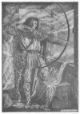
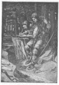
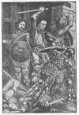
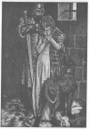

  
[Intangible Textual Heritage](../../../index) 
[Myths/Sagas](../../index)  [England](../index)  [Index](index) 
[Previous](hml14)  [Next](hml16) 

------------------------------------------------------------------------

[Buy this Book at
Amazon.com](https://www.amazon.com/exec/obidos/ASIN/1859580017/internetsacredte)

------------------------------------------------------------------------

p. 225

# CHAPTER XI: WILLIAM OF CLOUDESLEE

### Introduction

THE outlaw of mediæval England has always possessed a potent charm for
the minds of less rebellious persons. No doubt now the attraction has
somewhat waned, for in the exploration of distant lands and the study of
barbaric tribes men can find that breadth of outlook, that escape from
narrow conventionalities, which they could formerly gain only by the
cult of the "noble outlaw." The romance of life for many a worthy
citizen must have been found in secret sympathy with Robin Hood and his
merry band of banished men, robbing the purse-proud to help the needy
and gaily defying law and authority.

To the poor, however, the outlaw was something more than an easy
entrance to the realms of romance; he was a real embodiment of the
spirit of liberty. Of all the unjust laws which the Norman conquerors
laid upon England, perhaps the most bitterly resented were the forest
laws, and resistance to them was the most popular form of national
independence. Hence it follows that we find outlaw heroes popular very
early in our history--heroes who stand in the mind of the populace for
justice and true liberty against the oppressive tyranny of subordinate
officials, and who are always taken into favour by the king, the fount
of true justice.

### Famous Outlaws

There is some slight tinge of the "outlaw hero" in Hereward, but the
outlaw period of that patriot's life is but an episode in his defence of
England against William the Norman. There is a fully developed outlaw
hero, the ideal of the type, in Robin Hood, but he

p. 226

has been somewhat idealized and ennobled by being transformed into a
banished Earl of Huntingdon. Less known, but equally heroic, is William
of Cloudeslee, the William Tell of England, whose fame is that of a good
yeoman, a good archer, and a good patriot.

### The Outlaws

In the green forest of Englewood, in the "North Countree," not
[far](errata.htm#0) from the fortified town of Carlisle, dwelt a merry
band of outlaws. They were not evil-doers, but sturdy archers and
yeomen, whose outlawry had been incurred only for shooting the king's
deer. Indeed, to most men of that time--that is, to most men who were
not in the royal service--the shooting of deer, and the pursuit of game
in general, were not only venial offences, but the most natural thing in
life. The royal claim to exclusive hunting in the vast forests of
Epping, Sherwood, Needwood, Barnesdale, Englewood, and many others
seemed preposterous to the yeomen who lived on the borders of the
forests, and they took their risks and shot the deer and made venison
pasty, convinced that they were wronging no one and risking only their
own lives. They had the help and sympathy of many a man who was himself
a law-abiding citizen, as well as the less understanding help of the
town mob and the labourers in the country.

### The Leaders

While the outlaws of merry Sherwood recognised no chief but Robin Hood
and no foe but the Sheriff of Nottingham, the outlaws of Englewood were
under the headship of three famous archers, brothers-in-arms sworn to
stand by each other, but not brothers in blood. Their names were Adam
Bell, William of Cloudeslee, and Clym of the Cleugh; and of the three
William of

p. 227

\[paragraph continues\] Cloudeslee alone
was married. His wife, fair Alice of Cloudeslee, dwelt in a strong house
within the walls of Carlisle, with her three children, for they were not
included in William's outlawry. It was possible thus for her to send her
husband warning of any attack planned by the Sheriff of Carlisle on the
outlaws, and she had saved him and his comrades from surprise already.

### William Goes to Carlisle

When the blithe spring had come, and the forest was beautiful with its
fresh green leaves, William began to long for his home and family; he
had not ventured into Carlisle for some time, and it was more than six
months since he had seen his wife's face. Little wonder was it, then,
that he announced his intention of visiting his home, at the risk of
capture by his old enemy the Sheriff. In vain his comrades dissuaded him
from the venture. Adam Bell was especially urgent in his advice that
William should remain in the greenwood.

"You shall not go to Carlisle, brother, by my advice, nor with my
consent. If the sheriff or the justice should know that you are in the
town short would be your shrift and soon your span of life would end.
Stay with us, and we will fetch you tidings of your wife."

William replied: "Nay, I must go myself; I cannot rest content with
tidings only. If all is well I will return by prime to-morrow, and if I
fail you at that hour you may be sure I am taken or slain; and I pray
you guard well my family, if that be so."

Taking leave of his brother outlaws, William made his way unobserved
into the town and came to his wife's dwelling. It was closely shut, with
doors strongly bolted, and he was forced to knock long on the window
before his wife opened the shutter to see who was the importunate
visitor.

p. 228

"Let me in quickly, my own Alice," he said. "I have come to see you and
my three children. How have you fared this long time?"

"Alas!" she replied, hurriedly admitting him, and bolting the door
again, "why have you come now, risking your dear life to gain news of
us? Know you not that this house has been watched for more than six
months, so eager are the sheriff and the justice to capture and hang
you? I would have come to you in the forest, or sent you word of our
welfare. I fear--oh, how I fear!--lest your coming be known!"

### The Old Woman's Treachery

"Now that I am here, let us make merry," quoth William. "No man has seen
me enter, and I would fain enjoy my short stay with you and my children,
for I must be back in the forest by prime to-morrow. Can you not give a
hungry outlaw food and drink?"

Then Dame Alice bustled about and prepared the best she had for her
husband; and when all was ready a very happy little family sat down to
the meal, husband and wife talking cheerily together, while the children
watched in wondering silence the father who had been away so long and
came to them so seldom.

There was one inmate of the house who saw in William's return a means of
making shameful profit. She was an old bedridden woman, apparently
paralysed, whom he had rescued from utter poverty seven years before.
During all that time she had lain on a bed near toe fire, had shared all
the life of the family, and had never once moved from her couch. Now,
while husband and wife talked together and the darkness deepened in the
room, this old impostor slipped from her bed and glided stealthily out
of the house.

p. 229

### News Brought to the Sheriff

It happened that the king's assize was being held just then in Carlisle,
and the sheriff and his staunch ally the justice were sitting together
in the Justice Hall. Thither this treacherous old woman hurried with all
speed and pushed into the hall, forcing her way through the crowd till
she came near the sheriff. "Ha! what would you, good woman?" asked he,
surprised. "Sir, I bring tidings of great value." "Tell your tidings,
and I shall see if they be of value or no. If they are I will reward you
handsomely." "Sir, this night William of Cloudeslee has come into
Carlisle, and is even now in his wife's house. He is all alone, and you
can take him easily. Now what will you pay me, for I am sure this news
is much to you?" "You say truth, good woman. That bold outlaw .is the
worst of all who kill the king's deer in his forest of Englewood, and if
I could but catch him I should be well content. Dame, you shall not go
without a recompense for your journey here and for your loyalty." The
sheriff then bade his men give the old woman a piece of scarlet cloth,
dyed in grain, enough for a gown, and the treacherous hag hid the gift
under her cloak, hastened away to Alice's house, and slipped unperceived
into her place again, hiding the scarlet cloth under the bed-coverings.

### The Hue and Cry

Immediately he had heard of Cloudeslee's presence in Carlisle the
sheriff sent out the hue and cry, and with all speed raised the whole
town, for though none hated the outlaws men dared not refuse to obey the
king's officer. The justice, too, joined the sheriff in the congenial
task of capturing an outlaw whose

p. 230

condemnation was already pronounced. With all the forces at their
disposal, sheriff and justice took their way towards the house where
William and Alice, unconscious of the danger besetting them, still
talked lovingly together.

Suddenly the outlaw's ears, sharpened by wood-craft and by constant
danger, heard a growing noise coming nearer and nearer. He knew the
sound of the footsteps of many people, and among the casual shuffling of
feet recognised the ominous tramp of soldiers.

"Wife, we are betrayed," cried William. "Hither comes the sheriff to
take me."

### The Siege of the House

Alice ran quickly up to her bedchamber and opened a window looking to
the back, and saw, to her despair, that soldiers beset the house on
every side and filled all the neighbouring streets. Behind them pressed
a great throng of citizens, who seemed inclined to leave the capture of
the outlaw to the guard. At the same moment William from the front
called to his wife that the sheriff and justice were besieging the house
on that side.

"Alas! dear husband, what shall we do?" cried Alice. "Accursed be all
treason! But who can have betrayed you to your foes? Go into my
bedchamber, dear William, and defend yourself there, for it is the
strongest room in the house. The children and I will go with you, and I
will guard the door while you defend the windows."

The plan was speedily carried out, and while William took his stand by
the window Alice seized a pole-axe and stationed herself by the door.
"No man shall enter this door alive while I live," said she.

p. 231

### The Attack

From the window Cloudeslee could perceive his mortal enemies the justice
and the sheriff; and drawing his good longbow, he shot with deadly aim
fair at the breast of the justice. It was well for the latter then that
he wore a suit of good chain-mail under his robes; the arrow hit his
breast and split in three on the mail.

"Beshrew the man that clad you with that mail coat! You would have been
a dead man now if your coat had been no thicker than mine," said
William.

"Yield yourself, Cloudeslee, and lay down your bow and arrows," said the
justice. "You cannot escape, for we have you safe."

"Never shall my husband yield; it is evil counsel you give," exclaimed
the brave wife from her post at the door.

### The House is Burnt

The sheriff, who grew more angered as the hours passed on and Cloudeslee
was not taken, now cried aloud: "Why do we waste time trifling here? The
man is an outlaw and his life is forfeit. Let us burn him and his house,
and if his wife and children will not leave him they shall all burn
together, for it is their own choice."

This cruel plan was soon carried out. Fire was set to the door and
wooden shutters, and the flames spread swiftly; the smoke rolled up in
thick clouds into the lofty bedchamber, where the little children,
crouching on the ground, began to weep for fear.

"Alas! must we all die?" cried fair Alice, grieving for her children.

William opened the window and looked out, but

p. 232

there was no chance of escape; his foes filled every street and lane
around the house. "Surely they will spare my wife and babes," he
thought; and, tearing the sheets from the bed, he made a rope, with
which he let down to the ground his children, and last of all his
weeping wife.

He called aloud to the sheriff: "Sir Sheriff, here have I trusted to you
my chief treasures. For God's sake do them no harm, but wreak all your
wrath on me!"

Gentle hands received Alice and her babes, and friendly citizens led
them from the press; but Alice went reluctantly, in utter grief, knowing
that her husband must be burnt with his house or taken by his foes; but
for her children she would have stayed with him. William continued his
wonderful archery, never missing his aim, till all his arrows were
spent, and the flames came so close that his bowstring was burnt in two.
Great blazing brands came falling upon him from the burning roof, and
the floor was hot beneath his feet. "An evil death is this!" thought he.
"Better it were that I should take sword and buckler and leap down amid
my foes and so die, striking good blows in the throng of enemies, than
stay here and let them see me burn."

Thereupon he leaped lightly down, and fought so fiercely that he nearly
escaped through the throng, for the worthy citizens of Carlisle were not
anxious to capture him; but the soldiers, urged by the sheriff and
justice, threw doors and windows upon him, hampered his blows, and
seized and bound him, and cast him into a deep dungeon.

### The Sheriff Gives Sentence

"Now, William of Cloudeslee," quoth the sheriff, you shall be hanged
with speed, as soon as I can have a new gallows made. So noted an outlaw
merits no

 

[  
Click to enlarge](img/23200.jpg)  
''William continued his wonderful archery''  

[  
Click to enlarge](img/23300.jpg)  
Adam Bell writes the letter  

 

p. 233

common gibbet; a new one is most fitting. To-morrow at prime you shall
die. There is no hope of rescue, for the gates of the town shall be
shut. Your dear friends, Adam Bell and Clym of the Cleugh, would be
helpless to save you, though they brought a thousand more like
themselves, or even all the devils in Hell."

Early next morning the justice arose, went to the soldiers who guarded
the gates, and forbade them to open till the execution was over; then he
went to the market-place and superintended the erection of a specially
lofty gallows, beside the pillory.

### News is Brought to the Greenwood

Among the crowd who watched the gallows being raised was a little lad,
the town swineherd, who asked a bystander the meaning of the new gibbet.

"It is put up to hang a good yeoman, William of Cloudeslee, more's the
pity! He has done no wrong but kill the King's deer, and that merits not
hanging. It is a foul shame that such injustice can be wrought in the
king's name."

The little lad had often met William of Cloudeslee in the forest, and
had carried him messages from his wife; William had given the boy many a
dinner of vension, and now he determined to help his friend if he could.
The gates were shut and no man could pass out, but the boy stole along
the wall till he found a crevice, by which he clambered down outside.
Then he hastened to the forest of Englewood, and met Adam Bell and Clym
of the Cleugh.

"Come quickly, good yeomen; ye tarry here too long. While you are at
ease in the greenwood your friend, William of Cloudeslee, is taken,
condemned to death, and ready to be hanged. He needs your help this very
hour."

Adam Bell groaned. "Ah! if he had but taken our

p. 234

advice he would have been here in safety with us now. In the greenwood
there is no sorrow or care, but when William went to the town he was
running into trouble." Then, bending his bow, he shot with unerring aim
a hart, which he gave to the lad as recompense for his labour and
goodwill.

### The Outlaws Go to Carlisle

"Come," said Clym to Adam Bell, "let us tarry no longer, but take our
bows and arrows and see what we can do. By God's grace we will rescue
our brother, though we may abide it full dearly ourselves. We will go to
Carlisle without delay."

The morning was fair as the two yeomen strode from the deep green shades
of Englewood Forest along the hard white road leading to Carlisle Town.
They were in time as yet, but when they drew near the wall they were
amazed to see that no entrance or exit was possible; the gates were shut
fast.

Stepping hack into the green thickets beside the road, the two outlaws
consulted together. Adam Bell was for a valiant attempt to storm the
gate, but Clym suddenly bethought him of a wiser plan.

### Clym's Stratagem

Said he: "Let us pretend to be messengers from the king, with urgent
letters to the justice. Surely that should win us admission. But alas! I
forgot. How can we bear out our pretence, for I am no learned clerk. I
cannot write."

Quoth Adam Bell: "I can write a good clerkly hand. Wait one instant and
I will speedily have a letter written; then we can say we have the
king's seal. The plan will do well enough, for I hold the gate-keeper no
learned clerk, and this will deceive him."

p. 235

Indeed, the letter which he quickly wrote and folded and sealed was very
well and clearly written, and addressed to the Justice of Carlisle. Then
the two bold outlaws hastened up the road and thundered on the town
gates.

### They Enter the Town

So long and loud they knocked that the warder came in great wrath,
demanding who dared to make such clamour.

Adam Bell replied: "We are two messengers come straight from our lord
the king." Clym of the Cleugh added: "We have a letter for the justice
which we must deliver into his own hands. Let us in speedily to perform
our errand, for we must return to the king in haste."

"No," the warder replied, "that I cannot do. No man may enter these
gates till a false thief and outlaw be safely hanged. He is William of
Cloudeslee, who has long deserved death."

Now Clym saw that matters were becoming desperate, and time was passing
too quickly, so he adopted a more violent tone. "Ah, rascal, scoundrel,
madman!" quoth he. "If we be delayed here any longer thou shalt be
hanged for a false thief! To keep the king's messengers waiting thus!
Canst thou not see the king's seal? Canst thou not read the address of
the royal letter? Ah, blockhead, thou shalt dearly abide this delay when
my lord knows thereof."

Thus speaking, he flourished the forged letter, with its false seal, in
the porter's face; and the man, seeing the seal and the writing,
believed what was told him. Reverently he took off his hood and bent the
knee to the king's messengers, for whom he opened wide the gates, and
they entered, walking warily.

p. 236

### They Keep the Gates

"At last we are within Carlisle walls, and glad thereof are we," said
Adam Bell, "but when and how we shall go out again Christ only knows,
who harrowed Hell and brought out its prisoners."

"Now if we had the keys ourselves we should have a good chance of life,"
said Clym, "for then we could go in and out at our own will." "Let us
call the warder," said Adam. When he came running at their call both the
yeomen sprang upon hire, flung him to the ground, bound him hand and
foot, and cast him into a dark cell, taking his bunch of keys from his
girdle. Adam laughed and shook the heavy keys. "Now I am gate-ward of
merry Carlisle. See, here are my keys. I think I shall be the worst
warder they have had for three hundred years. Let us bend our bows and
hold our arrows ready, and walk into the town to deliver our brother."

### The Fight in the Market-place

When they came to the market-place they found a dense crowd of
sympathizers watching pityingly the hangman's cart, in which lay William
of Cloudeslee, bound hand and foot, with a rope round his neck. The
sheriff and the justice stood near the gallows, and Cloudeslee would
have been hanged already, but that the sheriff was hiring a man to
measure the outlaw for his grave. "You shall have the dead man's
clothes, good fellow, if you make his grave," said he.

Cloudeslee's courage was still undaunted. "I have seen as great a marvel
ere now," quoth he, "as that a man who digs a grave for another may lie
in it himself, in as short a time as from now to prime."

"You speak proudly, my fine fellow, but hanged you

p. 237

shall be, if I do it with my own hand," retorted the sheriff furiously.

Now the cart moved a little nearer to the scaffold, and William was
raised up to be ready for execution. As he looked round the dense mass
of faces his keen sight soon made him aware of his friends. Adam Bell
and Clym of the Cleugh stood at one corner of the market-place, with
arrow on string, and their deadly aim bent at the sheriff and justice,
whose horses raised them high above the murmuring throng. Cloudeslee
showed no surprise, but said aloud: "Lo I see comfort, and hope [to
fare](errata.htm#1) well in my journey. Yet if I might have my hands
free I would care little what else befell me."

### The Rescue

Now Adam said quietly to Clym: "Brother, do you take the justice, and I
will shoot the sheriff. Let us both loose at once and leave them dying.
It is an easy shot, though a long one."

Thus, while the sheriff yet waited for William to be measured for his
grave, suddenly men heard the twang of bowstrings and the whistling
flight of arrows through the air, and at the same moment both sheriff
and justice fell writhing from their steeds, with the grey goose
feathers standing in their breasts. All the bystanders fled from the
dangerous neighbourhood, and left the gallows, the fatal cart, and the
mortally wounded officials alone. The two bold outlaws rushed to release
their comrade, cut his bonds, and lifted him to his feet. William seized
an axe from a soldier and pursued the fleeing guard, while his two
friends with their deadly arrows slew a man at each shot.

### The Mayor of Carlisle

When the arrows were all used Adam Bell and Clym

p. 238

of the Cleugh threw away their bows and took to sword and buckler. The
fight continued till midday, for in the narrow streets the three
comrades protected each other, and drew gradually towards the gate. Adam
Bell still carried the keys at his girdle, and they could pass out
easily if they could but once reach the gateway. By this time the whole
town was in a commotion; again the hue and cry had been raised against
the outlaws, and the Mayor of Carlisle came in person with a mighty
troop of armed citizens, angered now at the fighting in the streets of
the town.

The three yeomen retreated as steadily as they could towards the gate,
but the mayor followed valiantly, armed with a pole-axe, with which he
clove Cloudeslee's shield in two. He soon perceived the object of the
outlaws, and bade his men guard the gates well, so that the three should
not escape.

### The Escape from Carlisle

Terrible was the din in the town now, for trumpets blew, church-bells
were rung backward, women bewailed their dead in the streets, and over
all resounded the clash of arms, as the fighting drew nigh the gate.
When the gatehouse came in sight the outlaws were fighting desperately,
with diminishing strength, but the thought of safety outside the walls
gave them force to make one last stand. With backs to the gate and faces
to the foe, Adam and Clym and William made a valiant onslaught on the
townsfolk, who fled in terror, leaving a breathing-space in which Adam
Bell turned the key, flung open the great ponderous gate, and flung it
to again, when the three had passed through.

### Adam and the Keys

As Adam locked the door they could hear inside

 

[  
Click to enlarge](img/23800.jpg)  
The fight at the gate  

[  
Click to enlarge](img/23900.jpg)  
''Wait for me seven years, dear wife''  

 

p. 239

the town the hurrying footsteps of the rallying citizens, whose furious
attack on the great iron-studded door came too late. The door was
locked, and the three friends stood in safety outside, with their
pleasant forest home within easy reach. The change of feeling was so
intense that Adam Bell, always the man to seize the humorous point of a
situation, laughed lightly. He called through the barred wicket:

"Here are your keys. I resign my office as warder--one half-day's work
is enough for me; and as I have resigned, and the former gate-ward is
somewhat damaged and has disappeared, I advise you to find a new one.
Take your keys, and much good may you get from them. Next time I advise
you not to stop an honest yeoman from coming to see his own wife and
have a chat with her."

Thereupon he flung the keys over the gate on the heads of the crowd, and
the three brethren slipped away into the forest to their own haunts,
where they found fresh bows and arrows in such abundance that they
longed to be back in fair Carlisle with their foes before them.

### William of Cloudeslee and his Wife Meet

While they were yet discussing all the details of the rescue they heard
a woman's pitiful lament and the crying of little children. "Hark!" said
Cloudeslee, and they all heard in the silence the words she said. It was
William's wife, and she cried: "Alas! why did I not die before this day?
Woe is me that my dear husband is slain! He is dead, and I have no
friend to lament with me. If only I could see his comrades and tell what
has befallen him my heart would be eased of some of its pain."

William, as he listened, was deeply touched, and

p. 240

walked gently to fair Alice, as she hid her face in her hands and wept.
"Welcome, wife, to the green-wood!" quoth he. "By heaven, I never
thought to see you again when I lay in bonds last night." Dame Alice
sprang up most joyously. "Oh, all is well with me now you are here; I
have no care or woe." "For that you must thank my dear brethren, Adam
and Clym," said he; and Alice began to load them with her thanks, but
Adam cut short the expression of her gratitude. "No need to talk about a
little matter like that," he said gruffly. "If we want any supper we had
better kill something, for the meat we must eat is yet running wild."

With three such good archers game was easily shot, and a merry meal was
quickly prepared in the green-wood, and all joyfully partook of venison
and other dainties. Throughout the repast William devotedly waited on
his wife with deepest love and reverence, for he could not forget how
she had defended him and risked her life to stand by him.

### William's Proposed Visit to London

When the meal was over, and they reclined on the green turf round the
fire, William began thoughtfully:

"It is in my mind that we ought speedily to go to London and try to win
our pardon from the king. Unless we approach him before news can be
brought from Carlisle he will assuredly slay us. Let us go at once,
leaving my dear wife and my two youngest sons in a convent here; but I
would fain take my eldest boy with me. If all goes well he can bring
good news to Alice in her nunnery, and if all goes ill he shall bring
her my last wishes. But I am sure I am not meant to die by the law." His
brethren approved the plan, and they took fair Alice and her two
youngest children to

p. 241

the nunnery, and then the three famous archers with the little boy of
seven set out at their best speed for London, watching the passers-by
carefully, that no news of the doings in Carlisle should precede them to
the king.

### Outlaws in the Royal Palace

The three yeomen, on arriving in London, made their way at once to the
king's palace, and walked boldly into the hall, regardless of the
astonished and indignant shouts of the royal porter. He followed them
angrily into the hall, and began reproaching them and trying to induce
them to withdraw, but to no purpose. Finally an usher came and said:
"Yeomen, what is your wish? Pray tell me, and I will help you if I can;
but if you enter the king's presence thus unmannerly you will cause us
to be blamed. Tell me now whence you come."

William fearlessly answered: "Sir, we will tell the truth without
deceit. W c are outlaws from the king's forests, outlawed for killing
the king's deer, and we come to beg for pardon and a charter of peace,
to show to the sheriff of our county."

### The King and the Outlaws

The usher went to an inner room and begged to know the king's will,
whether he would see these outlaws or not. The king was interested in
these bold yeomen, who dared to avow themselves law-breakers, and bade
men bring them to audience with him. The three comrades, with the little
boy, on being introduced into the royal presence, knelt down and held up
their hands, beseeching pardon for their offences.

"Sire, we beseech your pardon for our breach of your laws. We are forest
outlaws. who have slain your

p. 242

fallow deer in many parts of your royal forests." "Your names? Tell me
at once," said the king. "Adam Bell, Clym of the Cleugh, and William of
Cloudeslee," they replied.

The king was very wrathful. "Are you those bold robbers of whom men have
told me? Do you now dare to come to me for pardon? On mine honour I vow
that you shall all three be hanged without mercy, as I am crowned king
of this realm of England. Arrest them and lay them in bonds." There was
no resistance possible, and the yeomen submitted ruefully to their
arrest. Adam Bell was the first to speak. "As I hope to thrive, this
game pleases me not at all," he said. "Sire, of your mercy, we beg you
to remember that we came to you of our own free will, and to let us pass
away again as freely. Give us back our weapons and let us have free
passage till we have left your palace; we ask no more; we shall never
ask another favour, however long we live."

The king was obdurate, however; he only replied: "You speak proudly
still, but you shall all three be hanged."

### The Queen Intercedes

The queen, who was sitting beside her husband, now spoke for the first
time. "Sire, it were a pity that such good yeomen should die, if they
might in any wise be pardoned." "There is no pardon," said the king. She
then replied: "My lord, when I first left my native land and came into
this country as your bride you promised to grant me at once the first
boon I asked. I have never needed to ask one until to-day, but now,
sire, I claim one, and I beg you to grant it." "With all my heart; ask
your boon, and it shall be yours willingly." "Then, I pray you, grant me
the lives of these good

p. 243

yeomen." "Madam, you might have had half my kingdom, and you ask a
worthless trifle." "Sire, it seems not worthless to me; I beg you to
keep your promise." "Madam, it vexes me that you have asked so little;
yet since you will have these three outlaws, take them." The queen
rejoiced greatly. "Many thanks, my lord and husband. I will be surety
for them that they shall be true men henceforth. But, good my lord, give
them a word of comfort, that they may not be wholly dismayed by your
anger."

### News Comes to the King

The king smiled at his wife. "Ah, madam! you will have your own way, as
all women will. Go, fellows, wash yourselves, and find places at the
tables, where you shall dine well enough, even if it be not on venison
pasty from the king's own forests."

The outlaws did reverence to the king and queen, and found seats with
the king's guard at the lower tables in the hall. They were still
satisfying their appetites when a messenger came in haste to the king;
and the three North Countrymen looked at one another uneasily, for they
knew the man was from Carlisle. The messenger knelt before the king and
presented his letters. "Sire, your officers greet you well."

"How fare they? How does my valiant sheriff? And the prudent justice?
Are they well?"

"Alas! my lord, they have been slain, and many another good officer with
them."

"Who hath done this?" questioned the king angrily.

My lord, three bold outlaws, Adam Bell, Clym of the Cleugh, and William
of Cloudeslee."

"What! these three whom I have just pardoned? Ah, sorely I repent that I
forgave them! I would give

p. 244

a thousand pounds if I could have them hanged all three; but I cannot."

### The King's Test

As the king read the letters his anger and surprise increased. It seemed
impossible that three men should overawe a whole town, should slay
sheriff, justice, mayor, and nearly every official in the town, forge a
royal letter with the king's seal, and then lock the gates and escape
safely. There was no doubt of the fact, and the king raged impotently
against his own foolish mercy in giving them a free pardon. It had been
granted, however, and he could do nought but grieve over the ruin they
had wrought in Carlisle. At last he sprang up, for he could endure the
banquet no longer.

"Call my archers to go to the butts," he commanded. "I will see these
bold outlaws shoot, and try if their archery is so fine as men say."

Accordingly the king's archers and the queen's archers arrayed
themselves, and the three yeomen took their bows and looked well to
their silken bowstrings; and then all made their way to the butts where
the targets were set up. The archers shot in turn, aiming at an ordinary
target, but Cloudeslee soon grew weary of this childish sport, and said
aloud: "I shall never call a man a good archer who shoots at a target as
large as a buckler. We have another sort of butt in my country, and that
is worth shooting at."

### William of Cloudeslee's Archery

"Make ready your own butts," the king commanded, and the three outlaws
went to a bush in a field close by and returned bearing hazel-rods,
peeled and shining white. These rods they set up at four

p. 245

hundred yards apart, and, standing by one, they said to the king: "We
should account a man a fair archer if he could split one wand while
standing beside the other." "It cannot be done; the feat is too great,"
exclaimed the king. "Sire, I can easily do it," quoth Cloudeslee, and,
taking aim very carefully, he shot, and the arrow split the wand in two.
"In truth," said the king, "you are the best archer I have ever seen.
Can you do greater wonders?" "Yes," quoth Cloudeslee, "one thing more I
can do, but it is a more difficult feat. Nevertheless I will try it, to
show you our North Country shooting." "Try, then," the king replied;
"but if you fail you shall be hanged without mercy, because of your
boasting."

### Cloudeslee Shoots the Apple from his Son's Head

Now Cloudeslee stood for a few moments as if doubtful of himself, and
the South Country archers watched him, hoping for a chance to retrieve
their defeat, when William suddenly said: "I have a son, a dear son,
seven years of age. I will tie him to a stake and place an apple on his
head. Then from a distance of a hundred and twenty yards I will split
the apple in two with a broad arrow." "By heaven!" the king cried, "that
is a dreadful feat. Do as you have said, or by Him who died on the Cross
I will hang you high. Do as you have said, but if you touch one hair of
his head, or the edge of his gown, I will hang you and your two
companions." "I have never broken my pledged word," said the North
Country bowman, and he at once made ready for the terrible trial. The
stake was set in the ground, the boy tied to it, with his face turned
from his father, lest he should give a start and destroy his aim.
Cloudeslee then paced the hundred and twenty yards,

p. 246

anxiously felt his string, bent his bow, chose his broadest arrow, and
fitted it with care.

### The Last Shot

It was an anxious moment. The throng of spectators felt sick with
expectation, and many women wept and prayed for the father and his
innocent son. But Cloudeslee showed no fear. He addressed the crowd
gravely: "Good folk, stand all as still as may be. For such a shot a man
needs a steady hand, and your movements may destroy my aim and make me
slay my son. Pray for me."

Then, in an unbroken silence of breathless suspense, the bold marksman
shot, and the apple fell to the ground, cleft into two absolutely equal
halves. A cheer from every spectator burst forth deafeningly, and did
not die down till the king beckoned for silence.

### The King and Queen Show Favour

"God forbid that I should ever be your target," quoth he. "You shall be
my chief forester in the North Country, with daily wage, and daily right
of killing venison; your two brethren shall become yeomen of my guard,
and I will advance the fortunes of your family in every way."

The queen smiled graciously upon William, and she bestowed a pension
upon him, and bade him bring his wife, fair Alice, to court, to take up
the post of chief woman of the bedchamber to the royal children.

Overwhelmed with these favours, the three yeomen became conscious of
their own offences, more than they had told to the royal pair; their
awakened consciences sent them to a holy bishop, who heard their
confessions,

p. 247

gave them penance and bade them live well for the future, and then
absolved them. When they had returned to Englewood Forest and had broken
up the outlaw band they came back to the royal court, and spent the rest
of their lives in great favour with the king and queen.

------------------------------------------------------------------------

[Next: Chapter XII: Black Colin of Loch Awe](hml16)
