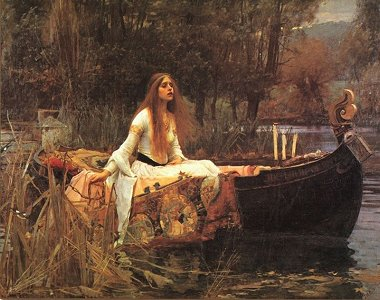

  
[Intangible Textual Heritage](../../../index) 
[Myths/Sagas](../../index)  [England](../index) 

------------------------------------------------------------------------

[Buy this Book at
Amazon.com](https://www.amazon.com/exec/obidos/ASIN/1859580017/internetsacredte)

------------------------------------------------------------------------

<table width="75%">
<colgroup>
<col style="width: 50%" />
<col style="width: 50%" />
</colgroup>
<tbody>
<tr class="odd">
<td width="50%" data-valign="TOP"> 
</td>
<td width="50%" data-valign="TOP"><h1 id="hero-myths-and-legends-of-the-british-race" data-align="CENTER">Hero-Myths and Legends of the British Race</h1>
<h2 id="by-maud-isabel-ebbutt" data-align="CENTER">by Maud Isabel Ebbutt</h2>
<h4 id="section" data-align="CENTER">[1910]</h4></td>
</tr>
</tbody>
</table>

------------------------------------------------------------------------

|                                                                                                                           |
|---------------------------------------------------------------------------------------------------------------------------|
|  |

This entry in the G.G. Harrap "Myths and Legends" series is slotted as
the "British" volume; however it covers a wide range of Northern
European legends, including Beowulf, Roland, Cuchulain and Robin Hood.
With legends from Iceland, Spain, Ireland and Constantinople, the common
theme here is not 'British' legends *per se*, but heroic characters from
the dark and middle ages. Notably, Ebbutt includes a number of memorable
heroines as well, including the Irish Countess Cathleen, who bargained
her soul to relieve a famine, the 'Loathly Lady,' redeemed by the love
of Sir Gawain, and Rymenhild, who (uncharacteristically for the genre)
seduces the Childe Horn, motivating his story arc towards knighthood.

This volume overlaps with Harrap's Myths and Legends of the Middle Ages,
by Helene A. Guerber, (an etext of which is forthcoming). It is a bit
shorter than the others in the series, and the sometimes muddy
monochrome illustrations are not particularly compelling. However,
Ebbutt turns in a very enjoyable volume of edifying tales.

------------------------------------------------------------------------

[Title Page](hml00)  
[Preface](hml01)  
[Contents](hml02)  
[List of Illustrations](hml03)  
[Introduction](hml04)  
[Chapter I. Beowulf](hml05)  
[Chapter II. The Dream of Maxen Wledig](hml06)  
[Chapter III. The Story of Constantine and Elene](hml07)  
[Chapter IV: The Compassion of Constantine](hml08)  
[Chapter V: Havelok the Dane](hml09)  
[Chapter VI. Howard the Halt](hml10)  
[Chapter VII. Roland, the Hero of Early France](hml11)  
[Chapter VIII: The Countess Cathleen](hml12)  
[Chapter IX: Cuchulain, the Champion of Ireland](hml13)  
[Chapter X: The Tale of Gamelyn](hml14)  
[Chapter XI. William of Cloudeslee](hml15)  
[Chapter XII: Black Colin of Loch Awe](hml16)  
[Chapter XIII. The Marriage of Sir Gawayne](hml17)  
[Chapter XIV: King Horn](hml18)  
[Chapter XV. Robin Hood](hml19)  
[Chapter XVI. Hereward the Wake](hml20)  
[Glossary and Index](hml21)  
