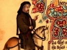

  
[Intangible Textual Heritage](../../../index)  [Legends and
Sagas](../../index)  [England](../index)  [Index](index) 
[Previous](mect79)  [Next](mect81) 

------------------------------------------------------------------------

  
*The Canterbury Tales and Other Works of Chaucer (Middle English)*, by
Geoffery Chaucer, \[14th cent.\], at Intangible Textual Heritage

------------------------------------------------------------------------

#### The Shorter Poems

### Lenvoy de Chaucer a Bukton

 My maister Bukton, whan of Crist our kyng  
 Was axed what is trouthe or sothfastnesse,  
 He nat a word answerde to that axing,  
 As who saith, "No man is al trewe," I gesse.  
 And therfore, though I highte to expresse  
 The sorwe and wo that is in mariage,  
 I dar not writen of it no wikkednesse,  
 Lest I myself falle eft in swich dotage.  
 I wol nat seyn how that yt is the cheyne  
10 Of Sathanas, on
which he gnaweth evere,  
 But I dar seyn, were he out of his peyne,  
 As by his wille he wolde be bounde nevere.  
 But thilke doted fool that eft hath levere  
 Ycheyned be than out of prison crepe,  
 God lete him never fro his wo dissevere,  
 Ne no man him bewayle, though he wepe.  
 But yet, lest thow do worse, take a wyf;  
 Bet ys to wedde than brenne in worse wise.  
 But thow shal have sorwe on thy flessh, thy
lyf,  
20 And ben thy
wives thral, as seyn these wise;  
 And yf that hooly writ may nat suffyse,  
 Experience shal the teche, so may happe,  
 That the were lever to be take in Frise  
 Than eft to falle of weddynge in the trappe.  
 This lytel writ, proverbes, or figure  
 I sende yow; take kepe of yt, I rede;  
 Unwys is he that kan no wele endure.  
 If thow be siker, put the nat in drede.  
 The Wyf of Bathe I pray yow that ye rede  
30 Of this matere
that we have on honde.  
 God graunte yow your lyf frely to lede  
 In fredam, for ful hard is to be bonde.  

------------------------------------------------------------------------

[Next: The Complaint of Chaucer to His Purse](mect81)
