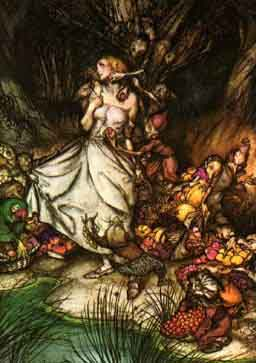

  
[Intangible Textual Heritage](../../../index)  [Legends and
Sagas](../../index)  [English Folklore](../index) 

------------------------------------------------------------------------

<table width="75%">
<colgroup>
<col style="width: 50%" />
<col style="width: 50%" />
</colgroup>
<tbody>
<tr class="odd">
<td width="50%" data-valign="TOP"></td>
<td width="50%" data-valign="TOP"><h1 id="more-english-fairy-tales" data-align="CENTER">More English Fairy Tales</h1>
<h2 id="by-joseph-jacobs" data-align="CENTER">by Joseph Jacobs</h2>
<h4 id="section" data-align="CENTER">[1894]</h4></td>
</tr>
</tbody>
</table>

------------------------------------------------------------------------

[Title Page](meft00)  
[Preface](meft01)  
[The Pied Piper](meft02)  
[Hereafterthis](meft03)  
[The Golden Ball](meft04)  
[My Own Self](meft05)  
[Black Bull of Norroway](meft06)  
[Yallery Brown](meft07)  
[Three Feathers](meft08)  
[Sir Gammer Vans](meft09)  
[Tom Hickathrift](meft10)  
[The Hedley Kow](meft11)  
[Gobborn Seer](meft12)  
[Lawkamercyme](meft13)  
[Tattercoats](meft14)  
[The Wee Bannock](meft15)  
[Johnny Gloke](meft16)  
[Coat o' Clay](meft17)  
[The Three Cows](meft18)  
[The Blinded Giant](meft19)  
[Scrapefoot](meft20)  
[The Pedlar of Swaffham](meft21)  
[The Old Witch](meft22)  
[The Three Wishes](meft23)  
[The Buried Moon](meft24)  
[A Son of Adam](meft25)  
[The Children in the Wood](meft26)  
[The Hobyahs](meft27)  
[A Pottle o' Brains](meft28)  
[The King of England and his Three Sons](meft29)  
[King John and the Abbot of Canterbury](meft30)  
[Rushen Coatie](meft31)  
[The King o' the Cats](meft32)  
[Tamlane](meft33)  
[The Stars in the Sky](meft34)  
[News!](meft35)  
[Puddock, Mousie and Ratton](meft36)  
[The Little Bull-Calf](meft37)  
[The Wee, Wee Mannie](meft38)  
[Habetrot and Scantlie Mab](meft39)  
[Old Mother Wiggle-Waggle](meft40)  
[Catskin](meft41)  
[Stupid's Cries](meft42)  
[The Lambton Worm](meft43)  
[The Wise Men of Gotham](meft44)  
[Princess of Canterbury](meft45)  
[Introductory Notes](meft46)  
[Notes](meft47)  
