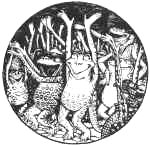

  
[Intangible Textual Heritage](../../../index)  [Legends and
Sagas](../../index)  [English Folklore](../index)  [Index](index) 
[Previous](meft03)  [Next](meft05) 

------------------------------------------------------------------------

# The Golden Ball

 [  
Click to enlarge](img/003.jpg)

THERE were two lasses, daughters of one mother, and as they came from
the fair, they saw a right bonny young man stand at the house-door
before them. They never saw such a bonny man before. He had gold on his
cap, gold on his finger, gold on his neck, a red gold watch-chain -- eh!
but he had brass. He had a golden ball in each hand. He gave a ball to
each lass, and she was to keep it, and if she lost it, she was to be
hanged. One of the lasses, 'twas the youngest, lost her ball. I'll tell
thee how. She was by a park paling, and she was tossing her ball, and it
went up, and up, and up, till it went fair over the paling; and when she
climbed up to look, the ball ran along the green grass, and it went
right forward to the door of the house, and the ball went in and she saw
it no more.

So she was taken away to be hanged by the neck till she was dead because
she'd lost her ball.

But she had a sweetheart, and he said he would go and get the ball. So
he went to the park gate, but 'twas shut; so he climbed the hedge, and
when he got to the top of the hedge, an old woman rose up out of the
dyke before him, and said, if he wanted to get the ball, he must sleep
three nights in the house. He said he would.

Then he went into the house, and looked for the ball, but could not find
it. Night came on and he heard bogles move in the courtyard; so he
looked out o' the window, and the yard was full of them.

Presently he heard steps coming upstairs. He hid behind the door, and
was as still as a mouse. Then in came a big giant five times as tall as
he, and the giant looked round but did not see the lad, so he went to
the window and bowed to look out; and as he bowed on his elbows to see
the bogles in the yard, the lad stepped behind him, and with one blow of
his sword he cut him in twain, so that the top part of him fell in the
yard, and the bottom part stood looking out of the window.

There was a great cry from the bogles when they saw half the giant come
tumbling down to them, and they called out, 'There comes half our
master; give us the other half.'

So the lad said, 'It's no use of thee, thou pair of legs, standing alone
at the window, as thou hast no eye to see with, so go join thy brother';
and he cast the lower part of the giant after the top part. Now when the
bogles had gotten all the giant they were quiet.

Next night the lad was at the house again, and now a second giant came
in at the door, and as he came in the lad cut him in twain, but the legs
walked on to the chimney and went up it. 'Go, get thee after thy legs,'
said the lad to the head, and he cast the head up the chimney, too.

The third night the lad got into bed, and he heard the bogles striving
under the bed, and they had the ball there, and they were casting it to
and fro.

Now one of them has his leg thrust out from under the bed, so the lad
brings his sword down and cuts it off. Then another thrusts his arm out
at other side of the bed, and the lad cuts that off. So at last he had
maimed them all, and they all went crying and wailing off, and forgot
the ball, but he took it from under the bed, and went to seek his
true-love.

Now the lass was taken to York to be hanged; she was brought out on the
scaffold, and the hangman said, 'Now, lass, thou must hang by the neck
till thou be'st dead.' But she cried out:

'Stop, stop, I think I see my mother coming!  
O mother, hast brought my golden ball  
And come to set me free?'

'I've neither brought thy golden ball  
Nor come to set thee free,  
But I have come to see thee hung  
Upon this gallows-tree.'

Then the hangman said, 'Now, lass, say thy prayers, for thou must die.'
But she said:

'Stop, stop, I think I see my father coming!  
O father, hast brought my golden ball  
And come to set me free?'

'I've neither brought thy golden ball  
Nor come to set thee free,  
But I have come to see thee hung  
Upon this gallows-tree.'

Then the hangman said, 'Hast thee done thy prayers? Now, lass, put thy
head into the noose.'

But she answered, 'Stop, stop, I think I see my brother coming!' And
again she sang, and then she thought she saw her sister coming, then her
uncle, then her aunt, then her cousin; but after this the hangman said,
'I will stop no longer; thou'rt making game of me. Thou must be hung at
once.'

But now she saw her sweetheart coming through the crowd, and he held
over his head in the air her own golden ball; so she said:

'Stop, stop, I see my sweetheart coming!  
Sweetheart, hast brought my golden ball  
And come to set me free?'

'Aye, I have brought thy golden ball  
And come to set thee free,  
I have not come to see thee hung  
Upon this gallows-tree.'

And he took her home, and they lived happy ever after.

 

------------------------------------------------------------------------

[Next: My Own Self](meft05)
